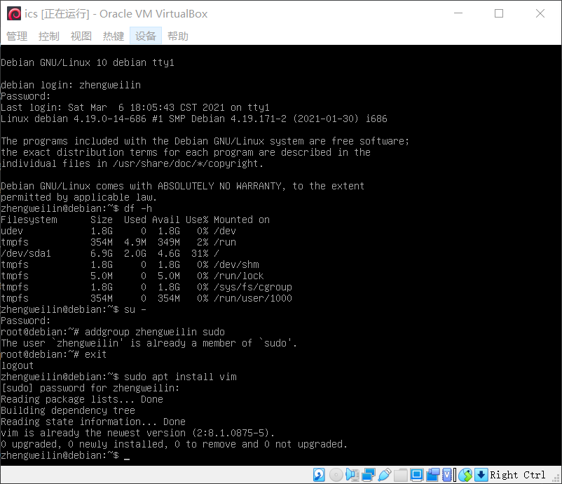

# 南京航空航天大学《计算机组成原理Ⅱ课程设计》报告

* 姓名：郑伟林
* 班级：1619303
* 学号：061920125
* 报告阶段：PA0
* 完成日期：2021.3.6
* 本次实验，我完成了所有内容。

## 目录

[TOC]

## 思考题

1. Linux and Linux?

   他们的共同点是都是基于Linux内核的系统；不同点在于Debian是属于社区组织维护的发行版本，是最遵循GNU规范的Linux系统，而Ubuntu是基于Debian改进后的版本，更适合桌面用户，而RedHat是属于商业公司维护的发行版本，是收费的，而CentOS是RedHat的社区克隆版，RedHat和CentOS的稳定性都很好，适合用于服务器。

2. Can't memory be larger?

   不能，32位系统内存理论上限为4GB。这是由于32位系统是针对32位CPU来使用的，位是指一次性CPU能处理的数据量，32位则为4字节，计算机通过地址总线传输数据的地址，因为是32位的，所以地址长度最大也是32位，所以它的内存寻址空间为2的32次方，即4GB左右，即32位操作系统对应的理论内存上限为4GB。所以不能超过4GB。
   
3. Why Windows is quite 'fat'?

   Windows是拥有较为完善的图形用户界面GUI的操作系统，且默认已经安装了许多软件工具（如计算机附件、office等等），因此其系统安装盘会相对较大；而我们所做实验用到的Debian没有GUI，只有命令窗口，且默认安装的软件相对较少，系统更纯净，因此所需空间会更少。

4. Why executing the '`poweroff`' command requires superuser privilege?

   `poweroff`命令涉及硬件资源和系统管理权限，如果普通用户能直接使用`poweroff`命令，可能会造成计算机被意外关闭而丢失数据的情形。比如一台计算机有多个用户使用，当某一个普通用户可以直接用`poweroff`命令关机，则其它用户数据在未得到保存情况下会造成损坏丢失。因此需将权限交由超级用户管理，更为安全。

5. Have a try! (in PA0.5)

   

   

   成功编辑并编译通过运行成功！

6. Have a try!!

   

   成功利用GDB设置断点，反汇编程序和调试程序。

7. Have a try!!!

   

   

   完成`Makefile`的创建与编辑，利用`make`进行编译，`make clean`进行清理项目，`make run`进行运行项目。

8. Have a try! (in PA0.6)

   

   

   成功实现在Windows本地和Debian虚拟机的文件互传。

9. Have a try (in PA0.7)

   

   成功修改STU_ID，并显示log。

10. What happened?

    从代码到可执行文件的过程称为编译，编译中相关的各步骤安排称为构建。`make`实际上就是利用`Makefile`文件来实现构建过程，使代码边为可执行文件。所以在`Makefile`文件中我们需要安排各个相关规则，一条规则形式如下：

    ```
    目标: 预置条件
    	步骤
    ```

    目标可以是一个文件名，也可以是某个操作名字（伪目标）；预置条件也叫依赖，可以是一个文件名，也可以是其它目标名；步骤则是该目标执行的命令。当执行make命令时，会默认执行第一个目标，如果有预置条件则会先执行预置条件的目标，然后执行本目标的步骤。

    利用`Makefile`就可以将构建过程写成一系列规则一键执行编译、汇编、链接等过程。

11. How will you do?

    根据计算机由冯·诺依曼体系，计算机由运算器、控制器、存储器、输入设备、输出设备五个部分组成。
    
    我们首先得搭建算术逻辑单元和寄存器，我猜应该可以用位运算等模拟实现门电路功能制作加法器、乘法器和寄存器等，以此来完成x86指令集实现CPU功能，然后再搭建一个简单的操作系统，继而能够执行一个程序。

## 实验内容

### PA0.1 Installing a GNU/Linux VM

1.安装`Oracle Virtual Box`，并启动；


2.点击`New`新建一个新的虚拟机；

3.填入虚拟机名称`ics`和操作系统版本`Debian (32-bit)`，下一步；

4.设置内存大小为4GB，下一步，选择`Create a virtual hard disk now`创建硬盘，点击创建；

5.加载Debian安装镜像，点击启动创建的虚拟机，选择电脑上下载好的ISO镜像文件，下一步；


6.选择语言`English - English`，位置`other -> Asia -> China`，语言环境、键盘默认，等待加载组件，然后选择先不配置网络`Do not configure the network at this time`，主机名保留默认，设置用户和密码为`zhengweilin`，分区磁盘后等待系统安装，最后将GRUB引导安装到硬盘，选择`/dev/sda`，重启并取出CD和打开网络。


至此PA0.1结束。

### PA0.2 First Step into Linux

1.开机后输入用户和密码进行登录。


2.查看Debian占用磁盘空间。使用以下命令：

```bash
df -h
```


3.切换到超级用户执行关机命令。

```bash
su -
poweroff
```

至此PA0.2结束。

### PA0.3 Installing Basic Tools

1.插入光盘，执行以下命令

```bash
apt-cdrom add
```

2.通过以下命令安装`sudo`，

```bash
apt install sudo
```

安装完毕后先进入root用户，在执行命令添加用户拥有`sudo`权限，然后退出root用户

```bash
su -
addgroup zhengweilin sudo
exit
```

在普通用户下键入以下命令，可以关机

```bash
sudo poweroff
```

3.安装vim、ssh

```bash
sudo apt install vim
sudo apt install openssh-server
```



用`vimturor`命令进入vim的教学。

可以通过以下命令建立新文档进行vim操作练习。

```bash
vim test
```

至此PA0.3结束。

### PA0.4 Installing More Tools

1.设置虚拟机的网络配置，将`Host Port` 和`Guest Port` 都设为22；


2.使用以下命令查看系统的网络设配器情况，

```bash
ip addr
```

之后进入<u>/etc/network/</u>目录修改文件，先进行备份，再用vim修改

```bash
cd /etc/network/
sudo cp interfaces interfaces.bak
sudo vim interfaces
```

在文件最后加上三行

```bash

auto enp0s3
iface enp0s3 inet dhcp
```


保存退出。再使用`ip addr`命令查看已经分配到了IP地址，接下来测试网络连通性。

```bash
ping www.baidu.com -c 4
```

(此处遇到些问题1)


3.添加APT来源，使用阿里云源替换原始源。先备份再修改位于<u>/etc/apt/</u>的文件<u>sources.list</u>

```bash
cd /etc/apt/                          
sudo cp sources.list sources.list.bak 
sudo vim sources.list
```

用`#`注释掉原有所有的信息，再在末尾添加以下信息：

```bash
deb http://mirrors.aliyun.com/debian/ buster main non-free contrib
deb-src http://mirrors.aliyun.com/debian/ buster main non-free contrib
deb http://mirrors.aliyun.com/debian-security buster/updates main
deb-src http://mirrors.aliyun.com/debian-security buster/updates main
deb http://mirrors.aliyun.com/debian/ buster-updates main non-free contrib
deb-src http://mirrors.aliyun.com/debian/ buster-updates main non-free contrib
deb http://mirrors.aliyun.com/debian/ buster-backports main non-free contrib
deb-src http://mirrors.aliyun.com/debian/ buster-backports main non-free contrib
```


退回vim的普通模式，用`:wq`保存退出，再使用以下命令更新apt源

```bash
sudo apt update
sudo apt upgrade -y
```

然后我们就可以轻松安装一系列的工具了。使用如下命令一键安装：

```bash
sudo apt install man build-essential gcc-doc gdb git gcc-multilib libreadline-dev libsdl2-dev qemu-system-x86 -y
```


至此PA0.4结束。

### PA0.5 More Exploration

1.启用vim的更多功能以改进使用体验，通过位于<u>/etc/vim/</u>的<u>vimrc</u>配置文件来实现，先将其复制到主目录下为<u>.vimrc</u>，然后显示隐藏文件，再用vim修改。

```bash
cp /etc/vim/vimrc ~/.vimrc
cd ~
ls -a
vim .vimrc
```


2.编写HelloWorld程序，先用`touch hello.c`建立空文件，再用`vim hello.c`编辑代码文件，输入代码后保存退出，再用命令`gcc -o ./hello hello.c` 进行编译，然后通过命令`./hello`执行程序。


3.调试：用`gdb ./hello` 加载`hello` GDB，然后用`br main` 在`main`函数创建断点，在输入`r`执行程序，然后用`disas`命令查看反汇编，接着输入`c`继续程序，程序输出`hello_world!`，键入`q`退出。


4.用Make组织项目

使用如下命令建立`Make`项目

```bash
cd ~
mkdir helloproject/
mv hello.c helloproject/
cd helloproject/
touch Makefile
vim Makefile
```

编辑`Makefile`文件

```bash
hello:hello.c
    gcc hello.c -o hello

.PHONY: clean

clean:
    rm hello
```


保存退出后可以使用`make`编译，`make clean`清理，`make run`运行


5.校时

用date命令可以查看时间，我们可以安装ntpdate进行时间同步。

```bash
sudo apt install ntpdate
sudo ntpdate ntp.ntsc.ac.cn
```

至此PA0.5结束。

### PA0.6 Logging in and Transferring Files via SSH

1.通过 SSH ⼯具登录 Debian

安装`PuTTY`软件，输入`IP address`127.0.0.1和`Port`22，打开，登录用户。


2.使⽤ SFTP ⼯具在主机和虚拟机之间传输⽂件

安装FileZilla软件，在Host输入sftp://127.0.0.1，输入用户和密码以及端口22，点击连接。


3.配置 X11 服务器

执行命令安装`sudo apt install x11-apps`软件，在Windows中安装`Xming`，打开`Xming`后在`PuTTY`中设置SSH中勾选`Enable X11 forwarding`，然后登录，执行`xclock`命令，跳出图形时钟。


4.备份虚拟机

在VM中选择虚拟机，点击管理，选择导出虚拟电脑，然后选择保存路径后一路默认等待备份完成。


至此PA0.6结束。

### PA0.7 Acquiring Source Code for PAs

1.配置 git 全局配置、从指定位置下载 PA 项⽬代码 

先获取pa源代码，然后执行一系列的配置。

```bash
git clone https://gitee.com/nuaa-pa-2021/ics-pa.git ics2021
git config --global user.name "06192025-Zheng Weilin"
git config --global user.email "2529039819@qq.com"
git config --global core.editor vim
git config --global color.ui true
```


2.在 PA 项⽬中设置学号等个⼈信息、提交⼀次 commit

然后将项目中`nemu/Makefile.git`的`STU_ID`改为自己学号，并提交一次

```bash
git status
git diff
git add .
git commit
git log
```


3.在gitee上开创账号，上传项⽬并设置为私有项⽬

将本地项目推到网络仓库

```
git remote add myrepo https://https://gitee.com/rlin1538/ics2021
git push -u myrepo master
git push myrepo pa0
```


至此PA0.7结束。


## 遇到的问题及解决办法

1.  遇到的问题：配置完`interface`文件后，ping网站ping不上，提示`temporary failure in name resolution`，但<u>`114.114.114.114`</u>可以ping上，后续apt源更新也无法完成。

   解决方案：在Internet的帮助下，我查到该原因是域名解析失败，解决方法是：在<u>/etc/</u>目录下修改`resolv.conf`文件，但我发现我的系统没有该文件，于是我机智的建了一个，将以下内容填入

   ```bash
   nameserver 114.114.114.114
   ```

   再去ping时就正常了，apt以正常更新。

2. 遇到问题：打开VM后，想进入虚拟机时，虚拟机无响应片刻后退出，提示启动错误：`the vm session was closed before any attempt topower it on`，此问题经常出现。

   解决方案：一开始查阅互联网，网上的方法是点菜单的`清除`，让虚拟机变为power off的状态，但`清除`是灰色无法选择；之后想到用管理员权限打开VM再启动，竟然就可以了！所以之后就一直用管理员权限打开VM。但某一次手残让虚拟机异常退出后，又跳这个问题，管理员也没有，万念俱灰时我重启了电脑，再次打开VM，奇迹发生了，虚拟机状态又正常了。

3. 无

## 实验心得

收获很多。

首先第一次使用Linux这个大名鼎鼎的系统，虽然一开始觉得用命令行的方式很不习惯，但用多了发现还挺有意思的，尤其是在学vim的时候，感觉这种方式进行文本编辑很好玩。还有当在Linux上编写并运行第一个Hello world程序时，感觉特有成就，就像当初第一次写出Hello World程序时一样，真是爷青回啊。而用make的方式来组织项目开发更是加深我对程序开发的理解，不得不佩服发明这些东西的大牛们。最后一个时终于终于开始用github（gitee、码云等）了，开始学习这些后，以后就能够自己在这些平台上找项目学习研究了。

## 其他备注

无