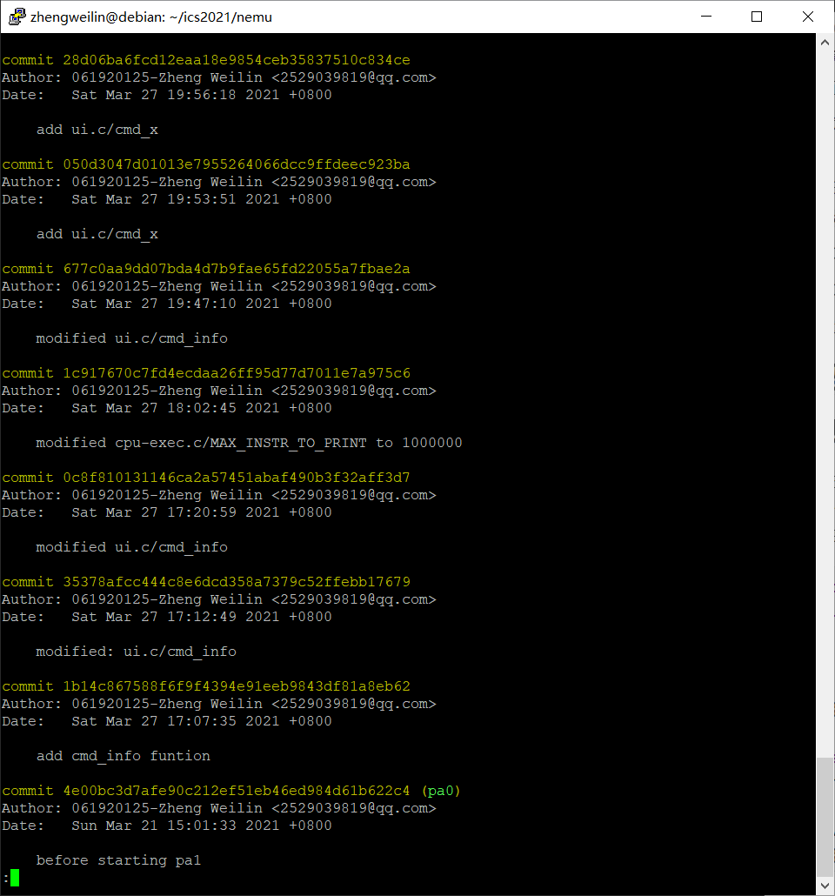
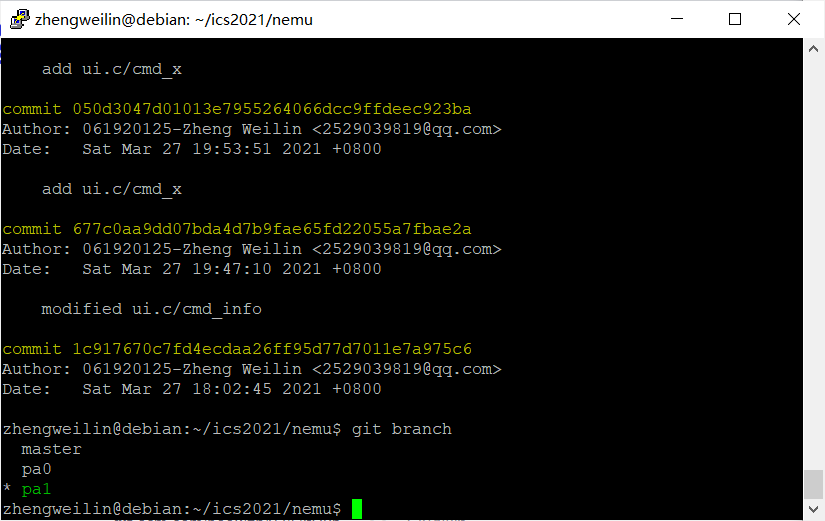
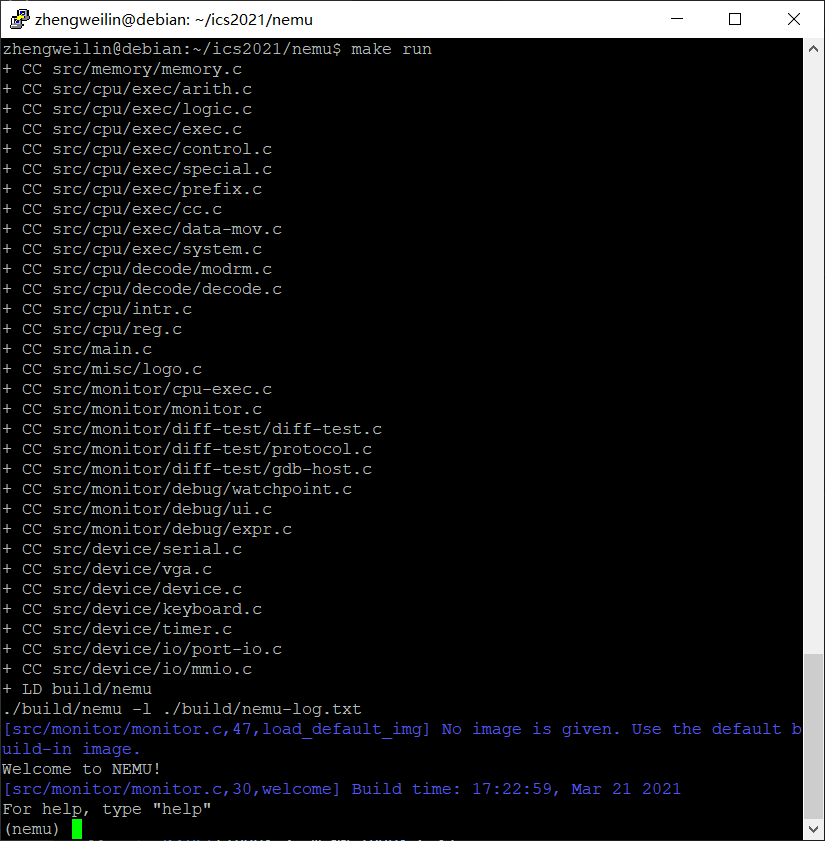
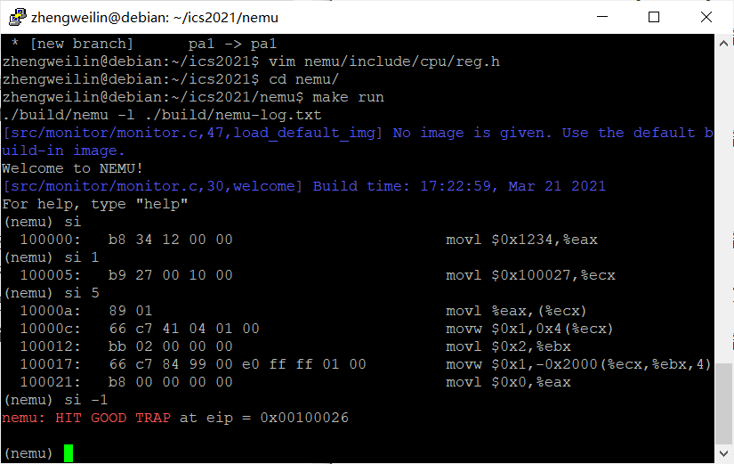
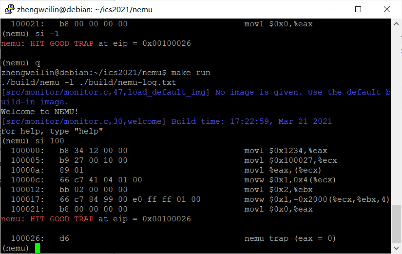
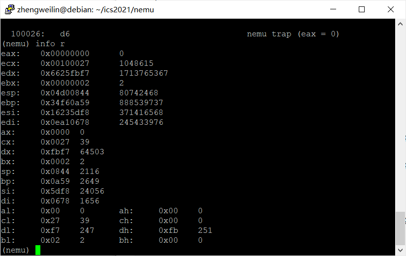
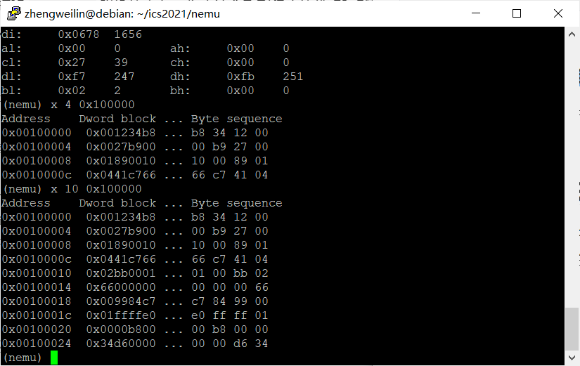

# 南京航空航天大学《计算机组成原理Ⅱ课程设计》报告

* 姓名：郑伟林
* 班级：1619303
* 学号：061920125
* 报告阶段：PA1.1
* 完成日期：2021.3.28
* 本次实验，我完成了所有内容。

## 目录

[TOC]

## 思考题

1. 存放的是什么？

   ​	PC中存放的是下一条指令的地址，这样在一条指令执行完后下一条指令可以继续被运行，PC再+1到下一条指令，程序就可以自动执行一段指令序列。而当前指令是存放在IR中。

2. 贵圈真乱

   ```
   +---------------------------------+
   |      "Hello World" program      |
   +---------------------------------+
   +      Micro operating system     +
   +---------------------------------+
   |              NEMU               |
   +---------------------------------+
   |            GNU/Linux            |
   +---------------------------------+
   | VirtualBox (Simulated Hardware) |
   +---------------------------------+
   |      Host Operating System      |
   +---------------------------------+
   |        Computer hardware        |
   +---------------------------------+
   ```
   
   
   
3. 虚拟机和模拟器的区别

   ​	我觉得虚拟机实际上是直接使用Host主机的硬件系统来运行操作系统，而NEMU是用程序构建了一系列硬件系统从而再运行操作系统，是从组成层开始构建。

4. 从哪开始阅读代码呢？

   ​	应该找到目录下的`main.c`文件开始执行其主函数`main`.

5. 究竟要执行多久？

   ​	`cpu_exec()`函数的形参是`uint64_t`其本质是`unsigned long long`类型，是无符号的整型，如果传给它-1，则以-1的补码形式是全1，截去符号位后为`unsigned long long`的最大值，因此函数可以执行最大指令数，即将指令全部运行。

6. 谁来指示程序的结束？

   ​	`main()`函数的返回语句只是将函数本身结束并返回一个值，该值会供操作系统判断程序是否正常结束，而真正让程序结束的是`exit()`函数，其在`main()`结束后会隐式调用结束程序。

7. 为什么会这样？

   ​	数据是按字节存储的，在读取时，x86是从低位到高位的，所以一次性打印4字节和以1字节打印4次时，顺序看起来是不一样的。如`0x00ab1234`，以1字节打印时，先取低位`34`，再`12`，再`ab`，再`00`。

8. Git Log截图

   

9. Git Branch截图

   

10. 远程git仓库提交截图

    

## 实验内容

### 实现寄存器结构体(30分)

​	根据寄存器结构，我们应该可以通过`cpu.gpr[0]._32`访问`eax`，而`cpu.gpr[0]._16`访问`eax`的低16位，`cpu.gpr[0]._8[0]`访问`eax`的低8位，因为三者类型不同，因此我们可以考虑使用union结构来包含这些结构。

```c
typedef union {
  union {
    uint32_t _32;
    uint16_t _16;
    uint8_t _8[2];
  } gpr[8];

  struct{
  rtlreg_t eax, ecx, edx, ebx, esp, ebp, esi, edi;

  vaddr_t eip;
  };
} CPU_state;
```



### 实现单步执行(15 分)

​	实现函数为`static int cmd_si(char *args)`，首先对缺省时进行判断，执行一步，再对负数进行判断，如果是-1的话执行`cpu_exec(-1)`，接下来才是正数时，通过分解字符串`args`从低位到高位将其转为整数n，执行`cpu_exec(n)`。

​	最后记得再`cmd_table`中添加相关字符串及函数名。

```c
static int cmd_si(char *args){
  if (args == NULL )
  {
    cpu_exec(1);
    return 0;
  }

  if (args[0] == '-')
  {
    if (args[1] == '1' && strlen(args)==2)
    {
      cpu_exec(-1);
    }
    else
	printf("Unknown comand si '%s'\n",args);
  }
  else
  {
    for(int i=0;i<strlen(args);i++)
    {
      if (args[i]<'0' || args[i]>'9')
      {
        printf("Unknown command si '%s'\n",args);
	return 0;
      }
    }
    int c = 1;
    int n = 0;
    for (int i = strlen(args) - 1; i >= 0; i--)
    {
      n += (args[i] - '0') * c;
      c *= 10;
    }
    cpu_exec(n);
  }
  return 0;
}
static int cmd_q(char *args) {
  return -1;
}
```



### 修改⼀次打印步数上限(10 分)

​	该问题是在`/nemu/src/monitor/cpu-exe.c/cpu_exec(unit64_t n)`函数中，会对n进行判断，如果`n>MAX_INSERT_TO_PRINT`则将打印标记记为false即不打印，所以我们可以通过修改`MAX_INSERT_TO_PRINT`，将其改为很大的数或者-1来扩大其打印范围。

```c
#define MAX_INSTR_TO_PRINT 1000000
```



### 实现打印寄存器功能(15 分)

​	实现函数为`static int cmd_info(char *args)`，打印寄存器的核心代码在于三个循环，每个循环中都打印相应寄存器的值，分别是整个寄存器的值、低十六位的值和低八位的值。直接访问`cpu.gpr[i]._32`、`cpu.gpr[i]._16`、`cpu.gpr[i]._8[0]`和`cpu.gpr[i]._8[1]`。

​	最后记得在`cmd_table`中添加相关代码。

```c
static int cmd_info(char *args)
{
  // 分割字符
  if (strlen(args) != 1 || ((args[0] != 'r') && (args[0] != 'w')))
  {
    printf("Unknown command info '%s'\n", args);
    return 0;
  }
  // 判断子命令是否是r
  if (args[0] == 'r')
  {
    // 依次打印所有寄存器
    // 这里给个例子：打印出 eax 寄存器的值
    for (int i = 0; i < 8; i++)
      printf("%s:\t0x%08x\t%d\n", regsl[i], cpu.gpr[i]._32,cpu.gpr[i]._32);
    for (int i = 0; i < 8; i++)
      printf("%s:\t0x%04x\t%d\n", regsw[i], cpu.gpr[i]._16,cpu.gpr[i]._16);
    for (int i = 0; i < 4; i++)
      printf("%s:\t0x%02x\t%d\t%s:\t0x%02x\t%d\n",
       regsb[i], cpu.gpr[i]._8[0],cpu.gpr[i]._8[0],regsb[i+4],cpu.gpr[i]._8[1],cpu.gpr[i]._8[1]);
    
    return 0;
  }
  else if (args[0] == 'w')
  {
    // 这里我们会在 PA1.3 中实现
  }
  return 0;
}
```



### 实现扫描内存功能(15 分)

​	实现函数为`static int cmd_x(char *args)`，首先分割字符串，利用`strtok`函数分解到`num`和`addr_s`，中，接着利用字符串操作从低位将字符转为数值到`n`和`addr`中，接着循环n次调用`vaddr_read(addr,4)`输出相应内存里的信息。

​	最后记得在`cmd_table`中添加相关代码。

```c
static int cmd_x(char *args){
    //分割字符串，得到起始位置和要读取的次数
    char *num = strtok(NULL," ");
    char *addr_s = strtok(NULL," ");
    int n = 0,c=1;
    for (int i = strlen(num) - 1; i >= 0; i--)
    {
      n += (num[i] - '0') * c;
      c *= 10;
    }

    uint32_t dword,temp,addr=0;
    c=1;
    for (int i = strlen(addr_s)-1; addr_s[i]!='x'; i--)
    {
      if (addr_s[i]>='0' && addr_s[i]<='9')
      {
        addr+=(addr_s[i]-'0')*c;
      }
      else if (addr_s[i]>='a' && addr_s[i]<='f')
      {
        addr+=(addr_s[i]-'a'+10)*c;
      }
      c*=16;
    }

    //循环使用 vaddr_read 函数来读取内存
    printf("Address    Dword block ... Byte sequence\n");
    for(int i=0;i<n;i++){
        uint16_t byte_seq[4]={0};
        dword = vaddr_read(addr,4);    //如何调用，怎么传递参数，请阅读代码
        temp=dword;
        for (int j = 0; j < 4; j++)
        {
          byte_seq[j]=temp % 256;
          temp/=256;
        }

    //每次循环将读取到的数据用 printf 打印出来
        printf("0x%08x  0x%08x ... %02x %02x %02x %02x\n",
        addr,dword,byte_seq[0],byte_seq[1],byte_seq[2],byte_seq[3]);    //如果你不知道应该打印什么，可以参考参考输出形式
        addr+=4;
    }
    return 0;
}
```



### 实现扫描内存字节单位显示(15 分)

​	在`static int cmd_x(char *args)`中我们可以先将`dword`复制一份到`temp`中，再对temp进行分解，要按一字节一字节分解只需将`temp`不断`%256`，再`/256`，存到一个数组里，最后打印出来即可。

```c
  temp=dword;
  for (int j = 0; j < 4; j++)
  {
     byte_seq[j]=temp % 256;
     temp/=256;
  }
  printf("0x%08x  0x%08x ... %02x %02x %02x %02x\n",
  	addr,dword,byte_seq[0],byte_seq[1],byte_seq[2],byte_seq[3]);
```

……

## 遇到的问题及解决办法

1. 遇到问题：在完成`cmd_x`命令时输出和预想的不一样。

   解决方案：通过对各个变量分析定位，最后确定时`strtok`函数截取字符串时有问题，再去查阅相关资料后，才明白`strtok`的正确用法，在第一次只需`strtok`后，之后再用`strtok`不需再传原字符串，只需传`NULL`。

2. 遇到问题：git操作时没有可提交的东西。

   解决方案：通过网络搜寻和询问同学之后，才知道在对代码修改过后，需要立马`git add .` 和`git commit`，否则退回上一层文件夹或运行操作后，这次修改的信息会被丢弃掉。因此在改完代码后需马上进行git操作进行记录。

3. 无

## 实验心得

​	做完了PA1.1，本阶段主要是完善寄存器结构和完成`nemu`的调试方法的函数。通过这次课设内容，我对寄存器的结构有了进一步了解，学会了利用结构体和联合嵌套来模拟其结构。同时，阅读了一部分的`nemu`源码，见识到了一些C语言的特别的用法。在编写代码时，对`strtok`函数的用法有了进一步了解。在整个实验过程中，不断利用git来提交保存修改，对git的使用更加熟练。

## 其他备注

无