# 南京航空航天大学《计算机组成原理Ⅱ课程设计》报告

* 姓名：郑伟林
* 班级：1619303
* 学号：061920125
* 报告阶段：PA1.2&1.3
* 完成日期：2021.4.15
* 本次实验，我完成了所有内容。

## 目录

[TOC]

## 思考题

1. 有什么办法？（5分）

   ​	①建立操作数栈和运算符栈，将操作数和运算符分开处理，执行时遇到数进操作数栈，遇到运算符要根据优先级来判断是要作运算还是进栈。

   ​	②后缀表达式法，可以先将表达式转化为后缀表达式，再用栈进行运算。

2. 一些简单的正则表达式（10分） 

   ①0x[a-fA-F0-9]{32}

   ②[0-9A-Za-z]+

   ③/[a-zA-Z_]{1}[a-zA-Z0-9_]*

   ④\d{9} - [\u4e00-\u9fa5]+ - PA1.1.pdf

3. 这是为什么？（5分） 

   因为需要经过两次转义，一次是编译器的转义，一次是正则引擎的转义，所以需要两个'\\'来转义。

4. 如何处理以上的问题（5分） 

   ​	在`make_token`之后`eval`之前，对负号`-`，解引用号`*`，非`!`进行额外的标记类别；在`eval`函数中，在`find_dominated_op`之前，对单元运算符进行递归。

5. 递归求值的过程？（5分） 

   ​	根据BNF定义：

   ```
   <expr> ::= <number>        #一个数也是一个表达式两者等价
      | "(" <expr> ")"        #表达式加括号也是表达式
      | <expr> "+" <expr>     #中间用加号连接也是表达式
      | <expr> "-" <expr>     #表达式相减也是表达式
      | <expr> "*" <expr>     #...
      | <expr> "/" <expr>
   ```

   ​	以表达式`4 +3*(2- 1)`为例，其可分为一下两部分<u>4</u> 和<u>3*(2- 1)</u>，是`<expr> "+" <expr>`类型，只要返回两者相加即可，要求两者值只需递归调用`eval`分别求值。4是一个`<number>`，所以返回其值；<u>3*(2- 1)</u>是`<expr> "*" <expr>`类型，返回两者相乘，子表达式继续递归调用`eval`。

   

6. 体验监视点（5分） 

   ​	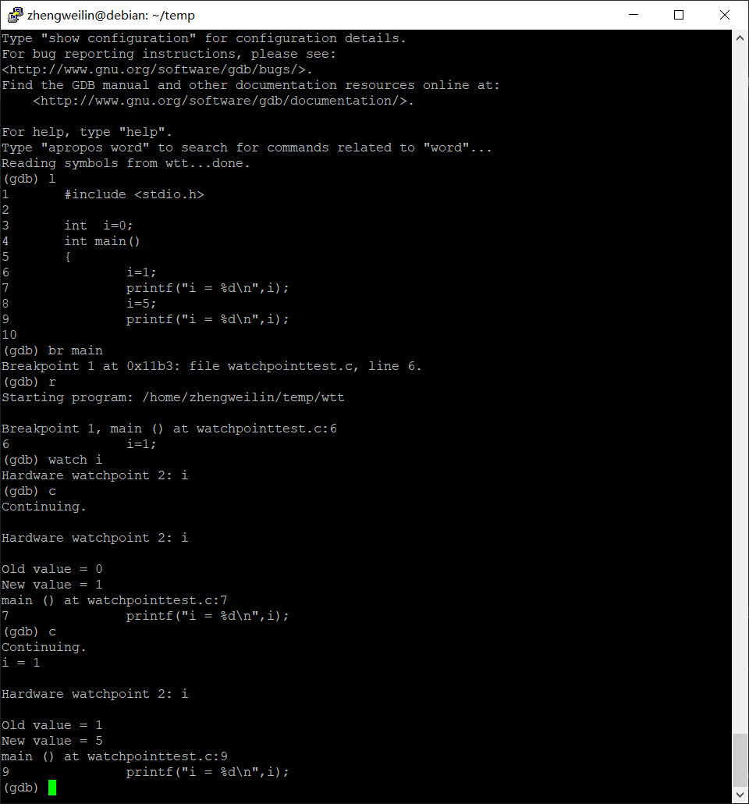

7. 科学起名（5分） 

   ​	不能用free，因为C语言中free是一个保留字，有内部的`free()`函数。

8. 温故而知新（5分） 

   ​	用static修饰可以使`wp_pool`等变量仅在当前文件下可见，保护了变量不会被其它操作所修改，避免监视点池被意外的更改导致监视点异常。

9. 一点也不能长？（10分） 

   ​	必须是一个字节，因为断点设置时是将原指令第一个字节存储并替换为`int3`，所以其必须是一个字节，否则读取会错误。

   ​	不能，因为只将`int3`改为2个字节，而去替换原指令一个字节空间不够，int3不能完整替换到指定空间。

10. “随心所欲”的断点（10分） 

    ​	断点不能正常运作，因为如果将`int3`设置在非首字节，`gdb`就无法检测到首字节的`int3`命令。

11. NEMU的前世今生（5分） 

    ​	模拟器是通过程序模拟计算机系统硬件的运作，其也带有一定的调试程序以便测试程序；而调试器是运用程序来对程序进行各种调试。

    ​	相比我们NEMU中直接编写函数对目标进行调试，GDB它是截获目标进程与操作系统之间的信号，通过这个信号来进行各种调试功能。

12. 尝试通过目录定位关注的问题（5分） 

    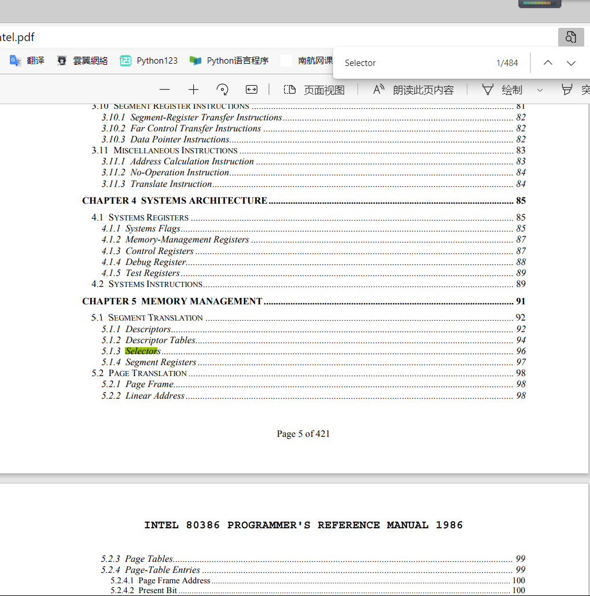

13. 理解基础设施（5分） 

    ​	调试75小时，简易调试器能省50小时。

14. 查阅i386手册（5分） 

    ​	①在手册3.2有详细介绍EFLAGS的内容，在P419中有总结。

    ​	②在手册17.2.1中有具体说明。

    ​	③在手册P345与P347中有说明。

15. shell 命令（5分） 

    ```shell
     find . -name "*[.hl.cpp]" | xargs wc -l
    ```

    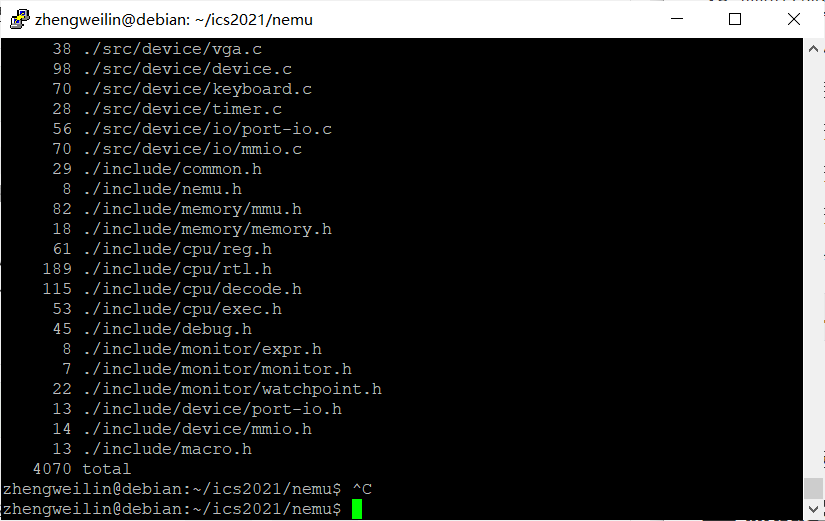

    ```shell
    find . -name "*[.cppl.h]" | xargs grep "^." | wc -l
    ```

    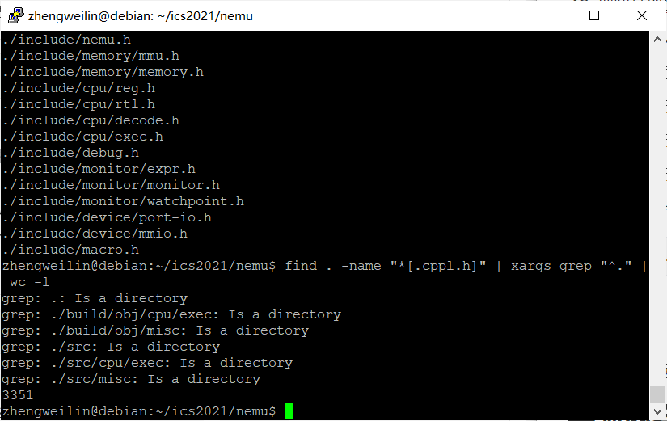

    用git返回上一次分支后查看代码行数，经计算共写了534行代码。 

16. 使用man（5分） 

    ​	`-Wall`使GCC产生更多警告信息，并取消编译，打印出所有警告与错误信息。

    ​	`-Werror`使GCC将所有警告当错误，并取消编译。

    ​	使用两者是为了尽可能减少错误，避免某些警告在将来成为错误。

17. git log和远程git仓库提交截图（5分）

    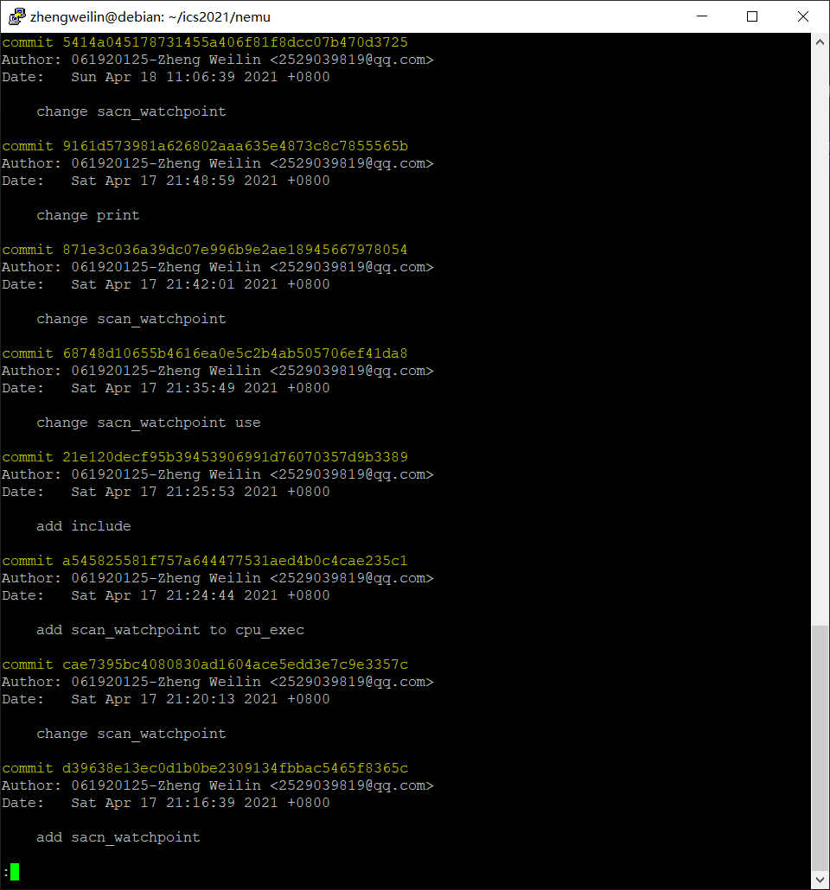

    

## 实验内容

#### 1.编写匹配规则(1) (5分)

​	根据正则表达式的定义，可以添加如下规则：

```c
	{" +", TK_NOTYPE},                                       // spaces
    {"0x[a-fA-F0-9]+|\\d+", TK_NUM},                         // number
    {"\\$eax|\\$ebx|\\$ecx|\\$edx|\\$esp|\\$ebp|\\$esi|\\$edi|\\$eip", TK_REG}, //register
    {"\\(", '('},                                              //left parenthese
    {"\\)", ')'},                                              //right parenthese
    {"\\*", '*'},                                              // multiply
    {"\\/", '/'},                                              // divide
    {"\\+", '+'},                                            // plus
    {"-", '-'},                                              // reduce
    {"==", TK_EQ}                                            // equal
```

​	由于`+`、`*`、`/`、`(`、`)`、`$`需要转义，因此在前面添加两个转义字符。

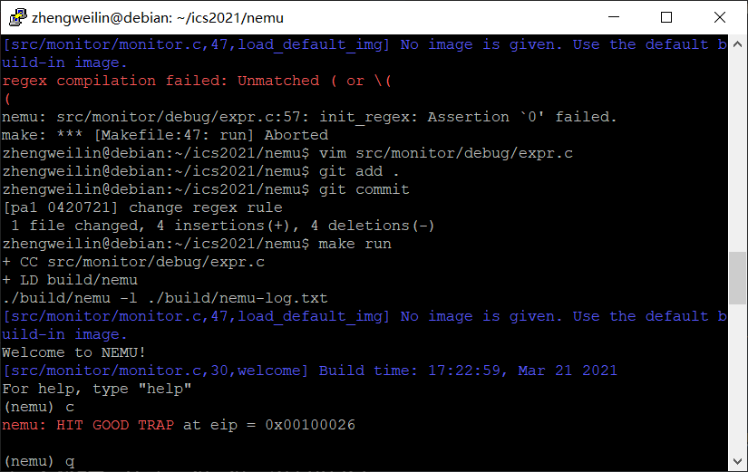

#### 2.添加 p 命令 (5分)

在`ui.c`中添加`cmd_p`函数用来处理表达式，其调用了expr对表达式字符串进行处理求值。

```c
static int cmd_p(char *args){
  bool isSuccess;
  uint32_t ans;

  ans=expr(args,&isSuccess);
  if (isSuccess)
  {
    printf("%d\n",ans);
  }
  else
  {
    printf("Bad Expression!\n");
  }
  
  return 0;
}
```

​	再在`cmd_table`中添加相关信息。

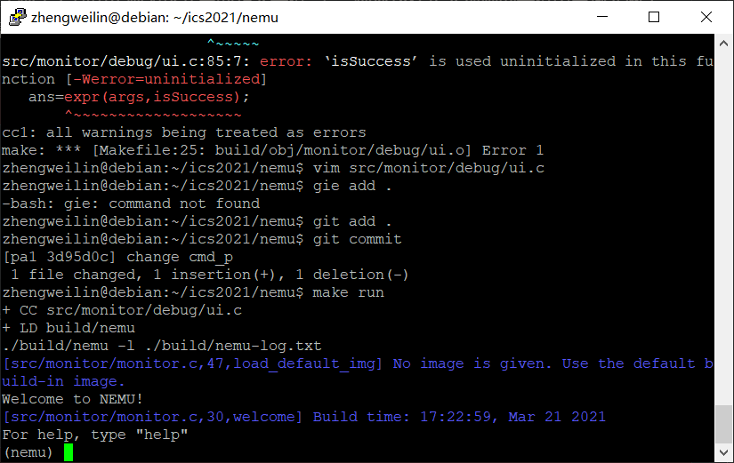

#### 3.识别并存储 token (10分)

​		`token`是在`make_token`函数中识别并存储的。

​		`token`存储在`tokens`数组中，因为还需记录token的字符串内容，因此其包含`str`变量用以存储字符串，为解决字符串长度会溢出问题，我采用动态申请字符数组空间的方法，避免数组爆掉。利用`strncpy`即可很方便的复制子串到`tokens`中。

```c
static bool make_token(char *e)
{
  int position = 0;
  int i;
  regmatch_t pmatch;

  nr_token = 0;

  while (e[position] != '\0')
  {
    /* Try all rules one by one. */
    for (i = 0; i < NR_REGEX; i++)
    {
      if (regexec(&re[i], e + position, 1, &pmatch, 0) == 0 && pmatch.rm_so == 0)
      {
        char *substr_start = e + position;
        int substr_len = pmatch.rm_eo;

        Log("match rules[%d] = \"%s\" at position %d with len %d: %.*s",
            i, rules[i].regex, position, substr_len, substr_len, substr_start);
        position += substr_len;

        switch (rules[i].token_type)
        {
        case TK_NOTYPE:
          break;
        default:
          tokens[nr_token].type = rules[i].token_type;
          // if (substr_len >= 32)
          if (tokens[nr_token].str)
            free(tokens[nr_token].str);
          tokens[nr_token].str = (char *)malloc(sizeof(char) * substr_len + 1);
          strncpy(tokens[nr_token].str, substr_start, substr_len);
          tokens[nr_token].str[substr_len] = '\0';
          nr_token++; //记录已识别信息
        }

        break;
      }
    }

    if (i == NR_REGEX)
    {
      printf("no match at position %d\n%s\n%*.s^\n", position, e, position, "");
      return false;
    }
  }

  return true;
}
```

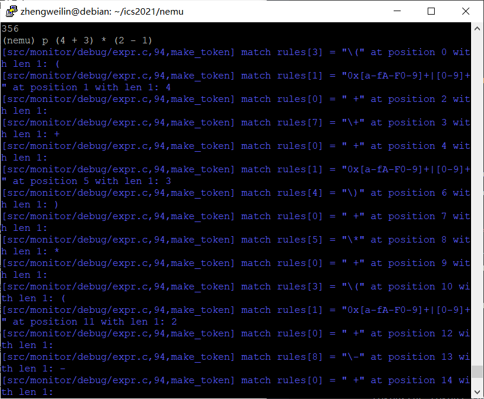

#### 4. 实现括号匹配 (5分)

​		括号匹配是在check_parentheses函数中实现。

​	主要方法是先判断最外层是否有左右括号，没有的话直接返回false，再对p+1到q-1区间内的左右括号进行入栈出栈操作，若中途发现右括号多于左括号，直接返回false。最后在对栈进行判断，栈空则返回true，否则返回false。

```c
bool check_parentheses(int p, int q)
{
  if (strcmp(tokens[p].str, "(") != 0 || strcmp(tokens[q].str, ")") != 0)
    return false;

  int k = p + 1;
  int ps = 0;
  char *s;
  s = (char *)malloc(nr_token * (sizeof(char)));
  while (k < q)
  {
    switch (tokens[k].type)
    {
    case '(':
      s[ps++] = '(';
      break;
    case ')':
      ps--;
      if (ps < 0)
        return false;
      break;

    default:
      break;
    }
    k++;
  }
  if (ps == 0)
    return true;
  else
    return false;
}
```

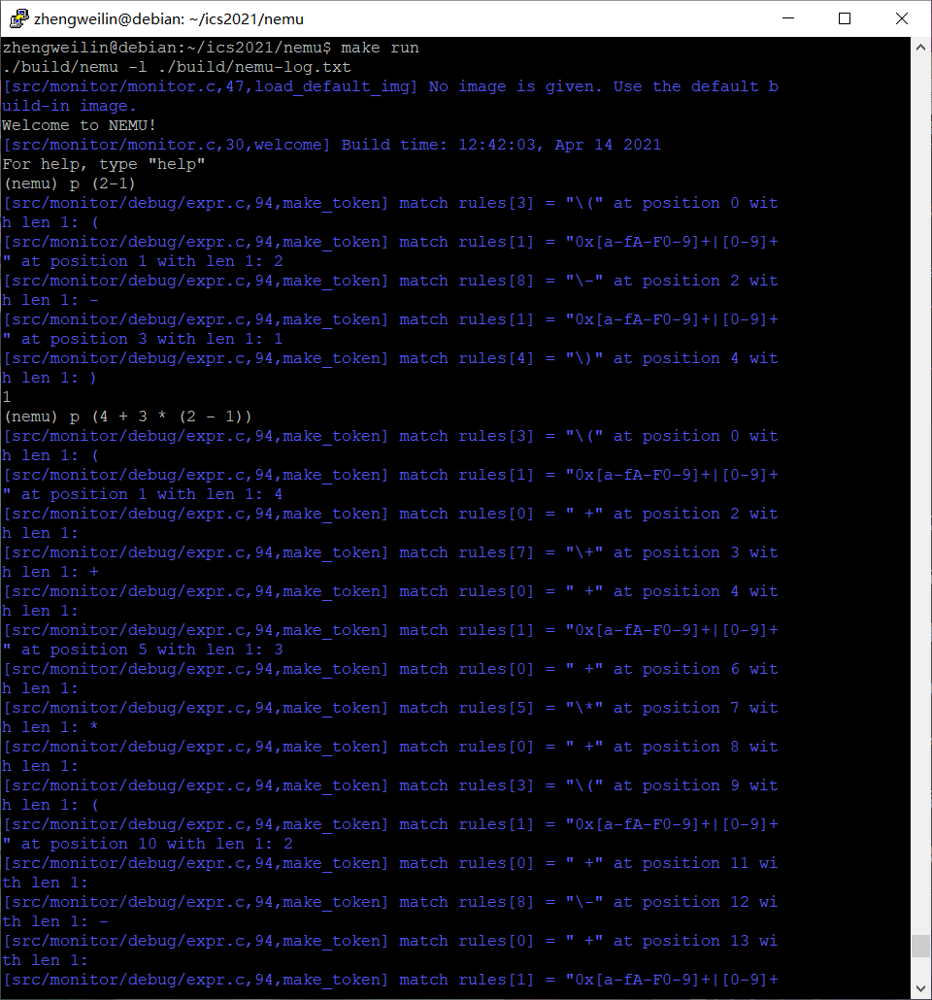

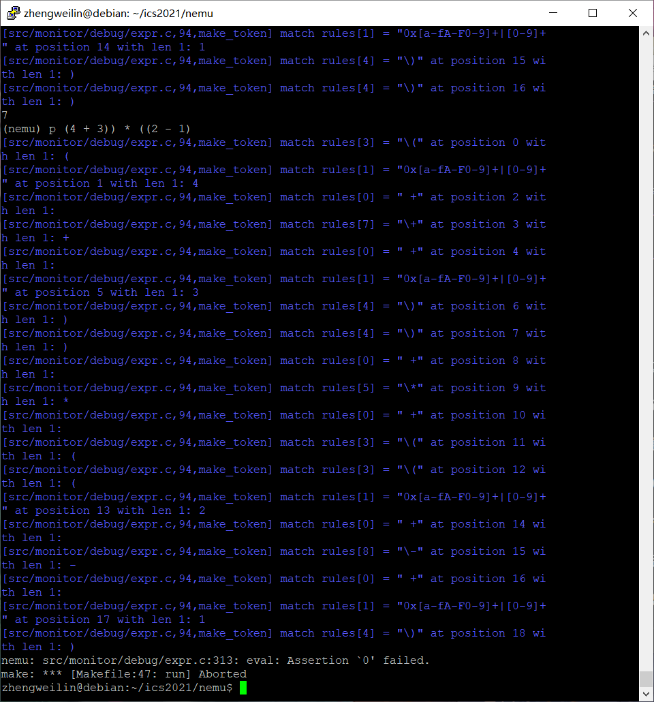

#### 5. 实现子表达式拆分 (5分)

​	表达式拆分是在find_dominated_op函数中实现。

​	其思想是忽略括号中的运算符，然后对外层所有运算符判断优先级，选最低的最右侧运算符。

优先顺序为： `* /`   >   `+ -`   >   `== !=`   >   `&&`   >   `||`

```c
uint32_t find_dominated_op(int p, int q, bool *success)
{
  //忽略括号中的运算符，然后对外层所有运算符判断优先级，选最低的最右侧运算符
  int posOfPlusOrReduce = -1;
  int posOfMultiplyOrDivide = -1;
  int posOfEqOrUeq = -1;
  int posOfAnd = -1;
  int posOfOr = -1;
  int numOfParenthese = 0;
  *success = true;

  for (int i = p; i <= q; i++)
  {
    switch (tokens[i].type)
    {
    case '(':
      numOfParenthese++;
      continue;
    case ')':
      numOfParenthese--;
      continue;
    }
    if (numOfParenthese == 0)
    {
      switch (tokens[i].type)
      {
      case '-':
      case '+':
        posOfPlusOrReduce = i;
        break;
      case '*':
      case '/':
        posOfMultiplyOrDivide = i;
        break;
      case TK_EQ:
      case TK_UEQ:
        posOfEqOrUeq = i;
        break;
      case TK_AND:
        posOfAnd = i;
        break;
      case TK_OR:
        posOfOr = i;
        break;

      default:
        break;
      }
    }
  }

  if (posOfPlusOrReduce == -1 && posOfMultiplyOrDivide == -1 && posOfEqOrUeq == -1 && posOfAnd == -1 && posOfOr == -1)
  {
    *success = false;
    return -1;
  }

  if (posOfOr != -1)
    return posOfOr;
  else if (posOfAnd != -1)
    return posOfAnd;
  else if (posOfEqOrUeq != -1)
    return posOfEqOrUeq;
  else if (posOfPlusOrReduce != -1)
    return posOfPlusOrReduce;
  else
    return posOfMultiplyOrDivide;
}
```

#### 6. 实现表达式求值 (15分)

​		表达式求值是利用`eval`函数递归调用实现。

​	函数对tokens数组进行操作，参数p、q指向头和尾，如果p>q了，则表示表达式有误；如果p==q则当前递归到了某个数值或寄存器，若是寄存器，则匹配寄存器名称并返回相应的值，若是数值，则根据其是十进制还是十六进制进行评估并返回。如果p<q则先判断有无单元操作符`!` 、`-` 、`*`，然后进行递归，若无，则先进行中心操作符查找`find_dominated_op`，然后根据返回情况递归调用。

```c
uint32_t eval(int p, int q)
{
  if (p > q)
  {
    /* Bad expression */
    assert(0);
  }
  else if (p == q)
  {
    if (tokens[p].type == TK_REG)
    {
      for (int i = 0; i < 8; i++)
      {
        if (strcmp(tokens[p].str + 1, regsl[i]) == 0)
          return cpu.gpr[i]._32;
        if (strcmp(tokens[p].str + 1, regsw[i]) == 0)
          return cpu.gpr[i]._16;
        if (strcmp(tokens[p].str + 1, regsb[i]) == 0)
          return reg_b(i);
      }
      if (strcmp(tokens[p].str + 1, "eip") == 0)
        return cpu.eip;
      printf("%s is not exist!\n", tokens[p].str);
      assert(0);
    }

    uint32_t radix = 1, num = 0;
    if (tokens[p].str[0] == '0' && tokens[p].str[1] == 'x') //Hex number
    {
      for (int i = strlen(tokens[p].str) - 1; i > 1; i--)
      {
        if (tokens[p].str[i] >= '0' && tokens[p].str[i] <= '9')
          num += radix * (tokens[p].str[i] - '0');
        else
          num += radix * (tokens[p].str[i] - 'a' + 10);
        radix *= 16;
      }
    }
    else
    {
      for (int i = strlen(tokens[p].str) - 1; i >= 0; i--)
      {
        num += radix * (tokens[p].str[i] - '0');
        radix *= 10;
      }
    }
    if (tokens[p].type == TK_DNUM)
      num = 0 - num;
    if (tokens[p].type == DEREF)
      return vaddr_read(num, 4);
    return num;
  }
  else if (check_parentheses(p, q) == true)
  {
    return eval(p + 1, q - 1);
  }
  else
  {
    bool isSuccess;

    switch (tokens[p].type)
    {
    case TK_DNUM:
      return 0 - eval(p + 1, q);
    case DEREF:
      return vaddr_read(eval(p + 1, q), 4);
    case '!':
      return !(eval(p + 1, q));
    default:
      break;
    }
    uint32_t op = find_dominated_op(p, q, &isSuccess);
    if (!isSuccess)
      assert(0);
    uint32_t val1 = eval(p, op - 1);
    uint32_t val2 = eval(op + 1, q);
    switch (tokens[op].type)
    {
    case '+':
      return val1 + val2;
    case '-':
      return val1 - val2;
    case '*':
      return val1 * val2;
    case '/':
      return val1 / val2;
    case TK_EQ:
      return (val1 == val2);
    case TK_UEQ:
      return (val1 != val2);
    case TK_AND:
      return (val1 && val2);
    case TK_OR:
      return (val1 || val2);
    default:
      assert(0);
    }
  }
}
```

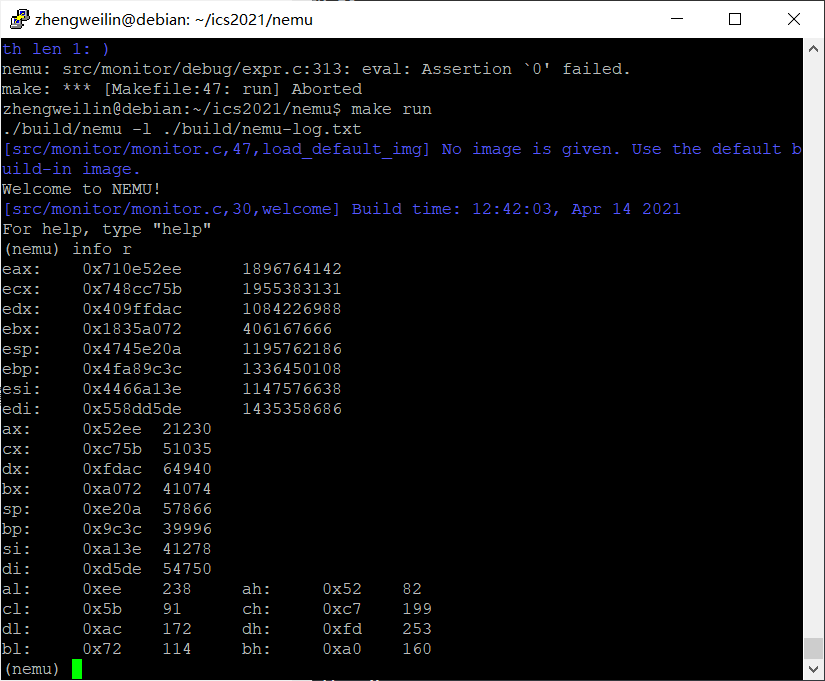

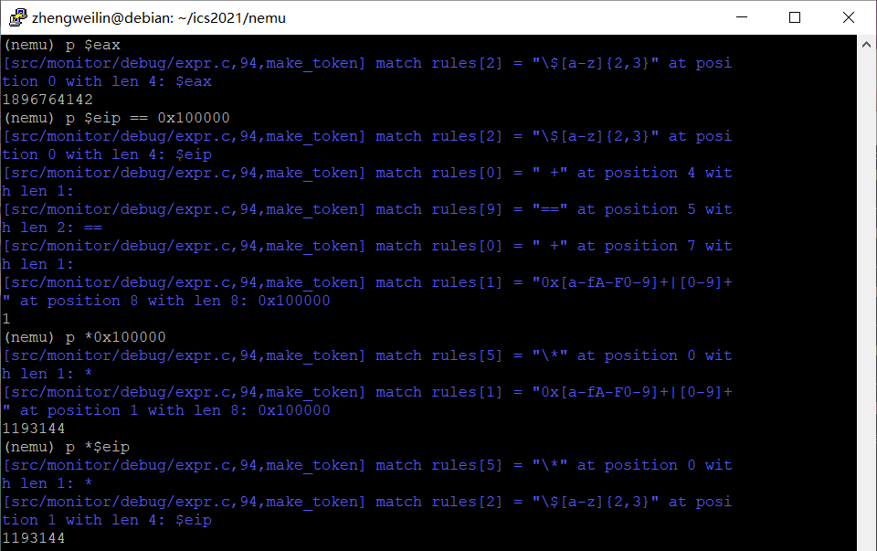

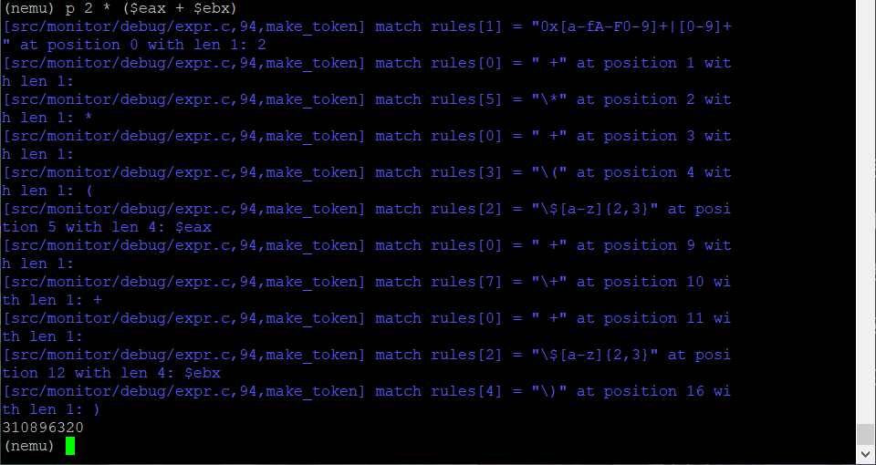

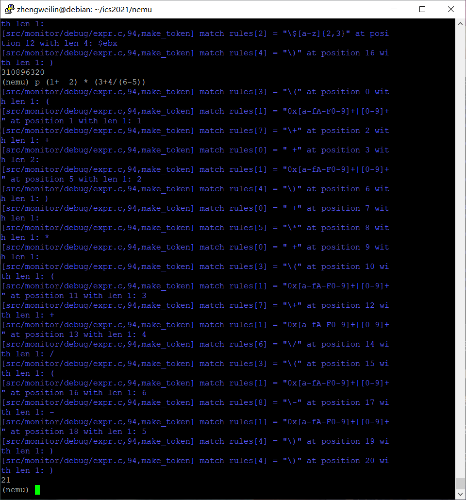


#### 7. 实现指针解引用 (5分)

​	指针的解引用是`make_token`后通过对指针符号`*`进行标记类型为`DEREF`，然后再`eval`函数中p<q时对`tokens[p].type`为`DEREF`类型时进行递归调用`vaddr_read(eval(p + 1, q), 4)`，具体代码在上一步已详细展示。

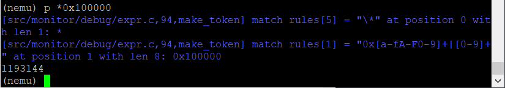

#### 8. 实现负数 (加分项，5分)

​	负数实现与指针解引用类似，先在`make_token`后标记`-`，然后同样在`eval`中递归调用`0 - eval(p + 1, q)`。

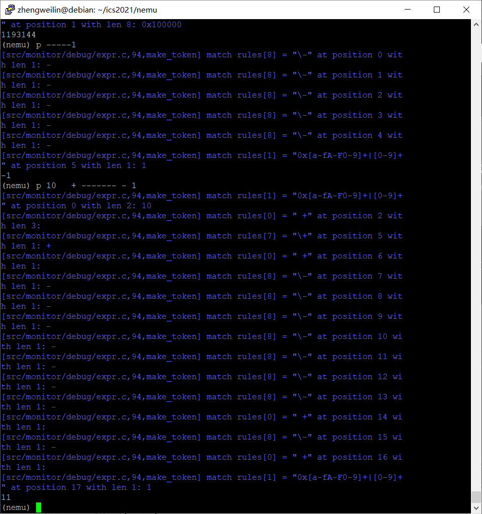

#### 9. 实现x命令使用表达式求值 (加分项，5分)

​	修改`cmd_x`函数中处理后半部分的代码，将其改为调用`expr`函数。

```c
static int cmd_x(char *args)
{
  //分割字符串，得到起始位置和要读取的次数
  ......

  uint32_t dword, temp, addr = 0;
  bool isSuccess=false;
  addr = expr(addr_s, &isSuccess);
  if (!isSuccess)
  {
    printf("Bad Expression!\n");
    return 0;
  }
  /*原代码
  	c=1;
    for (int i = strlen(addr_s)-1; addr_s[i]!='x'; i--)
    {
      if (addr_s[i]>='0' && addr_s[i]<='9')
      {
        addr+=(addr_s[i]-'0')*c;
      }
      else if (addr_s[i]>='a' && addr_s[i]<='f')
      {
        addr+=(addr_s[i]-'a'+10)*c;
      }
      c*=16;
    }*/

  //循环使用 vaddr_read 函数来读取内存
  ......
      
  return 0;
}
```

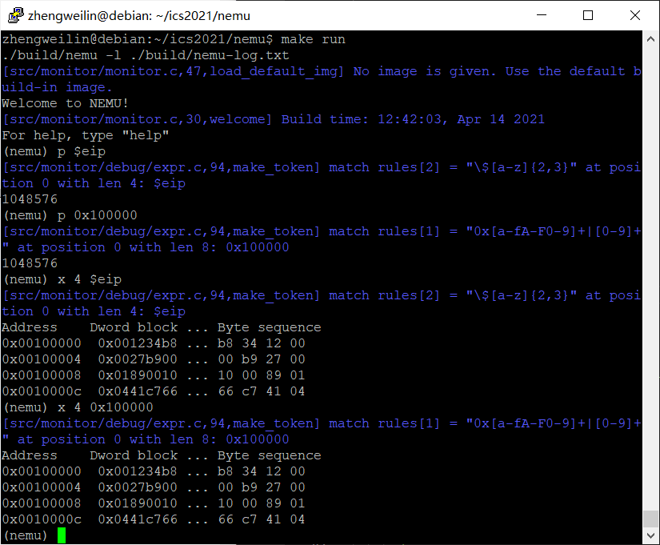

#### 10. 监视点结构体 (5分)

​	添加三个新成员，`expr`存表达式，`old_val`、`new_val`存旧值和新值。

```c
typedef struct watchpoint
{
  int NO;
  struct watchpoint *next;

  /* TODO: Add more members if necessary */
  char *expr; //被监视的表达式
  uint32_t new_val;
  uint32_t old_val;

} WP;
```

#### 11. 监视点池的管理 (10分)

​	`new_wp`函数是从`free_`链表中取出一个节点添加到head链表中。并返回该结点指针。

```c
WP *new_wp()
{
  if (free_ == NULL)
    assert(0);

  WP *temp;
  temp = free_;
  free_ = free_->next;

  temp->next = head;
  head = temp;

  return temp;
}
```

​	`free_wp`函数是根据参数`num`从`head`链表中搜索到`NO`为`num`的节点，将其取下接到`free_`链表中。

```c
bool free_wp(int num)
{
  WP *p;
  WP *pre;

  for (p = head; p != NULL; p = p->next)
  {
    if (p->NO == num)
    {
      if (p == head)
        head = head->next;
      else
        pre->next = p->next;
      p->next = free_;
      free_ = p;
      return true;
    }
    pre = p;
  }

  return false;
}

```

#### 12. 监视点加入调试器 (15分)

​	在`ui.c`中添加`cmd_w`函数，其将建立一个以表达式EXPR为监视对象的监视点。在函数中直接调用set_watchpoint 函数建立新节点即可。

```c
static int cmd_w(char *args)
{
  if (args == NULL)
  {
    printf("Bad Expression!\n");
    return 0;
  }

  set_watchpoint(args);

  return 0;
}
```

​	在`ui.c`中添加`cmd_d`函数，其将删除编号为NUM的监视点，调用`delete_watchpoint`函数删除。

```c
static int cmd_d(char *args)
{
  int t;
  if (args==NULL)
  {
    printf("Please input Watchpoint NO!\n");
    return 0;
  }
  
  sscanf(args,"%d",&t);
  if (!delete_watchpoint(t))
    printf("Can't delete watchpoint %s\n",args);
  else
    printf("Delete watchpoint #%s\n",args);

  return 0;
}
```

​	在`cmd_info`函数中补充`args==w`时调用list_watchpoint函数。

```c
......
else if (args[0] == 'w')
  {
    // 这里我们会在 PA1.3 中实现
    list_watchpoint();
  }
......
```

#### 13. 监视点主要功能 (20分)

​	先在`watchpoint.h`中声明一下函数，以便其它文件调用。

```c
int set_watchpoint(char *e);
bool delete_watchpoint(int NO);
void list_watchpoint(void);
WP* scan_watchpoint(void);
```

​	然后在`watchpoint.c` 中定义函数内容。

​	`set_watchpoint` 函数，根据e表达式，先用`new_wp()`函数取得一个新节点，然后将申请表达式字段的空间并赋值，初始化`old_val`。

```c
int set_watchpoint(char *e) //给予一个表达式e，构造以该表达式为监视目标的监视点，并返回编号
{
  WP *temp;
  temp=new_wp();

  if (temp->expr != NULL)
    free(temp->expr);
  temp->expr = (char *)malloc(sizeof(char) * strlen(e) + 1);
  strcpy(temp->expr, e);
  bool isSuccess;
  temp->old_val = expr(e, &isSuccess);

  printf("Set watchpoint #%d\nexpr      = %s\nold value = 0x%x\n",temp->NO,temp->expr,temp->old_val);

  return temp->NO;
}
```

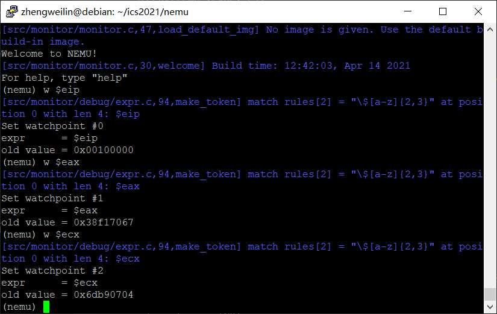

​	`delete_watchpoint` 函数直接调用`free_wp`即可。

```c
bool delete_watchpoint(int NO) //给予一个监视点编号，从已使用的监视点中归还该监视点到池中
{
  return free_wp(NO);
}
```

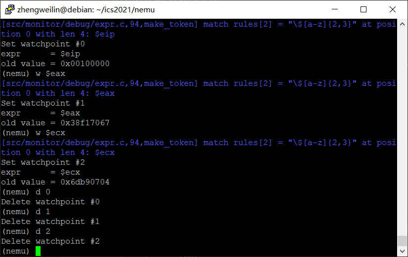

​	`list_watchpoint` 函数，遍历head链表输出信息。

```c
void list_watchpoint(void) //显示当前在使用状态中的监视点列表
{
  WP* p;
  p=head;

  printf("NO Expr                Old Value\n");
  while (p!=NULL)
    printf("%-3d%-20s0x%x\n",p->NO,p->expr,p->old_val);
    p=p->next;
  return;
}
```

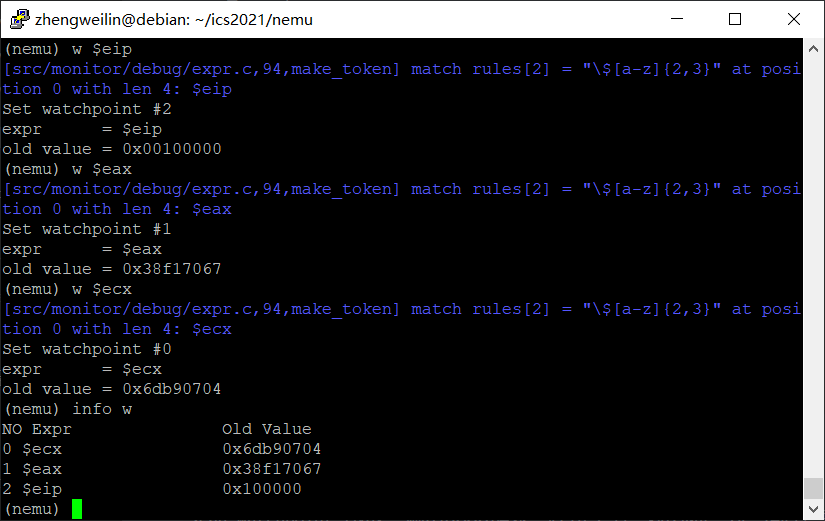

​	`scan_watchpoint` 函数，遍历head链表，在每个节点都判断一次当前节点对应表达式的值与旧值是否一致，不一致则输出命中监视点。

```c
WP *scan_watchpoint(void) //扫描所有使用中的监视点，返回触发的监视点指针，若无触发返回NULL
{
  WP *temp=NULL;
  WP *p;
  bool t;
  p = head;
  static vaddr_t cur_eip=0x100000;

  while (p != NULL)
  {
    p->new_val = expr(p->expr, &t);
    if (p->new_val != p->old_val)
    {
      printf("Hit watchpoint %d at address 0x%08x\nexpr      = %s\nold value = 0x%08x\nnew value = 0x%08x\nprogram paused\n", 
      p->NO,cur_eip,p->expr,p->old_val,p->new_val);
      p->old_val = p->new_val;
      temp=p;
    }

    p = p->next;
  }
  cur_eip=cpu.eip;

  return temp;
}

```

​	为实现监视点效果，需在`cpu_exec()`中的`ifdef DEBUG` 中调用上述`scan_watch()`函数。

```c
#ifdef DEBUG
    /* TODO: check watchpoints here. */
    if (scan_watchpoint()!=NULL)
      nemu_state = NEMU_STOP;

#endif
```

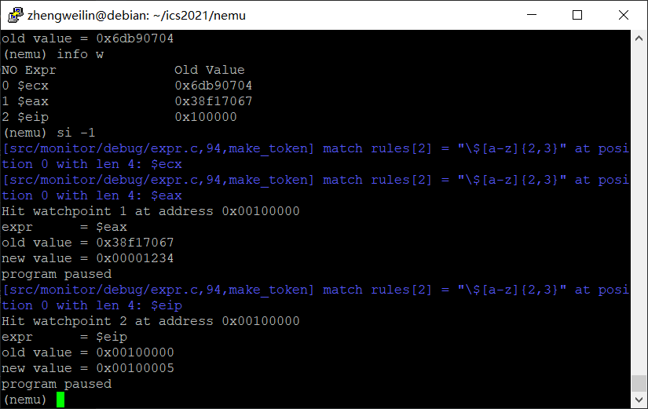

#### 14. 实现软件断点 (加分项，10分)

<!--暂未完成-->

……

## 遇到的问题及解决办法

1. 遇到问题：实现负号有多种方法，但一开始用的方法不能和其它单元运算符统一处理。

   解决方案：最后选择的方案：在`make_token`之后`eval`之前，对负号`-`，解引用号`*`，非`!`进行额外的标记类别；在`eval`函数中，在`find_dominated_op`之前，对单元运算符进行递归。

2. 遇到问题：监视点中，地址和值搞混。

   解决方案：复习了1.1中的内容，搞清楚了指令、指令地址、值等。

3. ……

## 实验心得

​	本次实验完成了表达式求值与监视点。在表达式求值部分中，运用递归思想实现求值，过程中学习了正则表达式、BNF、词法分析等，加深了对递归程序的理解。在监视点部分，实现了模拟监视点和断点功能，对GDB的运用有了进一步认识，同时复习了链表操作。最后学习了i386手册的查阅，方便后续课设的进行。

## 其他备注

无