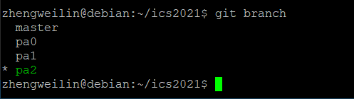
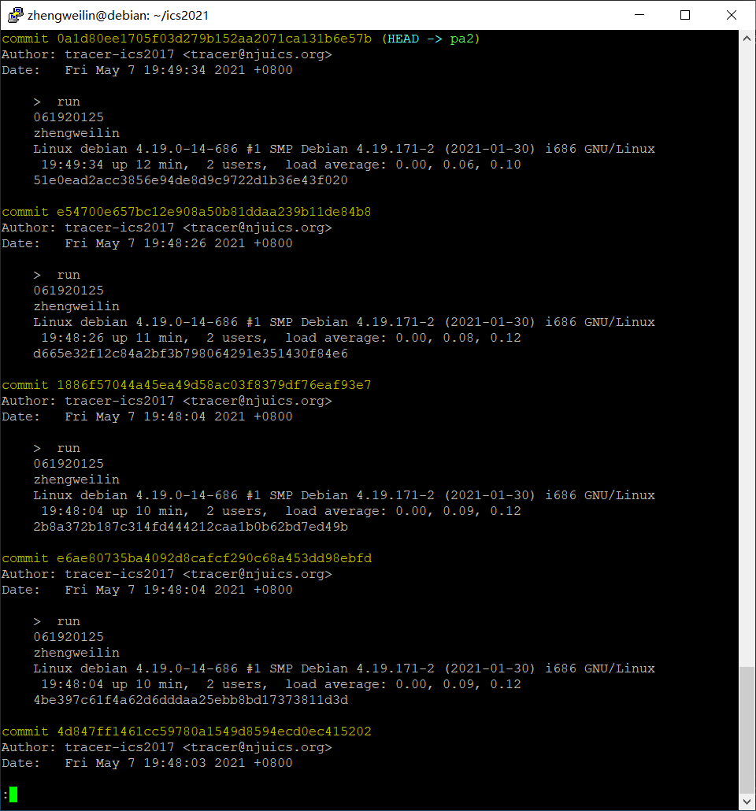
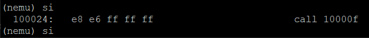
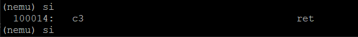
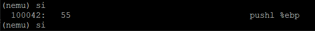
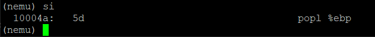
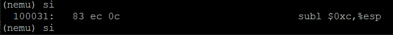
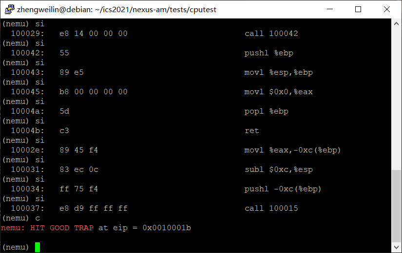
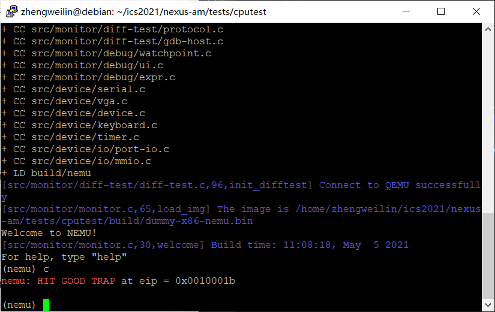

# 南京航空航天大学《计算机组成原理Ⅱ课程设计》报告

* 姓名：郑伟林
* 班级：1619303
* 学号：061920125
* 报告阶段：PA2.1
* 完成日期：2021.5.5
* 本次实验，我完成了所有内容。

## 目录

[TOC]

## 思考题

1. ### 增加了多少（10分）

   ​	包括了指令码和操作数。

2. ### 是什么类型（10分）

   ​	每个表项都是一个`opcode_entry`类型的元素。`opcode_entry`包含译码函数指针`decode`和执行函数指针`execute`以及操作数长度`width`。通过访问表项的对应成员变量来进行相关操作。

3. ### 操作数结构体的实现（10分）

   ​	操作数结构体包括了操作数类型`type`、宽度`width`、内容`val`、源字符串`str`，以及一个联合体可能是寄存器`reg`、访存地址`addr`、立即数`imm`、有符号立即数`simm`。类型决定了该操作数是联合体中的哪一个，宽度为提供译码提供译码长度，内容供译码、执行使用。

4. ### 复现宏定义（30分）

   ①

   ```c
   make_EHelper(mov) //mov 指令的执行函数
   ⇩
   void concat(exec_, mov) (vaddr_t *eip)
   ⇩
   void exec_mov(vaddr_t *eip)
   ```

   ②

   ```c
   make_EHelper(push) //push 指令的执行函数
   ⇩
   void concat(exec_, push) (vaddr_t *eip)
   ⇩
   void exec_push(vaddr_t *eip)
   ```

   ③

   ```c
   make_DHelper(I2r) //I2r 类型操作数的译码函数
   ⇩
   void concat(decode_op_, I2r) (vaddr_t *eip, Operand *op, bool load_val)
   ⇩
   void decode_op_I2r(vaddr_t *eip, Operand *op, bool load_val)
   ```

   ④

   ```c
   IDEX(I2a, cmp) //cmp 指令的 opcode_table 表项
   ⇩
   IDEXW(I2a, cmp, 0)
   ⇩
   {concat(decode_, I2a), concat(exec_, cmp), 0}
   ⇩
   {decode_I2a,exec_cmp,0}
   ```

   ⑤

   ```c
   EX(nop) //nop 指令的 opcode_table 表项
   ⇩
   EXW(nop, 0)
   ⇩
   {NULL,concat(exec_,nop),0}
   ⇩
   {NULL,exec_nop,0}
   ```

   ⑥

   ```c
   make_rtl_arith_logic(and) //and 运算的 RTL 指令
   ⇩
   static inline void concat(rtl_, and) (rtlreg_t* dest, const rtlreg_t* src1, const rtlreg_t* src2) { \
       *dest = concat(c_, and) (*src1, *src2); \
     } \
   static inline void concat3(rtl_, and, i) (rtlreg_t* dest, const rtlreg_t* src1, int imm) { \
       *dest = concat(c_, and) (*src1, imm); \
     }
   ⇩
   static inline void rtl_and (rtlreg_t* dest, const rtlreg_t* src1, const rtlreg_t* src2) { 
       *dest = c_and (*src1, *src2); 
     } 
   static inline void rtl_andi (rtlreg_t* dest, const rtlreg_t* src1, int imm) { 
       *dest = c_and (*src1, imm); 
     }
   ```

   

5. ### ⽴即数背后的故事（10分）

   ①主机会按照大端方式来解释imm变量的字节序列,导致立即数解释错误.这是因为NEMU是x86结构,是小端架构,而主机是Motorola 68k大端架构,运行instr_fetch函数是主机CPU按大端方式解释,导致不符合NEMU的结果.可以通过增加一个反转函数将解释结果转换为小端形式.

   ②主机会按小端方式来解释字节序列,而NEMU-Motorola-68k是大端架构,导致立即数不符要求.同样需加一个反转函数将解释结果转换为大端形式.

6. ### 神奇的 eflags (20分)

   ​	溢出是指整型结果是较大正数或较小负数,且无法匹配目的操作数.

   ​	CF不可以代替OF,OF是用于有符号整数溢出指示,CF是用于无符号整型越界状态.

   ​	在`sub`中,对`dest`与`src`做异或得t0,再对`dest`和t2做异或得t1,然后将`t0 and t1` 后取最高有效位,将其赋给OF.

7. ### git branch 和 git log 截图（最新的，⼀张即可）（10分）

   

   

## 实验内容

### 1.实现标志寄存器（ 10 分）

```c
typedef struct
{
  union
  {
    union
    {
      uint32_t _32;
      uint16_t _16;
      uint8_t _8[2];
    } gpr[8];

    /* Do NOT change the order of the GPRs' definitions. */

    /* In NEMU, rtlreg_t is exactly uint32_t. This makes RTL instructions
   * in PA2 able to directly access these registers.
   */
    struct
    {
      rtlreg_t eax, ecx, edx, ebx, esp, ebp, esi, edi;
    };
  };
  vaddr_t eip;
  struct
  {
    rtlreg_t CF : 1;
    rtlreg_t : 5;
    rtlreg_t ZF : 1;
    rtlreg_t SF : 1;
    rtlreg_t : 1;
    rtlreg_t IF : 1;
    rtlreg_t : 1;
    rtlreg_t OF : 1;
  } eflags;

} CPU_state; 
```

​	在`CPU_state`结构中添加`eflags`结构体,其包含若干个位域用于表示EFLAGS的各个位.

根据手册将各个有效位都赋值为零进行初始化.

### 2.实现所有 RTL 指令（ 30 分）

```c
static inline void rtl_mv(rtlreg_t* dest, const rtlreg_t *src1) {
  // dest <- src1
  *dest=*src1;
}

static inline void rtl_not(rtlreg_t* dest) {
  // dest <- ~dest
  rtl_li(dest,~(*dest));
}

static inline void rtl_sext(rtlreg_t* dest, const rtlreg_t* src1, int width) {
  // dest <- signext(src1[(width * 8 - 1) .. 0])
  rtl_shli(dest,src1,(4-width)*8);
  rtl_sari(dest,dest,(4-width)*8);
}

static inline void rtl_push(const rtlreg_t* src1) {
  // esp <- esp - 4
  // M[esp] <- src1
  rtl_subi(&cpu.esp,&cpu.esp,4);
  rtl_sm(&cpu.esp,4,src1);
}

static inline void rtl_pop(rtlreg_t* dest) {
  // dest <- M[esp]
  // esp <- esp + 4
  rtlreg_t t;
  rtl_lr_l(&t,R_ESP);
  rtl_lm(dest,&t,4);
  rtl_addi(&t,&t,4);
  rtl_sr_l(R_ESP,&t);
}

static inline void rtl_eq0(rtlreg_t* dest, const rtlreg_t* src1) {
  // dest <- (src1 == 0 ? 1 : 0)
  rtl_li(dest,((*src1) == 0 ? 1 : 0));
}

static inline void rtl_eqi(rtlreg_t* dest, const rtlreg_t* src1, int imm) {
  // dest <- (src1 == imm ? 1 : 0)
  rtl_li(dest,((*src1) == imm ? 1 : 0));
}

static inline void rtl_neq0(rtlreg_t* dest, const rtlreg_t* src1) {
  // dest <- (src1 != 0 ? 1 : 0)
  rtl_li(dest,((*src1) != 0 ? 1 : 0));
}

static inline void rtl_msb(rtlreg_t* dest, const rtlreg_t* src1, int width) {
  // dest <- src1[width * 8 - 1]
  rtl_shri(dest,src1,(width*8)-1);
}

static inline void rtl_update_ZF(const rtlreg_t* result, int width) {
  // eflags.ZF <- is_zero(result[width * 8 - 1 .. 0])
  rtlreg_t t;
  rtl_eq0(&t,result);
  rtl_set_ZF(&t);
}

static inline void rtl_update_SF(const rtlreg_t* result, int width) {
  // eflags.SF <- is_sign(result[width * 8 - 1 .. 0])
  rtlreg_t t;
  rtl_msb(&t,result,width);
  rtl_set_SF(&t);
}
```

​	以上位`rtl.h`中的`rtl`指令.其中`rtl_msb`是取src1的最高有效位,只需将src1右移width*8-1位即可;`rtl_update_ZF`是更新ZF,通过判断result是否为零对ZF赋值即可;`rtl_update_SF`是更新SF,通过对result取符号对SF赋值即可.

### 3.实现 6 条 x86 指令（ 30 分）

`call`:先将`decoding.is_jmp`设为1,再将decoding.jmp_eip设为跳转目标地址.

```c
make_EHelper(call) {
  // the target address is calculated at the decode stage
  decoding.is_jmp = 1;
  rtl_push(eip);
  rtl_add(&decoding.jmp_eip,eip,&id_dest->val);

  print_asm("call %x", decoding.jmp_eip);
}
```



`ret`:将栈顶地址取出将`decoding.jmp_eip`设为该地址,再将`decoding.is_jmp`设为1.

```c
make_EHelper(ret) {
  rtl_pop(&t0);
  decoding.jmp_eip=t0;
  decoding.is_jmp = 1;

  print_asm("ret");
}
```



`push`:直接将`id_dest->val`入栈即可.

```c
make_EHelper(push) {
  rtl_push(&id_dest->val);

  print_asm_template1(push);
}
```



`pop`:用`rtl_pop`将栈顶元素出栈,写入`id_dest`中.

```c
make_EHelper(pop) {
  rtl_pop(&t1);
  operand_write(id_dest,&t1);

  print_asm_template1(pop);
}
```



`sub`:先将dest-src存入dest中,然后若是无符号数,根据结果更新CF标志,如果减法结果溢出则标记1,否则为0;若是带符号数,则根据结果更新OF标志.

```c
make_EHelper(sub) {
  rtl_sub(&t2, &id_dest->val, &id_src->val);
  rtl_sltu(&t3, &id_dest->val, &t2);
  operand_write(id_dest, &t2);

  rtl_update_ZFSF(&t2, id_dest->width);

  rtl_sltu(&t0, &id_dest->val, &t2);
  rtl_or(&t0, &t3, &t0);
  rtl_set_CF(&t0);

  rtl_xor(&t0, &id_dest->val, &id_src->val);
  rtl_xor(&t1, &id_dest->val, &t2);
  rtl_and(&t0, &t0, &t1);
  rtl_msb(&t0, &t0, id_dest->width);
  rtl_set_OF(&t0);

  print_asm_template2(sub);
}
```



`xor`:用rtl_xor对src与dest做运算结果为t3,将t3写入id_dest中,再更新CF,OF为0,根据t3更新ZF,SF.

```c
make_EHelper(xor) {
  rtl_xor(&t3,&id_dest->val,&id_src->val);
  operand_write(id_dest,&t3);
  t2=0;
  rtl_set_CF(&t2);
  rtl_set_OF(&t2);
  rtl_update_ZFSF(&t3,id_dest->width);

  print_asm_template2(xor);
}
```


### 4.成功运⾏ dummy（10 分）

​	将opcode_table按要求填写之后运行，即可成功运行dummy。



### 5.实现 Diff-test（ 20 分）

​	在`difftest_step`中的TODO添加如下代码，当NEMU和QEMU的寄存器信息不匹配时，将diff标志设为true。

```c
...
if (r.eax!=cpu.eax || r.ebx!=cpu.ebx || r.ecx!=cpu.ecx \
   || r.edx!=cpu.edx || r.esp!=cpu.esp || r.ebp!=cpu.ebp \
   || r.esi!=cpu.esi || r.edi!=cpu.edi || r.eip!=cpu.eip)
    diff = true;
...
```



……

## 遇到的问题及解决办法

1. 遇到问题：sub函数的过程不会写

   解决方案：查阅了手册，并搜索了解了EFLAGS的含义与用途后，并参考对比了`sbb`命令，完成了`sub`的过程。

2. ……

## 实验心得

​	通过这次实验，对`cpu`执行指令的过程有了深入的了解，明白了指令如何从存储器到执行的过程，同时也学会了寄存器与`cpu`的合作来完成一条指令。

## 其他备注

无