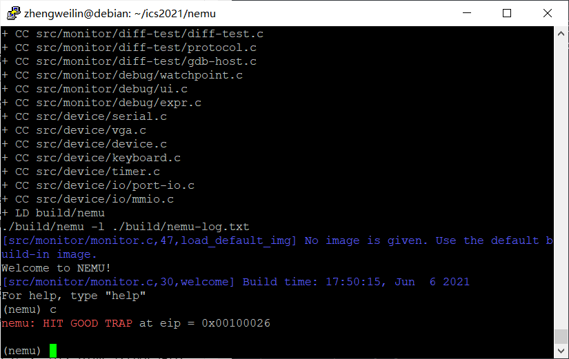
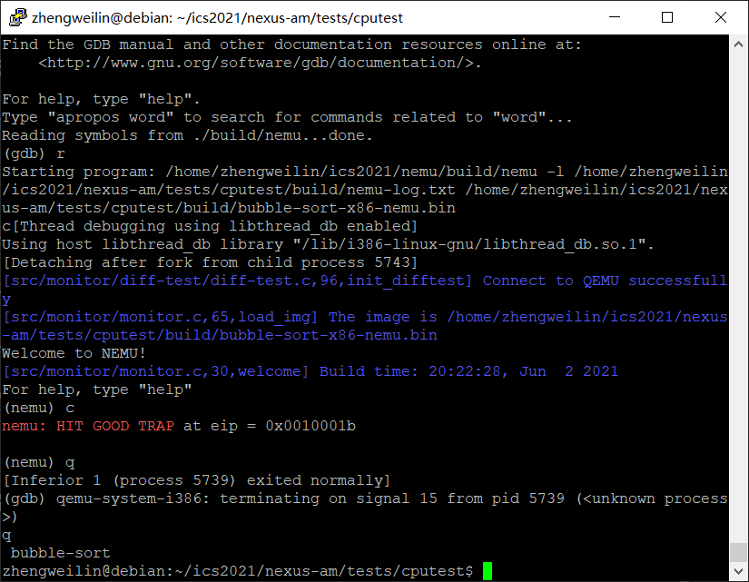

# 南京航空航天大学《计算机组成原理Ⅱ课程设计》报告

* 姓名：郑伟林
* 班级：1619303
* 学号：061920125
* 报告阶段：PA2.2&2.3
* 完成日期：2021.x.x
* 本次实验，我完成了所有内容。

## 目录

[TOC]

## 思考题

### 1.什么是 API

​	API是应用程序接口，是一些预先定义的接口。开发者可以直接调用API而不用访问源码来实现其提供的功能。

### 2.AM 属于硬件还是软件？

​	AM是属于软件，它是一个抽象计算机模型，它定义了一组统一的API，来和计算机硬件进行访问和操作，类似于操作系统，来作为一个硬件（虚拟硬件NEMU）和应用程序直接的介质。

### 3.堆和栈在哪⾥?

​	堆和栈的内容会随程序运行不断变化，放可执行文件中不方便增删改减，因此不适合放进可执行文件里；程序运行时将从内存中申请空间来作为堆和栈。

### 4.回忆运⾏过程

​	回车后，Make将ARCH参数更新进规则中，然后按规则中所安排的指令来将源代码编译到x86-nemu的AM中

	make ALL=dummy run：
	用dummy.c作为测试程序源码
	编译成x86-nemu的AM下的可执行文件
	调用 nexus-am/am/arch/x86-nemu/img/run 来启动 NEMU并载入 dummy 这个测试程序运行
	(NEMU)

### 5.神奇的eflags（2）

```
+-----+-----+------------------------------------+
| SF  |  OF |              实 例                 |
+-----+-----+------------------------------------+
|  0  |  0  |               2 - 1                |
+-----+-----+------------------------------------+
|  0  |  1  |           -1 - 0xF0000000          |
+-----+-----+------------------------------------+
|  1  |  0  |               1 - 2                |
+-----+-----+------------------------------------+
|  1  |  1  |          0x7fffffff - -1           |
+-----+-----+------------------------------------+
```


### 6.这是巧合吗？

无符号数：

​		op2>op1 是ja（above）

​		op2<op1 是jb（below）

有符号数：

​		op2>op1 是jg（greater）

​		op2<op1 是jl（less）

### 7.nemu的本质

```
0x00:	x=x-1
0x01:	y=y+1
0x02:	IF x != 0 GOTO 0x00
0x03:	y=y-1
0x04:	a=a+1
0x05:	IF y != 0 GOTO 0x03
```

​	我觉得还少了用户图形界面以及视频音频输入输出。

### 8.设备是如何⼯作的？

​	将设备分配虚拟地址映射到内存中，CPU可以像读写内存一样通过发送端口读写设备，设备也可以将信息反馈到CPU的接收端口。

### 9. CPU 需要知道设备是如何⼯作的吗？

​	不需要。CPU只需发送和接受信息，剩下的交给设备运作即可。CPU相当于指挥者，无需知道设备如何完成。

### 10. 什么是驱动？

​	驱动是指设备驱动程序。它可以使计算机和设备进行相互通信，相当于硬件的接口，操作系统通过这个接口控制硬件操作。

### 11. cpu知道吗？

​	不需要，CPU只需把地址上的数据赋予指定的值即可。

### 12.再次理解volatile

​	


​	如果没有volatile的话，用-O2会进行代码优化，会损失数据。

​	用volatile来避免被优化，从而保证数据不丢失。

​	会使CPU找不到目标设备寄存器。

### 13.hello world运⾏在哪⾥？

​	不一样，编程课中的程序运行在硬件层，而该程序运行在AM层

### 14.如何检测很多个键同时被按下？

​	每个按键都对应一个按键码，CPU以很快的频率扫描端口状态，当你同时按下多个键，他们总会在微小的时间内有先后顺序，产生端口状态，然后CPU检查状态进行读取，多个键信息即可在微小的时间内几乎同时被读取。

### 15.编译与链接Ⅰ

​	去掉`static`，没有发生错误

​	去掉`inline`，没有发生错误


​	去掉`static inline`，发生错误


​	分析：去掉`static`不影响nemu，去掉后目标函数变成全局函数，对使用不影响。去掉`inline`我这里没有错误，但了解`inline`是将频繁用到的函数放到栈中提高运行效率，去掉后就不在栈区里了。这个函数就不会用到，会报警告函数定义了未使用（后来发现可能是我debug关了才没错误）

​	如果去掉static inline，那就会使该函数被多重定义导致错误。

### 16.编译与链接Ⅱ（10分）

​	1.有31个，用命令`grep -rn "dummy" |wc -l`


​	2.有32个，多了1个，就是在`debug.h`中加上的那个。


​	3.会发生错误。原因是赋初值后dummy就变成强符号了，而有两个同名强符号就会导致连接错误。之前由于没赋初值所以两个都是弱符号，不会发生连接错误。


### 17.I/O 端⼝与接⼝（10分）

​	1.由于1K=2^10，每个端口8个地址，则范围：0000H~8000H，如果是16地址编线那就是8001H~FFFFH。

​	2.如中断控制信号。例如打印机，设备启动后会进行I/O操作，在CPU执行其它进程时打印机进行打印操作。当设备完成操作向CPU发送中断请求信号，CPU监测到信号后发送中断控制信号，执行终端服务程序执行。

### 18. git log截图


## 实验内容

### 实现剩余所有 x86 指令（40 分）

#### （一）add.c

`lea`：填表8b `IDEX(lea_M2G, lea)`，添加进all-instr.h，并完成如下函数。

```c
make_EHelper(leave) {
  cpu.esp=cpu.ebp;
  rtl_pop(&cpu.ebp);

  print_asm("leave");
}
```

`and`：填表83 gp1 `EX(and)`，添加进all-instr.h，并完成如下函数。

```c
make_EHelper(and)
{
  rtl_and(&t2, &id_dest->val, &id_src->val);
  operand_write(id_dest, &t2);

  rtl_update_ZFSF(&t2, id_dest->width);
  cpu.eflags.CF = 0;
  cpu.eflags.OF = 0;

  print_asm_template2(and);
}
```

`cmp`：填表83 gp1 `EX(cmp)`，添加进all-instr.h，并完成如下函数。

```c
make_EHelper(cmp) {
  rtlreg_t temp;

  rtl_sext(&temp,&id_src->val,id_dest->width);
  rtl_sub(&t2,&id_dest->val,&temp);

  rtl_sltu(&t3, &id_dest->val, &t2);

  rtl_update_ZFSF(&t2, id_dest->width);

  rtl_sltu(&t0, &id_dest->val, &t2);
  rtl_or(&t0, &t3, &t0);
  rtl_set_CF(&t0);

  rtl_xor(&t0, &id_dest->val, &temp);
  rtl_xor(&t1, &id_dest->val, &t2);
  rtl_and(&t0, &t0, &t1);
  rtl_msb(&t0, &t0, id_dest->width);
  rtl_set_OF(&t0);


  print_asm_template2(cmp);
}
```

`jbe`：填表76 `IDEXW(J,jcc,1)`，添加进all-instr.h，并完成cc.c 中对应的情况CC_BE。

```c
case CC_BE:
      if (cpu.eflags.CF == 1 || cpu.eflags.ZF == 1)
        rtl_li(dest, 1);
      else
        rtl_li(dest, 0);
      break;
```

`push`：填表52 `IDEX(r,push)`和50 `IDEX(r,push)`

`add`：填表01 `IDEX(G2E,add)`，添加进all-instr.h，并完成对应函数。

```c
make_EHelper(add) {
  rtl_add(&t2, &id_dest->val, &id_src->val);
  rtl_update_ZFSF(&t2, id_dest->width);
  operand_write(id_dest, &t2);

  rtl_sltu(&t3, &id_dest->val, &t2);
  rtl_sltu(&t0, &id_src->val, &t2);
  rtl_and(&t0, &t3, &t0);
  rtl_set_CF(&t0);

  rtl_xor(&t0, &id_dest->val, &id_src->val);
  rtl_not(&t0);
  rtl_xor(&t1, &id_dest->val, &t2);
  rtl_and(&t0, &t0, &t1);
  rtl_msb(&t0, &t0, id_dest->width);
  rtl_set_OF(&t0);

  print_asm_template2(add);
}
```

`cmp`：填表39 `IDEX(G2E,cmp)`

`sete`：填表双字节94 `IDEXW(E,setcc,1)`，添加进all-instr.h，并完成cc.c 中对应的情况CC_E。

```c
case CC_E:
      if (cpu.eflags.ZF == 1)
        rtl_li(dest, 1);
      else
        rtl_li(dest, 0);
      break;
```

`movzbl`：填表双字节b6 `IDEXW(mov_E2G,movzx,1)`，添加进all-instr.h

`inc`：填表ff gp5 `EX(inc)`，添加进all-instr.h，并完成对应函数。

```c
make_EHelper(inc) {
  rtl_addi(&t2,&id_dest->val,1);
  operand_write(id_dest,&t2);
  rtl_update_ZFSF(&id_dest->val,id_dest->width);

  rtl_xori(&t0, &id_dest->val, 1);
  rtl_not(&t0);
  rtl_xor(&t1, &id_dest->val, &t2);
  rtl_and(&t0, &t0, &t1);
  rtl_msb(&t0, &t0, id_dest->width);
  rtl_set_OF(&t0);

  print_asm_template1(inc);
}case CC_E:
      if (cpu.eflags.ZF == 1)
        rtl_li(dest, 1);
      else
        rtl_li(dest, 0);
      break;
```


#### （二）add-longlong.c

`push`：填表57,56,53 `IDEX(r,push)`

`jmp`：填表e9 `IDEX(J,jmp)`

`jbe`：填表双字节86 `IDEX(J,jcc)`

`adc`：填表11 `IDEX(G2E,adc)`，添加进all-instr.h

`pop`：填表5b `IDEX(r,pop)`

`xor`：填表33 `IDEX(E2G,xor)`

`or`：填表09 `IDEX(G2E,or)`，添加进all-instr.h，并完成对应函数。

```c
make_EHelper(or)
{
  rtl_or(&t2,&id_dest->val,&id_src->val);
  cpu.eflags.CF = 0;
  cpu.eflags.OF = 0;
  operand_write(id_dest, &t2);

  rtl_update_ZFSF(&t2, id_dest->width);

  print_asm_template2(or);
}
```

`test`：填表85 `IDEX(G2E,test)`，添加进all-instr.h，并完成对应函数。

```c
make_EHelper(test)
{
  rtl_and(&t2, &id_dest->val, &id_src->val);
  cpu.eflags.CF = 0;
  cpu.eflags.OF = 0;

  rtl_update_ZFSF(&t2, id_dest->width);

  print_asm_template2(test);
}
```

`push`：填表6a `IDEXW(I,push,1)`

#### （三）bit.c

`sar`：填表gp2 `EX(sar)`，添加进all-instr.h，并完成对应函数。

```c
make_EHelper(sar)
{
  rtl_sext(&id_src->val,&id_src->val,id_src->width);
  rtl_sar(&t2,&id_dest->val,&id_src->val);
  operand_write(id_dest, &t2);

  rtl_update_ZFSF(&t2, id_dest->width);
  // unnecessary to update CF and OF in NEMU

  print_asm_template2(sar);
}
```

`shl`：填表gp2 `EX(shl)`，添加进all-instr.h，并完成对应函数。

```c
make_EHelper(shl)
{
  rtl_shl(&t2,&id_dest->val,&id_src->val);
  operand_write(id_dest, &t2);

  rtl_update_ZFSF(&t2, id_dest->width);
  // unnecessary to update CF and OF in NEMU

  print_asm_template2(shl);
}
```

`and`：填表22 `IDEXW(E2G,and,1)`

`test`：填表84 `IDEXW(G2E,test,1)`

`setne`：填表双字节95 `IDEXW(E,setcc,1)`

`cmp`：填表3c `IDEXW(I2a,cmp,1)`

`or`：填表0a `IDEXW(E2G,or,1)`

`not`：填表gp3 `EX(not)`，添加进all-instr.h，并完成对应函数。

```c
make_EHelper(not )
{
  rtl_mv(&t2,&id_dest->val);
  rtl_not(&t2);
  operand_write(id_dest,&t2);

  print_asm_template1(not );
}
```

`and`：填表21 `IDEX(G2E,and)`


#### （四）bubble-sort.c

`jle`：填表7e `IDEXW(J,setcc,1)`，添加进all-instr.h，并完成cc.c 中对应的情况CC_LE。

```c
case CC_LE:
      if (cpu.eflags.SF != cpu.eflags.OF || cpu.eflags.ZF == 1)
        rtl_li(dest, 1);
      else
        rtl_li(dest, 0);
      break;
```

`jl`：填表7c `IDEXW(J,setcc,1)`，添加进all-instr.h，并完成cc.c 中对应的情况CC_L。

```c
case CC_L:
      if (cpu.eflags.SF != cpu.eflags.OF)
        rtl_li(dest, 1);
      else
        rtl_li(dest, 0);
      break;
```

`sub`：填表2b `IDEX(E2G,sub)`



#### （五）fact.c

`je`：填表74 `IDEXW(J,setcc,1)`

`dec`：填表48 `IDEX(r,dec)`（这里顺便把48~4f全填了），添加进all-instr.h，并完成对应函数。

```c
make_EHelper(dec) {
  rtl_subi(&t2,&id_dest->val,1);
  operand_write(id_dest,&t2);
  rtl_update_ZFSF(&id_dest->val,id_dest->width);

  rtl_xori(&t0, &id_dest->val, 1);
  rtl_not(&t0);
  rtl_xor(&t1, &id_dest->val, &t2);
  rtl_and(&t0, &t0, &t1);
  rtl_msb(&t0, &t0, id_dest->width);
  rtl_set_OF(&t0);

  print_asm_template1(dec);
}
```

`imul`：填表双字节af `EX(not)`，添加进all-instr.h


#### （六）goldbach.c

`cmp`：填表3b `IDEX(E2G,cmp)`（这里顺便把38~3d全填了）

`jg`：填表7f `IDEXW(J,jcc,1)`（这里顺便把70~7f全填了）

`cltd`：填表99 `EX(cltd)`，添加进all-instr.h，并完成对应函数。

```c
make_EHelper(cltd) {
  if (decoding.is_operand_size_16) {
    rtl_lr_w(&t0,R_AX);
    if ((int32_t)(int16_t)(uint16_t)t0 < 0)
      reg_w(R_DX) = 0xffff;
    else
      reg_w(R_DX) = 0;
  }
  else {
    rtl_lr_l(&t0,R_EAX);
    if ((int32_t)t0 < 0)
      reg_l(R_EDX) = 0xffffffff;
    else
      reg_l(R_EDX) = 0;
  }

  print_asm(decoding.is_operand_size_16 ? "cwtl" : "cltd");
}
```

`idivl`：填表gp3 `EX(mul)`，添加进all-instr.h


#### （七）leap-year.c,load-store.c,matrix-mul.c,min3.c

`add`：填表05 `IDEXW(J,jcc,1)`（这里顺便把00~05全填了）

`movsx`：填表双字节bf `IDEXW(J,jcc,1)`（这里顺便把be全填了）

`jcc`：填表双字节80~8f `IDEXW(J,jcc,1)`

#### （八）mul-longlong.c

`mul`：填表gp3 `EX(mul)`,添加进all-instr.h

`xor`：填表31 `IDEX(G2E,xor)`（这里顺便把30~35全填了）

`or`：填表0b`IDEX(E2G,or)`（这里顺便把08~0d全填了）

#### （九）quick-sort.c

`push`：填表68 `IDEX(I,push)`

#### （十）recursion.c

`dec`：填表gp5 `EX(dec)`

`call_rm`：填表gp5 `EX(call_rm)`,添加进all-instr.h，并完成对应函数。

```c
make_EHelper(call_rm) {
  decoding.is_jmp=1;
  rtl_push(&decoding.seq_eip);
  decoding.jmp_eip=id_dest->val;

  print_asm("call *%s", id_dest->str);
}
```

`imul`：填表gp3 `EX(imul1)`,添加进all-instr.h

`sub`：填表29 `IDEX(G2E,sub)（这里顺便把28~2d全填了）`

`shr`：填表gp2 `EX(shr)`,添加进all-instr.h，并完成对应函数。

```c
make_EHelper(shr)
{
  rtl_shr(&t2,&id_dest->val,&id_src->val);
  operand_write(id_dest, &t2);

  rtl_update_ZFSF(&t2, id_dest->width);
  // unnecessary to update CF and OF in NEMU

  print_asm_template2(shr);
}
```


#### （十一）sub-longlong.c

`sbb`：填表1b `IDEX(E2G,sbb)`（这里顺便把18~1d全填了）,添加进all-instr.h

#### （十二）switch.c

`jmp_rm`：填表gp5 `EX(jmp_rm)`,添加进all-instr.h

### 通过⼀键回归测试（5 分）

执行如下脚本

```
bash runall.sh
```


### IN/OUT 指令（10 分）

将`common.h`中的`HAS_IOE`开启，运行nemu。


`out`：填表ee `IDEXW(out_a2dx,out,1)（这里顺便把ec~ef全填了）`

在`nexus-am/am/arch/x86-nemu/src/trm.c`` 中定义宏 ``HAS_SERIAL`

运行hello程序


### 实现时钟设备（10 分）

完善`_uptime()`函数

运行timetest项目


### 运⾏跑分项⽬（10 分）

①dhrystone


②coremark

`cwtl`：填表98 `EX(cwtl)`,添加进all-instr.h，并完成对应函数。

```c
make_EHelper(cwtl) {
  if (decoding.is_operand_size_16) {
    rtl_lr_b(&t2,R_AL);
	  rtl_sext(&t2, &t2, 1);
	  rtl_sr_w(R_AX, &t2);
  }
  else {
    rtl_lr_w(&t2,R_AX);
	  rtl_sext(&t2, &t2, 2);
	  rtl_sr_l(R_EAX, &t2);
  }
```

`sbb`：填表gp1 `EX(sbb)`（这里顺便把gp1全填了）

`setcc`：填表双字节90 `IDEXW(E,setcc,1)`（这里顺便把90~9f全填了）

`neg`：填表gp3 `EX(neg)`,添加进`all-instr.h`，并完成对应函数。（这里顺便把gp3全填了）

```c
make_EHelper(neg) {
  rtl_mv(&t2,&id_dest->val);
  if (t2 == 0)
    cpu.eflags.CF = 0;
  else
    cpu.eflags.CF = 1;
  
  rtl_not(&id_dest->val);
  rtl_addi(&t1,&id_dest->val,1);
  operand_write(id_dest, &t1);

  print_asm_template1(neg);
}
```


③microbench

`ret`：填表c2 `IDEX(I,ret)`

`rol`：填表gp2 `EX(rol)`,添加进`all-instr.h`，并完成对应函数。

```c
make_EHelper(rol) {
  rtl_mv(&t2,&id_dest->val);
  for (t0 = 0; t0 < id_src->val; t0++)
  {
    rtl_msb(&t1,&t2,id_dest->width);
    rtl_shli(&t2,&t2,1);
    rtl_add(&t2,&t2,&t1);
    rtl_set_CF(&t1);
  }
  operand_write(id_dest,&t2);
  
  
  print_asm_template2(rol);
}
```


### 实现键盘设备（10 分）

完成`_read_key()`函数

```c
int _read_key() {
  if (inb(0x64))
    return inl(0x60);
  else
    return _KEY_NONE;
}
```

运行keytest项目


### 添加内存映射 I/O （10 分）

完成`paddr_read()` 和`paddr_write()`函数

```c
uint32_t paddr_read(paddr_t addr, int len) {
  int mmio_id;
  mmio_id = is_mmio(addr);
  if (mmio_id != -1)
  {
    return mmio_read(addr,len,mmio_id) & (~0u >> ((4 - len) << 3));
  }
  return pmem_rw(addr, uint32_t) & (~0u >> ((4 - len) << 3));
}

void paddr_write(paddr_t addr, int len, uint32_t data) {
  int mmio_id;
  mmio_id = is_mmio(addr);
  if (mmio_id != -1)
  {
    mmio_write(addr,len,data,mmio_id);
  }
  else
    memcpy(guest_to_host(addr), &data, len);
}
```

运行videotest项目


### 运⾏打字⼩游戏（5 分）

运行typing项目


### 捕捉死循环（加分项，10 分）

……

## 遇到的问题及解决办法

1. 遇到问题：在and指令读取时，和反汇编的立即数不一样

   解决方案：经过助教指点，发现是符号拓展没做好，具体是在SI的译码函数中，原先没有符号拓展，加上符号拓展即可。

2. 遇到问题：测试样例`movsx`不通过

   解决方案：发现有个rtl函数写错了，改一下就可以了。

3. ……

## 实验心得

​	本次实验对许多汇编命令进行了学习和完善其函数功能，通过耐心的填表最后基本完成当前使用的各个指令，对CPU执行指令的过程更加熟悉了。并且还了解了一部分I/O的知识。

## 其他备注

无