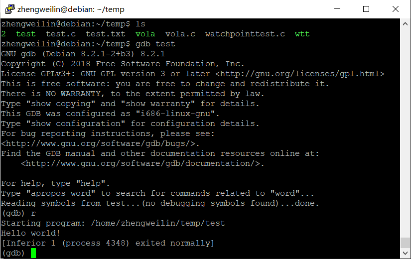
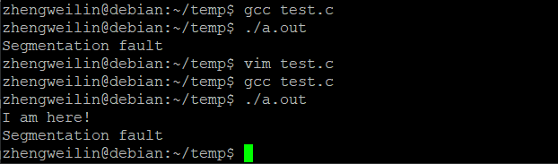
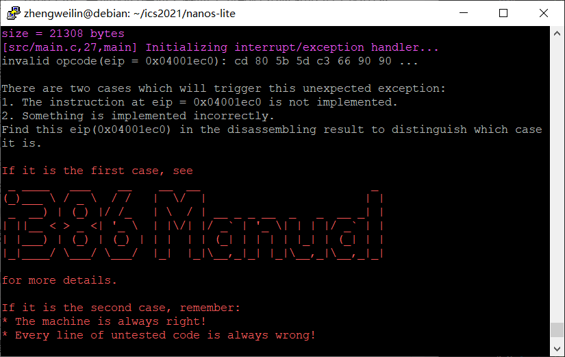
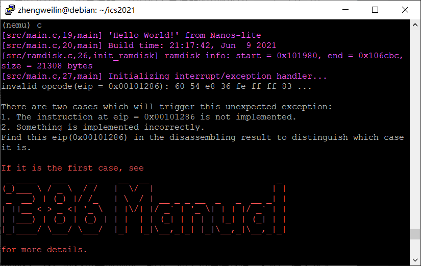
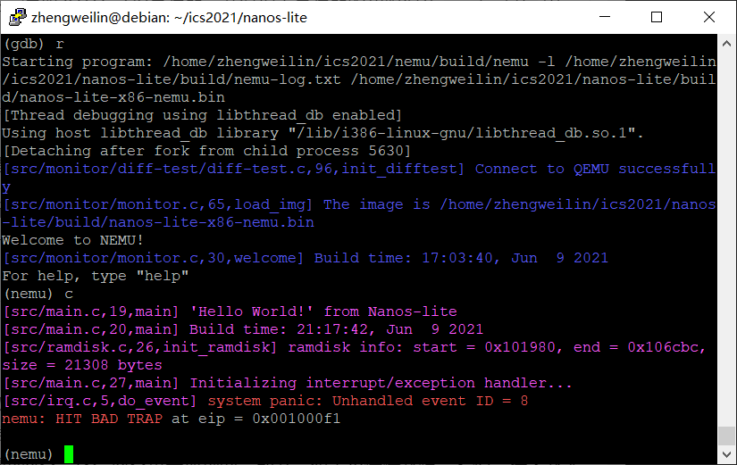
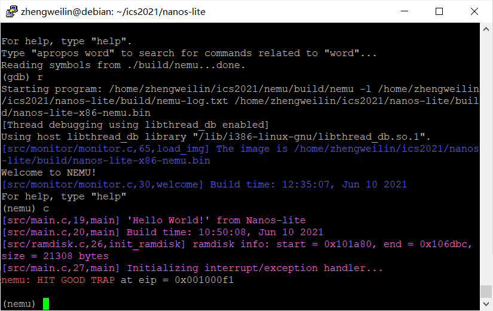
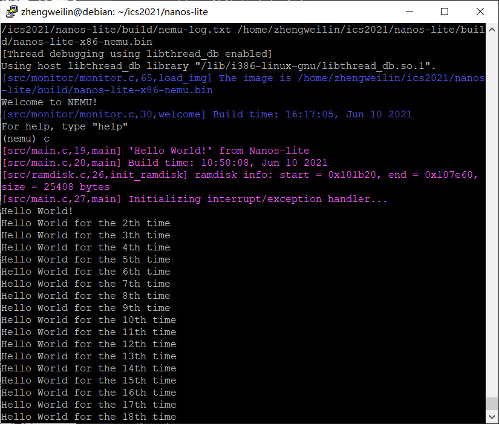
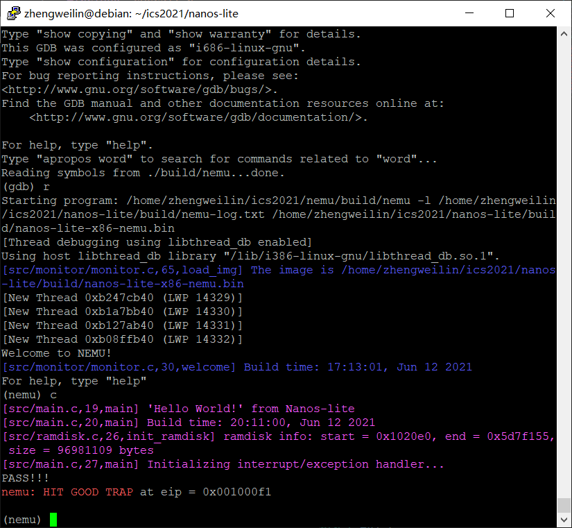
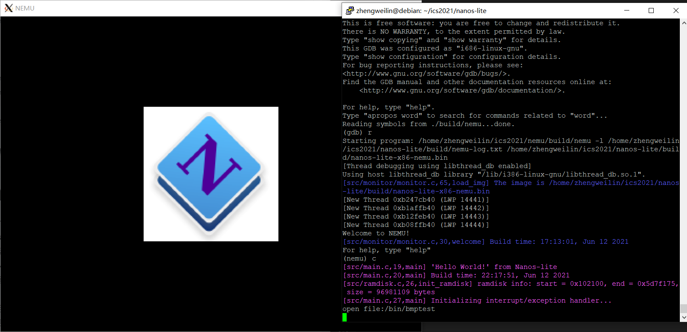
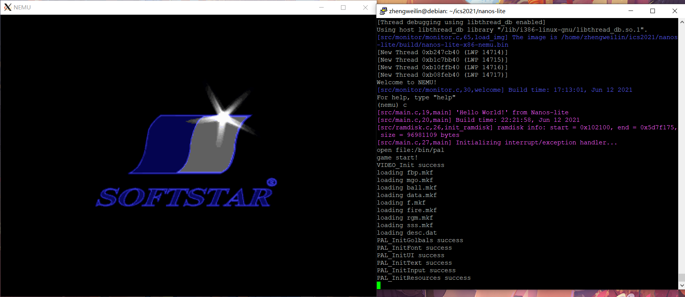

# 南京航空航天大学《计算机组成原理Ⅱ课程设计》报告

* 姓名：郑伟林
* 班级：1619303
* 学号：061920125
* 报告阶段：PA3.1
* 完成日期：2021.6.12
* 本次实验，我完成了所有内容。

## 目录

[TOC]

## 思考题

#### 1. 什么是操作系统？（5）

​	操作系统是连接硬件与软件的媒介，它也属于软件的范畴，可以管理内存、控制设备、操作文件与网络等。同时提供界面给用户进行操作。

#### 2. 我们不⼀样，吗？（5）

​	是一样的AM程序，因为它们都是一类使用AM的API的普通C程序而已。

#### 3. 操作系统的实质（5）

​	操作系统就是一个较为大型的用户程序，它和直接运行在硬件上的程序无实质差别

#### 4. 程序真的结束了吗？（10）

​	`return 0;`后程序还未结束。在进入main函数前会进行各种初始化系统的操作，在main函数之后会销毁堆内存，并根据main函数返回结果再将返回值exit给操作系统。

#### 5. 触发系统调⽤（10）

​	

#### 6. 有什么不同？（5）

​	和函数调用相似，可以这么理解，但系统调用需要将所有寄存器以及异常码压栈进行保存，而函数调用只需压入部分。

#### 7. 段错误（10）

​	段错误是指访问的内存超出了系统所给的内存空间，由于在编译阶段程序并未分配到内存，因此无法判断是否超出，所以不能发现。

​	通常是可能没有对地址访问设定有效区间，导致访问到非法的内存空间引起。

#### 8. 对⽐异常与函数调⽤（5）

​	函数调用需要保存返回的地址，以便函数结束后可以正确执行下一段指令，以及需要调用者保存的部分寄存器中的数据。但是异常处理由于一般不是正常指令执行时会遇到的，所以要求执行完异常处理后寄存器仍是原来应有的状态，因此需要将所有寄存器信息都保存，还需保存异常码等信息。

#### 9. 诡异的代码（5）

​	`pushl %esp`是用于保存原来的栈顶，以便结束异常处理后可以正常的回到原来所处的状态。

#### 10. 注意区分事件号和系统调⽤号（5）

​	事件号包括了系统调用事件以及一些其他的事件；而系统调用号是具体描述某一个系统调用的编号。

#### 11. 打印不出来？（5）

​	因为C的`stdout`采用缓冲输出，所以`printf`之后可能会有缓冲，而这时触发了段错误，就不会输出，解决方法是`printf`中加上\n回车不进行缓冲。

​	

#### 12. 理解⽂件管理函数（15）

​	`fs_filesz()`：返回`file_table[fd].size`。

​	`fs_open()`：遍历`file_table`中找到`name`匹配`pathname`的返回其索引`i`。

​	`fs_read()`：根据文件类型进行读取，如果是`EVENT`则调用`events_read()`读取；如果是`DISPINFO`则调用`dispinfo_read()`读取；如果是普通文件，调用`ramdisk_read()`读取。最后返回`bytes_to_read`

​	`fs_write()`：根据类型进行写入，如果是`STDOUT`、`STDERR`，则直接逐字`_putc()`输出；如果是`EVENT`，则直接返回`len`；如果是`FB`，则调用`fb_write()`输出；如果是普通类型则调用`ramdisk_write()`输出。

​	`fs_lseek()`：根据whence返回偏移值，如果是SEEK_CUR，new_offset等于open_offset+offset；如果是SEEK_SET，new_offset等于offset；如果是SEEK_END，new_offset等于file_size+offset。最后根据new_offset，若小于零，则将open_offset设为0，再返回0；若大于file_size，则将open_offset设为file_offset，再返回file_size；否则将open_offset设为new_offset，再返回.

​		`fs_close()`：返回0.

#### 13. 不再神秘的秘技（5）

​	是因为这些特殊秘技操作会导致一些数据溢出等错误，从而实现一些特别的效果。

#### 14. 必答题（5）

首先AM运行在虚拟硬件NEMU上，然后Nanos-lite运行在AM程序中，调用AM的API利用NEMU执行程序指令，而库函数、libos等对应用程序的执行提供了必要的一些函数、数据等。

#### 15. `git log`和`git branch`截图（5）

## 实验内容

#### 实现 loader（10分）

​	调用`ramdisk_read()`函数对`ramdisk`进行读取。

```c
uintptr_t loader(_Protect *as, const char *filename) {
  ramdisk_read(DEFAULT_ENTRY, 0, get_ramdisk_size());

  return (uintptr_t)DEFAULT_ENTRY;
}
```



引入文件系统后，调用`fs_open()`、`fs_filesz()`、 `fs_read()`、 `fs_close()`函数读取信息

```c
uintptr_t loader(_Protect *as, const char *filename) {
  int fd = fs_open(filename,0,0);
  size_t len = fs_filesz(fd);
  fs_read(fd,(void *)DEFAULT_ENTRY,len);
  fs_close(fd);

  return (uintptr_t)DEFAULT_ENTRY;
}
```


#### 添加寄存器和 LIDT 指令（10 分）

​	在寄存器结构体中添加CS和IDTR寄存器，并在`restart()`函数中将cs初始化为8，EFLAGS设为0x2

```c
  uint16_t cs;
  struct
  {
    uint16_t limit;
    uint32_t base;
  } idtr;
```

​	实现LIDT指令并进行填表

```c
make_EHelper(lidt) {
  cpu.idtr.limit = vaddr_read(id_dest->addr, 2);
  if (decoding.is_operand_size_16)
    cpu.idtr.base = vaddr_read(id_dest->addr + 2, 3);
  else
    cpu.idtr.base = vaddr_read(id_dest->addr + 2, 4);

  print_asm_template1(lidt);
}
```

#### 实现 INT 指令（10 分）

​	实现int指令，具体实现步骤写在`raise_intr()`中，然后调用`raise_intr()`,然后进行填表操作

```c
make_EHelper(int) {
  raise_intr(id_dest->val,decoding.seq_eip);
  printf("Finished int!\n");

  print_asm("int %s", id_dest->str);

#ifdef DIFF_TEST
  diff_test_skip_nemu();
#endif
}
```

```c
void raise_intr(uint8_t NO, vaddr_t ret_addr) {
  /* TODO: Trigger an interrupt/exception with ``NO''.
   * That is, use ``NO'' to index the IDT.
   */
  union
  {
    struct
    {
      uint32_t a, b;
    };
    GateDesc val;
  } temp;

  temp.a = vaddr_read(cpu.idtr.base + NO * 8, 4);
  temp.b = vaddr_read(cpu.idtr.base + NO * 8 + 4, 4);
  if (temp.val.present)
    decoding.seq_eip = (temp.val.offset_15_0 & 0xffff) + ((temp.val.offset_31_16 & 0xffff) << 16);
  else
    assert(0);
  
  decoding.is_jmp = 1;
  rtl_push(&cpu.eflags.val);
  t1 = cpu.cs;
  rtl_push(&t1);
  rtl_push(&ret_addr);
}
```

​	运行dummy程序。



#### 实现其他相关指令和结构体（15 分）

​	重新组织~结构体，依据`trap.S`中的trap frame来完成。具体是根据触发异常后的寄存器压栈顺序来写：先将EFLAGS，CS，EIP入栈，之后用`vecsys()`先将错误码和异常号压栈，最后用`pusha`将通用寄存器压栈，因此根据这个顺序可以组织出来。

```c
struct _RegSet {
  uintptr_t edi, esi, ebp, esp, ebx, edx, ecx, eax;
  int irq;
  uintptr_t error_code, eip, cs, eflags;
};

```

​	实现`pusha`，并填表

```c
make_EHelper(pusha) {
  if (decoding.is_operand_size_16)
  {
    rtl_lr_w(&t0,R_SP);
    rtl_lr_w(&t1,R_AX);
    rtl_push(&t1);
    rtl_lr_w(&t1,R_CX);
    rtl_push(&t1);
    rtl_lr_w(&t1,R_DX);
    rtl_push(&t1);
    rtl_lr_w(&t1,R_BX);
    rtl_push(&t1);
    rtl_push(&t0);
    rtl_lr_w(&t1,R_BP);
    rtl_push(&t1);
    rtl_lr_w(&t1,R_SI);
    rtl_push(&t1);
    rtl_lr_w(&t1,R_DI);
    rtl_push(&t1);
  }
  else
  {
    rtl_lr_l(&t0,R_ESP);
    rtl_lr_l(&t1,R_EAX);
    rtl_push(&t1);
    rtl_lr_l(&t1,R_ECX);
    rtl_push(&t1);
    rtl_lr_l(&t1,R_EDX);
    rtl_push(&t1);
    rtl_lr_l(&t1,R_EBX);
    rtl_push(&t1);
    rtl_push(&t0);
    rtl_lr_l(&t1,R_EBP);
    rtl_push(&t1);
    rtl_lr_l(&t1,R_ESI);
    rtl_push(&t1);
    rtl_lr_l(&t1,R_EDI);
    rtl_push(&t1);
  }

  print_asm("pusha");
}
```

​	实现popa，并填表

```c
make_EHelper(popa) {
  if (decoding.is_operand_size_16)
  {
    rtl_pop(&t0);
    rtl_sr_w(R_DI,&t0);
    rtl_pop(&t0);
    rtl_sr_w(R_SI,&t0);
    rtl_pop(&t0);
    rtl_sr_w(R_BP,&t0);
    rtl_pop(&t0);
    //rtl_sr_w(R_SP,&t0);
    rtl_pop(&t0);
    rtl_sr_w(R_BX,&t0);
    rtl_pop(&t0);
    rtl_sr_w(R_DX,&t0);
    rtl_pop(&t0);
    rtl_sr_w(R_CX,&t0);
    rtl_pop(&t0);
    rtl_sr_w(R_AX,&t0);
  }
  else{
    rtl_pop(&t0);
    rtl_sr_l(R_EDI,&t0);
    rtl_pop(&t0);
    rtl_sr_l(R_ESI,&t0);
    rtl_pop(&t0);
    rtl_sr_l(R_EBP,&t0);
    rtl_pop(&t0);
    //rtl_sr_l(R_ESP,&t0);
    rtl_pop(&t0);
    rtl_sr_l(R_EBX,&t0);
    rtl_pop(&t0);
    rtl_sr_l(R_EDX,&t0);
    rtl_pop(&t0);
    rtl_sr_l(R_ECX,&t0);
    rtl_pop(&t0);
    rtl_sr_l(R_EAX,&t0);
    }

  print_asm("popa");
}
```

​	实现iret，并填表

```c
make_EHelper(iret) {
  rtl_pop(&t0);
	decoding.is_jmp=1;
	decoding.jmp_eip=t0;

	rtl_pop(&t0);
	cpu.cs=t0;

	rtl_pop(&t0);
	cpu.eflags.val=t0;

  print_asm("iret");
}
```



#### 完善事件分发和 do_syscall（15 分）

​	完善`do_event()`，添加系统调用事件的case

```c
static _RegSet* do_event(_Event e, _RegSet* r) {
  switch (e.event) {
    case _EVENT_SYSCALL: 
      do_syscall(r);
      break;
    default: panic("Unhandled event ID = %d", e.event);
  }
```

​	实现正确的`SYSCALL_ARGx()`

```c
#define SYSCALL_ARG1(r) r->eax
#define SYSCALL_ARG2(r) r->ebx
#define SYSCALL_ARG3(r) r->ecx
#define SYSCALL_ARG4(r) r->edx
```

​	在`do_syscall()`中添加所有的系统调用

```c
_RegSet* do_syscall(_RegSet *r) {
  uintptr_t a[4];
  a[0] = SYSCALL_ARG1(r);
  a[1] = SYSCALL_ARG2(r);
  a[2] = SYSCALL_ARG3(r);
  a[3] = SYSCALL_ARG4(r);

  switch (a[0]) {
    case SYS_none:
      SYSCALL_ARG1(r) = sys_none();
      Log("CALL SYS_none");
      break;
    case SYS_exit:
      _halt(a[2]);
      SYSCALL_ARG1(r) = 1;
      Log("CALL SYS_exit");
      break;
    case SYS_write:
      SYSCALL_ARG1(r) = sys_write(a[1],a[2],a[3]);
      Log("CALL SYS_write");
      break;
    case SYS_brk:
      SYSCALL_ARG1(r) = sys_brk(a[1]);
      Log("CALL SYS_brk");
      break;
    case SYS_open:
      SYSCALL_ARG1(r) = sys_open(a[1],a[2],a[3]);
      Log("CALL SYS_open");
      break;
    case SYS_read:
      SYSCALL_ARG1(r) = sys_read(a[1],a[2],a[3]);
      Log("CALL SYS_read");
      break;
    case SYS_lseek:
      SYSCALL_ARG1(r) = sys_lseek(a[1],a[2],a[3]);
      Log("CALL SYS_lseek");
      break;
    case SYS_close:
      SYSCALL_ARG1(r) = sys_close(a[1]);
      Log("CALL SYS_close");
      break;
    default: panic("Unhandled syscall ID = %d", a[0]);
  }

  return NULL;
}
```



#### 实现堆区管理（10 分）

​	完成所有`nanos.c`中待实现的函数

```c
int _open(const char *path, int flags, mode_t mode) {
  //_exit(SYS_open);
  return _syscall_(SYS_open,(uintptr_t) path,flags,mode);
}

int _write(int fd, void *buf, size_t count){
  return _syscall_(SYS_write,fd,(uintptr_t)buf,count);
  //_exit(SYS_write);
}

extern char _end;
static intptr_t brk = (intptr_t)& _end;
void *_sbrk(intptr_t increment){
  intptr_t old_brk = brk;
  intptr_t now_brk = old_brk + increment;
  intptr_t sys_ret = _syscall_(SYS_brk,now_brk,0,0);
  if (sys_ret == 0 )
  {
    brk = now_brk;
    return (void *)old_brk;
  }
  return (void *)-1;
}

int _read(int fd, void *buf, size_t count) {
  return _syscall_(SYS_read,fd,(uintptr_t)buf,count);
  //_exit(SYS_read);
}

int _close(int fd) {
  return _syscall_(SYS_close,fd,0,0);
  //_exit(SYS_close);
}

off_t _lseek(int fd, off_t offset, int whence) {
  return _syscall_(SYS_lseek,fd,offset,whence);
  //_exit(SYS_lseek);
}
```

​	完成`sys_brk()`函数

```c
static inline uintptr_t sys_brk(uintptr_t new_brk) {
  return 0;
```


#### 实现系统调⽤（10 分）

​	实现所有的`sys_xxx()`函数。

```c
static inline uintptr_t sys_none() {
  return 1;
}

static inline uintptr_t sys_open(uintptr_t pathname, uintptr_t flags, uintptr_t mode) {
  return fs_open((const char *)pathname,flags,mode);
}

static inline uintptr_t sys_write(uintptr_t fd, uintptr_t buf, uintptr_t len) {
  return fs_write(fd,(void *)buf,len);
}

static inline uintptr_t sys_read(uintptr_t fd, uintptr_t buf, uintptr_t len) {

  return fs_read(fd,(void *)buf,len);
}

static inline uintptr_t sys_lseek(uintptr_t fd, uintptr_t offset, uintptr_t whence) {
  return fs_lseek(fd, offset, whence);
}

static inline uintptr_t sys_close(uintptr_t fd) {

  return fs_close(fd);
}
```

#### 成功运⾏各测试⽤例（20 分）









## 遇到的问题及解决办法

1. 遇到问题：`diff_test`卡在某个地方，发现是一些跳转不对，导致`eip`寄存器不同

   解决方案：通过`si`看汇编代码，对比了几个程序，发现在跳转前都进行了`dec`命令，猜测是`dec`的`EFLAG`更新没写好。重写一遍就可以了。

2. 遇到问题：`/bin/text`样例虽然good trap了，但没`PASS!!!`而输出一条assertion:`Assertion failed: n == i + 1, file text.c, line 26`

   解决方案：`sys_write()`函数改成调用fs_write()即可解决。

3. ……

## 实验心得

​	本次实验学习了计算机异常处理机制的过程，了解了计算机的权限等级，IDT，中断触发，系统调用以及文件读写等内容，通过这些代码的学习，我对异常控制流的理解加深了一步。

## 其他备注

无