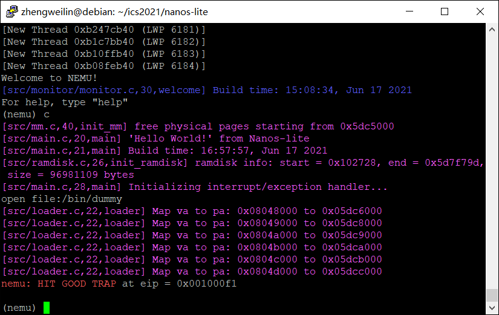

# 南京航空航天大学《计算机组成原理Ⅱ课程设计》报告

* 姓名：郑伟林
* 班级：1619303
* 学号：061920125
* 报告阶段：PA3.2
* 完成日期：2021.6.17
* 本次实验，我完成了所有内容。

## 目录

[TOC]

## 思考题

1. ⼀些问题（25）

   ①还有12位是一些控制、标志信息，二十位是页框号，而不是具体的地址单元。

   ②必须是物理地址，不能用虚拟地址

   ③采用一级页表会使页表过大，不利于存储与索引

2. 空指针真的是'空'的吗?（15）

   ​	C语言空指针的值为null，一般null指针指向进程的最小的地址，通常这个值为0。如果程序对空指针解引用，则会访问进程地址的最小值，从而触发系统的错误，在Linux上是段错误。
   
3. 理解 _map 函数（25）

   ​	先通过p->ptr取出页目录基地址，然后取出页表项地址，如果需要申请新页面，则调用palloc_f()获取一页空闲的物理页，最后将其存放的具体物理地址取出。

4. 内核映射的作⽤（25）

   ​	会触发Assert，去掉该部分会使虚拟空间无法正常初始化，从而引发冲突触发Assert

5. git log 和 远程仓库截图（10）

   

   

## 实验内容

### 1. 添加分⻚控制相关寄存器（10分）

​	由于已给出CR0和CR3的结构体，因此只需在`CPU_state`中加入下列两个寄存器即可。

```c
  CR0 cr0;
  CR3 cr3;
```

​	在`monitor.c`的restart()函数中将`cr0`的值赋为`0x60000011`.

```c
static inline void restart() {
  ......
  cpu.cr0.val = 0x60000011;
  ......
 }
```

### 2. 修改访存函数（20 分）

`vaddr_read()`

​	首先判断cr0是否处于分页机制状态：

​	1.是的话进行分页的虚拟内存读取。先判断当前数据是否会超过本页的边界，如果会：将`addr`分为两段，`prev_addr`和`last_addr`，分别进行读取，然后返回两者合并后的结果；如果不会：直接调用`page_translate()`转换为物理地址进行读取。

​	2.否的话直接对`addr`进行读取。

```c
uint32_t vaddr_read(vaddr_t addr, int len)
{
  if (cpu.cr0.paging)
  {
    if ((addr & 0xfff) + len > PGSIZE)
    {
      /* this is a special case, you can handle it later. */
      int prev = PGSIZE - OFF(addr);
      int last = len - prev;
      uint32_t prev_addr = paddr_read(page_translate(addr), prev);
      uint32_t last_addr = paddr_read(page_translate(addr + prev), last);
      return (last_addr << (8 * prev)) | prev_addr;
      //assert(0);
    }
    else
    {
      paddr_t paddr = page_translate(addr);
      return paddr_read(paddr, len);
    }
  }
  else
    return paddr_read(addr, len);
  //return paddr_read(addr, len);
}
```

`vaddr_write()`

​	首先判断cr0是否处于分页机制状态：

​	1.是的话进行分页的虚拟内存读取。先判断当前数据是否会超过本页的边界，如果会：assert(0)处理，暂时无需考虑；如果不会：直接调用`page_translate()`转换为物理地址进行写入。

​	2.否的话直接对`addr`进行写入。

```c
void vaddr_write(vaddr_t addr, int len, uint32_t data)
{
  if (cpu.cr0.paging)
  {
    if ((addr & 0xfff) + len > PGSIZE)
    {
      assert(0);
    }
    else
    {
      paddr_t paddr = page_translate(addr);
      paddr_write(paddr, len, data);
    }
  }
  else
    paddr_write(addr, len, data);
}

```

### 3.page_translate()（30 分）

​	根据讲义提示做即可。

​	当cr0处于保护模式并且开启分页机制时转换地址。根据 CR3 寄存器得到页目录表基址; 用这个基址和从虚拟地址中隐含的页目录字段项结合计算出所需页目录项地址`page_dir.val`； 从内存中读出这个页目录项，并对有效位进行检验; 将取出的 PDE 和虚拟地址的页表字段相组合，得到所需页表项地址`page_table.val`; 从内存中读出这个页表项，并对有效位进行检验; 检验 PDE 的 `accessed` 位，如果为 0 则需变为 1，并写回到页目录项所在地址; 检验 PTE 的 `accessed` 位如果为 0，或者 PTE 的脏位为 0 且现在正在做写内存操作，满足这两个条件之一时需要将 `accessed` 位，然后更新 `dirty` 位，最后并写回到页表项所在地址; 页级地址转换结束，返回转换结果.

​	如果不是以上情况直接返回`vaddr`

```c
paddr_t page_translate(vaddr_t vaddr)
{
  if (cpu.cr0.protect_enable && cpu.cr0.paging)
  {
    paddr_t pde_base = cpu.cr3.page_directory_base;
    PDE page_dir;
    page_dir.val = paddr_read((pde_base << 12) + ((vaddr >> 22) << 2), 4);

    if (!page_dir.present)
    {
      printf("Invalid page_dir:0x%x\n", page_dir.val);
      assert(0);
    }
    PTE page_table;
    page_table.val = paddr_read((page_dir.page_frame << 12) + ((vaddr >> 10) & 0xffc), 4);

    if (!page_table.present)
    {
      printf("Invalid page_table:0x%x\n", page_table.val);
      assert(0);
    }

    if (page_dir.accessed == 0)
    {
      page_dir.accessed = 1;
      paddr_write(page_dir.page_frame, 4, vaddr & 0xfffff000);
    }
    if (page_table.accessed == 0 || (page_table.dirty == 0 && page_table.read_write == 1))
    {
      page_table.accessed = 1;
      page_table.dirty = 1;
      paddr_write(page_table.page_frame, 4, vaddr & 0xfffff000);
    }
    Log("vaddr: 0x%x => paddr: 0x%x\n", vaddr, (page_table.page_frame << 12) + (vaddr & 0xfff));
    return (page_table.page_frame << 12) + (vaddr & 0xfff);
  }
  else
  {
    Log("paddr: 0x%x\n", vaddr);
    return vaddr;
  }
}
```

​	完成上述函数后发现还需完成两个指令，分别是`mov_r2cr`和`mov_cr2r`.如下，只需根据操作符情况完成赋值即可。然后填表就完成了。

```c
make_EHelper(mov_r2cr) {
  if (id_dest->reg == R_EAX)
    cpu.cr0.val = id_src->val;
  else if (id_dest->reg == R_EBX)
    cpu.cr3.val = id_src->val;
  else
    assert(0);

  print_asm("movl %%%s,%%cr%d", reg_name(id_src->reg, 4), id_dest->reg);
}

make_EHelper(mov_cr2r) {
  if (id_src->reg == R_EAX)
    operand_write(id_dest,&cpu.cr0.val);
  else if (id_src->reg == R_EBX)
    operand_write(id_dest,&cpu.cr3.val);
  else
    assert(0);

  print_asm("movl %%cr%d,%%%s", id_src->reg, reg_name(id_dest->reg, 4));

#ifdef DIFF_TEST
  diff_test_skip_qemu();
#endif
}
```


### 4.修改 loader()（30 分）

​	根据讲义步骤

​	先获取默认入口`va`，和页数（用文件长度/页大小 +1），再循环每一页进行映射，方法是先用`new_page()`获取一个空闲物理页给`pa`，然后调用`_map(as,va,pa)`，然后进行文件读取，最后`va+PGSIZE`.

```c
uintptr_t loader(_Protect *as, const char *filename) {
  //ramdisk_read(DEFAULT_ENTRY, 0, get_ramdisk_size());
  int fd = fs_open(filename,0,0);
  size_t len = fs_filesz(fd);
  void *va = DEFAULT_ENTRY;
  int page_num = len / PGSIZE + 1;
  
  for (int i = 0; i < page_num; i++)
  {
    void *pa = new_page();
    Log("Map va to pa: 0x%08x to 0x%08x", va, pa);
    _map(as,va,pa);
    fs_read(fd,pa,PGSIZE);
    va += PGSIZE;
  }
  
  fs_close(fd);

  return (uintptr_t)DEFAULT_ENTRY;
}
```



### 5. 在分⻚上运⾏仙剑奇侠传（10 分）

​	在`sys_brk()`函数中，将返回值修改为调用`mm_brk()`.


## 遇到的问题及解决办法

1. 遇到问题：分页机制不能正常执行，会触发assert

   解决方案：发现是跨页功能实现不正确导致，重新思考改了一下就可以了。

2. 遇到问题：...

   解决方案：...


## 实验心得

​	本次实验运用了分页、虚拟地址的知识，通过代码实现了nanos的分页功能，并在分页机制下成功运行了仙剑奇侠传。通过此次实验，我对虚拟存储器的有了进一步的理解，明白操作系统如何分页，分页后如何从虚拟地址找到物理地址读取数据。计算机巧妙的运用虚拟存储技术来使程序将一部分代码和数据传入主存，其它暂时放在硬盘，解决了物理内存大小的限制。

## 其他备注

无