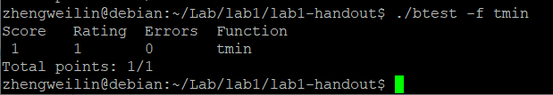
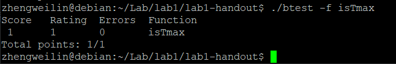
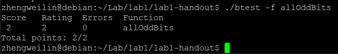
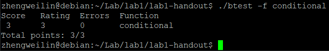
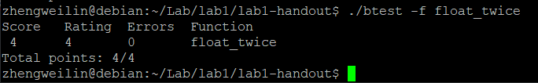
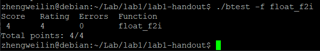
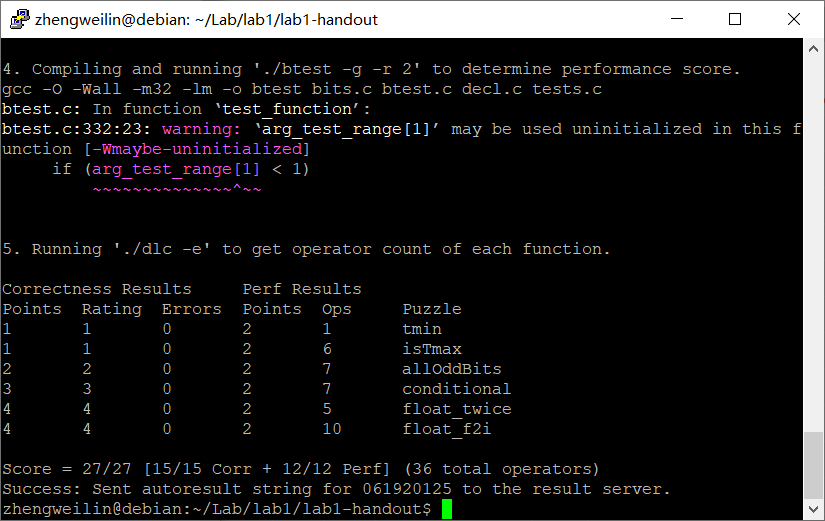
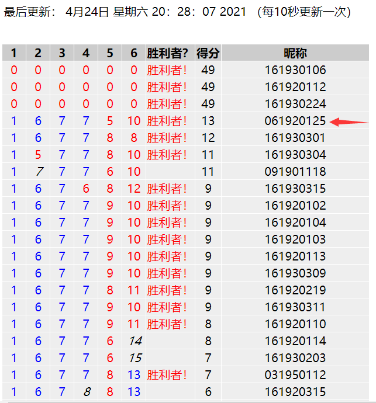

# Lab1 报告

* 姓名：郑伟林
* 班级：1619303
* 学号：061920125
* 报告阶段：lab1
* 完成日期：2021.4.22
* 本次实验，我完成了所有内容。

## 目录

[TOC]

## 1. Nuaa_question1

* 思路

  ​	因为补码的最小`int`值为`10000...0`，所以只需要通过将1左移31位即可。

* 代码

  ```c
  int tmin(void) {
      int x = 1;
      return x << 31;
  }
  ```

* 测试截图（dlc btest）

  

## 2. Nuaa_question2

* 思路

  ​	`int`型最大值补码形式为`0x7FFFFFFF`，即`0111 1111 ... 1111`，若将其加一则变成`1000 0000 ... 0000`，如果将两者取异或，则可以得到`1111 1111 ... 1111`，再按位取反就得到0，最后取非即可返回1。但再`int`范围内满足以上性质的除了`0x7FFFFFFF`外还有`0xFFFFFFFF`，因此我们在异或运算后再加上`!(x+1)`，这样如果是`0x7FFFFFFF`，那就是加零，但如果是`0xFFFFFFFF`，就是加一，这样就可以区别开。

* 代码

  ```c
  int isTmax(int x) {
    int y=x+1;
     return !(~((x^y)+!y));
  }
  ```

* 测试截图（dlc btest）

  

## 3. Nuaa_question3

* 思路

  ​	要检测32位的补码所有奇数位都是1，先将x前16位与后16位做与运算，这样得到的a后16位奇数位都是一，同理再将a的前八位与后八位做与运算，得b的后8位奇数位都是一，然后将b与1010 1010 做与运算将b偶数位全变为0，将结果再次与1010 1010做亦或，即可得到0000 0000，然后取非即可返回1。

* 代码

  ```C
  int allOddBits(int x) {
    int a, b, d = 170;
     a = (x >> 16) & x;
     b = (a >> 8) & a;
     b = b & d;
     return !(b ^ d);
  }
  ```

* 测试截图（dlc btest）

  

## 4. Nuaa_question4

* 思路

  ​	要实现`x?y:z`，即当x!=0，返回y，当x=0，返回z，很容易想到，当x!=0时：将y与`1111 1111 ...  1111`做与运算，将z与`0000 0000 ... 0000`做与运算，再将上述两者做或运算；当x=0时则为：将y与`0000 0000 ... 0000`做与运算，将z与`1111 1111 ...  1111`做与运算，再将上述两者做或运算。因此我们需要找到一个表达式：x!=0时为`0000 0000 ... 0000`，x=0时为`1111 1111 ...  1111`。该表达式可以通过`(!x) << 31 >> 31`来实现。

* 代码

  ```c
  int conditional(int x, int y, int z) {
    int a;
     a = (!x) << 31 >> 31;
     return (y & ~a) | (z & a);
  }
  ```

* 测试截图（dlc btest）

  

## 5. Nuaa_question5

* 思路

  ​	我们先将浮点数的阶码部分和尾数部分取出，阶码可以将uf左移一位再右移24位得到，尾数可以将uf与`0000 0000 0111 1111 ... 1111`做与运算得到。然后如果j==255，则表示为无穷大或`NaN`，只需将`uf`返回即可，如果j是0~255之间的数，则返回`uf+0000 0000 1000 ... 0000`（即阶码加一），若j为0，则返回`uf+尾数`。

* 代码

  ```c
  unsigned float_twice(unsigned uf) {
     unsigned t = 8388607;
     unsigned j = uf << 1 >> 24;
     unsigned w = uf & t;
     unsigned a = 8388608u;
  
     switch (j)
     {
         case 0xff:
          return uf;
     }
     if (j)
          return uf+a;
      else
          return uf+w;
  }
  ```

* 测试截图（dlc btest）

  

## 6. Nuaa_question6

* 思路

  ​	先将各部分分离出来，阶码j和尾数w与上一题同理，符号位s可以将uf右移31为来表示。若j==0，则直接返回0，否则继续。将w+0000 0000 1000 ... 0000来表示加上隐藏位的尾数ans，然后由计算，e=150-j来表示尾数应该右移动的位数，如果e>=24，则表示数据过小，直接返回0；如果e<=-8，则表示数据过大，直接返回0x80000000。除了上面两种情况外，ans可以正常右移e位，然后根据符号位s返回整数或负数。

* 代码

  ```c
  int float_f2i(unsigned uf) {
     int e, ans;
     int temp=4294967288;
     unsigned t2=8388607;
     unsigned j = uf << 1 >> 24;
     unsigned w = uf & t2;
     unsigned s = uf >> 31;
     e = 150 - j;
     ans = w + 8388608;
     if (j){
     if (e>=24)
          return 0;
      if (e<=temp)
          return 0x80000000;
      ans=ans>>e;
     if (s)
        return -ans;
     else
        return ans;
     }
     else
  	   return 0;
  }
  ```

* 测试截图（dlc btest）

  

## 7. 最终结果

* ./driver.pl 截图

  

* 挑战教授截图（必须是你的学号）

  

## 8. 备注

助教真帅

