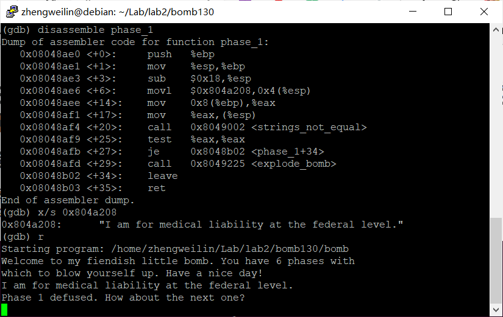
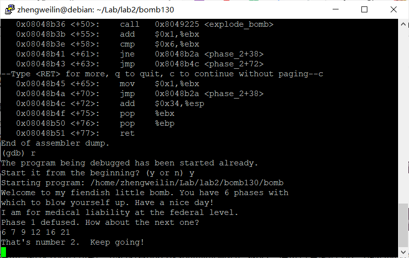
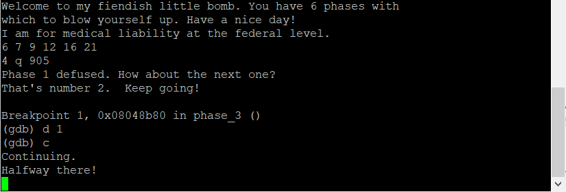
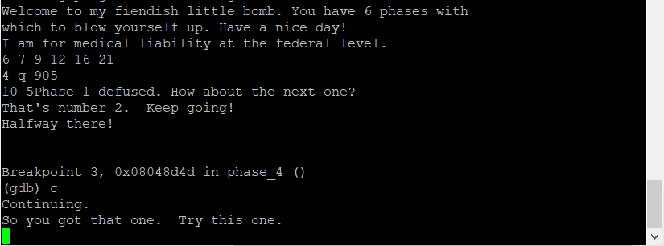
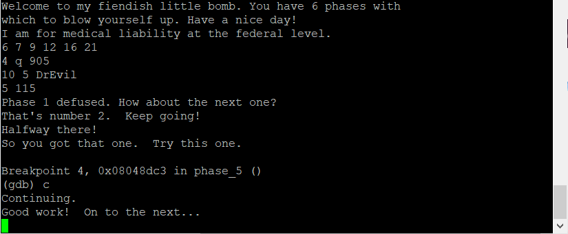
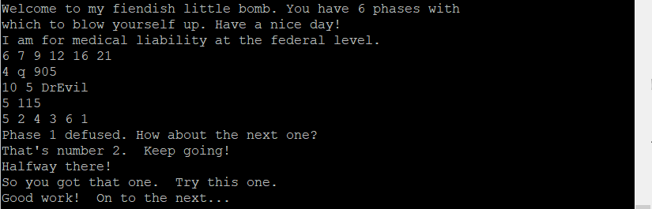
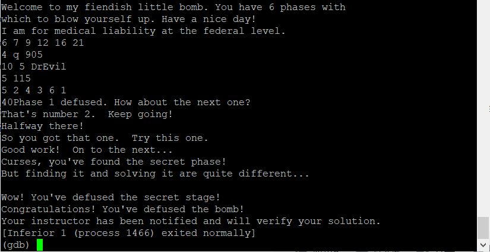

# Lab2 报告

* 姓名：郑伟林
* 班级：1619303
* 学号：061920125
* 报告阶段：lab2
* 完成日期：2021.5.23
* 本次实验，我完成了所有内容。

## 目录

[TOC]

## 1. phase_1

* 思路

  ​	查看`pahse_1`内容发现有一个`strings_not_equal`函数，则会进行字符串比较，观察到将`0x804a208`的内容赋值到`esp`中，查看目标地址即可得到答案。

  所以密码是`I am for medical liability at the federal level.`

* 完成截图

  

## 2. phase_2

* 思路

  ​	由`read_six_numbers`可知输入位六个数字，

  由

  ```
  	0x08048b3b <+55>:    add    $0x1,%ebx
  	0x08048b3e <+58>:    cmp    $0x6,%ebx
  	0x08048b41 <+61>:    jne    0x8048b2a <phase_2+38>
  	0x08048b43 <+63>:    jmp    0x8048b4c <phase_2+72>
  ```

  这是个循环跳转，可知程序对六个数字进行循环处理

  ```
     0x08048b2a <+38>:    mov    %ebx,%eax
     0x08048b2c <+40>:    add    -0x24(%ebp,%ebx,4),%eax
     0x08048b30 <+44>:    cmp    %eax,-0x20(%ebp,%ebx,4)
     0x08048b34 <+48>:    je     0x8048b3b <phase_2+55>
     0x08048b36 <+50>:    call   0x8049225 <explode_bomb>
  ```

  由此看出循环体中将前一个数加上当前循环次数i与当前数比较，不相等的爆炸，即可推出六个数之差分别为1、2、3、4、5.

  因此密码可以是`6 7 9 12 16 21`

* 完成截图

  

## 3. phase_3

* 思路

  ​	在输入前将`0x804a262`赋给了`esp+0x4`，查看该地址内容为`"%d %c %d"`，可知输入为数字、字符、数字。

  ​	输入测试数据`4 a 100`，在输入完成后设置断点停下，然后单步执行，观察到执行到

  ```
     0x08048b97 <+69>:    jmp    *0x804a280(,%eax,4)
  ```

  查看`x/10xg 0x804a280+16`，发现内容为`08048c1b`，继续查看`x/10i 0x08048c1b`

  ```
     0x8048c1b <phase_3+201>:     mov    $0x71,%eax
     0x8048c20 <phase_3+206>:     cmpl   $0x389,-0x10(%ebp)
     0x8048c27 <phase_3+213>:     je     0x8048c8d <phase_3+315>
     0x8048c29 <phase_3+215>:     call   0x8049225 <explode_bomb>
     0x8048c2e <phase_3+220>:     mov    $0x71,%eax
     0x8048c33 <phase_3+225>:     jmp    0x8048c8d <phase_3+315>
     0x8048c35 <phase_3+227>:     mov    $0x6e,%eax
     0x8048c3a <phase_3+232>:     cmpl   $0x32f,-0x10(%ebp)
     0x8048c41 <phase_3+239>:     je     0x8048c8d <phase_3+315>
     0x8048c43 <phase_3+241>:     call   0x8049225 <explode_bomb>
  ```

  可发现第二个字符应该和`0x71`对应字符相等，第三个数据应为`0x389`.

  所以密码为`4 q 905`

* 完成截图

  

## 4. phase_4

* 思路

  ​	查看`0x804a4b1`内容可知输入为两个数字

  ```
  0x08048d0f <+20>:    movl   $0x804a4b1,0x4(%esp)
  ......
  (gdb) x/s 0x804a4b1
  0x804a4b1:      "%d %d"
  ```

  由

  ```
     0x08048d25 <+42>:    jne    0x8048d2d <phase_4+50>
     0x08048d27 <+44>:    cmpl   $0xe,-0xc(%ebp)
     0x08048d2b <+48>:    jbe    0x8048d32 <phase_4+55>
     0x08048d2d <+50>:    call   0x8049225 <explode_bomb>
     0x08048d32 <+55>:    movl   $0xe,0x8(%esp)
  ```

  可知`ebp-0xc`中存放第一个数，应该`<=0xe`，接着程序调用了func4函数，结束后如果`eax`应该存放5，`ebp-0x10`应该存放5，否则爆炸。因此func4过程应该将`eax`和`ebp-0x10`都变为5.

  ```
     0x08048d4d <+82>:    cmp    $0x5,%eax
     0x08048d50 <+85>:    jne    0x8048d58 <phase_4+93>
     0x08048d52 <+87>:    cmpl   $0x5,-0x10(%ebp)
     0x08048d56 <+91>:    je     0x8048d5d <phase_4+98>
     0x08048d58 <+93>:    call   0x8049225 <explode_bomb>
  ```

  ​	由于func4对`ebp-0x10`并无改变，则第二个数应该为5.

  由于第一个数不大于15，因此可以尝试1~15，并在func4后断点查看eax。

  最后的密码`10 5`

* 完成截图

  

## 5. phase_5

* 思路

  ​	由

  ```
  0x08048d75 <+20>:    movl   $0x804a4b1,0x4(%esp)
  
  (gdb) x/s 0x804a4b1
  0x804a4b1:      "%d %d"
  ```

  得输入为两个数字x和y。

  ​	观察得`0x804a2a0`开始存放了一个数组，程序将从第x个数t开始，累加，然后找第t个数存放的数，累加，不断进行上述，直到加了十五次读到的t是`f`结束则不会爆炸，因此将数组列出来后可知从第5开始可以加十五次，第二个数由

  ```
     0x08048dbb <+90>:    mov    %eax,-0xc(%ebp)
     0x08048dbe <+93>:    cmp    $0xf,%edx
     0x08048dc1 <+96>:    jne    0x8048dc8 <phase_5+103>
     0x08048dc3 <+98>:    cmp    -0x10(%ebp),%ecx
     0x08048dc6 <+101>:   je     0x8048dcd <phase_5+108>
     0x08048dc8 <+103>:   call   0x8049225 <explode_bomb>
  ```

  可知y为累加结果

  因此密码为`5 115`

* 完成截图

  

## 6. phase_6

* 思路

  由read_six_number可知读入六个数。

  注意到程序引用了`0x804c154`，查看发现这存了一个结构体数组node。

  ```
  (gdb) x/10x 0x804c154
  0x804c154 <node1>:      0x00000001000002e9      0x0000014c0804c160
  0x804c164 <node2+4>:    0x0804c16c00000002      0x000000030000018d
  0x804c174 <node3+8>:    0x0000014d0804c178      0x0804c18400000004
  0x804c184 <node5>:      0x0000000500000137      0x000002140804c190
  0x804c194 <node6+4>:    0x0000000000000006      0x3931363000000000
  ```

  由

  ```
     0x08048e6f <+158>:   add    $0x4,%eax
     0x08048e72 <+161>:   cmp    %esi,%eax
     0x08048e74 <+163>:   je     0x8048e7a <phase_6+169>
     0x08048e76 <+165>:   mov    %edx,%ecx
     0x08048e78 <+167>:   jmp    0x8048e6a <phase_6+153>
     0x08048e7a <+169>:   movl   $0x0,0x8(%edx)
     0x08048e81 <+176>:   mov    $0x5,%esi
     0x08048e86 <+181>:   mov    0x8(%ebx),%eax
     0x08048e89 <+184>:   mov    (%eax),%eax
     0x08048e8b <+186>:   cmp    %eax,(%ebx)
     0x08048e8d <+188>:   jle    0x8048e94 <phase_6+195>
     0x08048e8f <+190>:   call   0x8049225 <explode_bomb>
     0x08048e94 <+195>:   mov    0x8(%ebx),%ebx
  ```

  可知程序将前一个数A和当前数B比较，若A>B则爆炸，因此推测六个数顺序为结构体数组值从小到大的结点编号

  密码为`5 2 4 3 6 1`

* 完成截图

  

## 7. 最终结果

* `bomblab` 完成截图

  

* （可选）`bomblab` 隐藏关卡

  查看`phase_defused`中的信息，发现`0x804a514`，查看发现

  ```
  (gdb) x/s 0x804a514
  0x804a514:      "DrEvil"
  ```

  因此开启密码为`DrEvil`

  分析secret_phase，程序调用`strtol`获取了一个数值y。

  观察到0x804c0a0，查看内容

  ```
  (gdb) x/20xg 0x804c0a0
  0x804c0a0 <n1>: 0x0804c0ac00000024      0x000000080804c0b8
  0x804c0b0 <n21+4>:      0x0804c0c40804c0dc      0x0804c0d000000032
  0x804c0c0 <n22+8>:      0x000000160804c0e8      0x0804c1180804c130
  0x804c0d0 <n33>:        0x0804c0f40000002d      0x000000060804c13c
  0x804c0e0 <n31+4>:      0x0804c1240804c100      0x0804c10c0000006b
  0x804c0f0 <n34+8>:      0x000000280804c148      0x0000000000000000
  0x804c100 <n41>:        0x0000000000000001      0x0000006300000000
  0x804c110 <n47+4>:      0x0000000000000000      0x0000000000000023
  0x804c120 <n44+8>:      0x0000000700000000      0x0000000000000000
  0x804c130 <n43>:        0x0000000000000014      0x0000002f00000000
  ```

  发现这是个结构体node数组，如n1包含一个值24，左孩子地址0x0804c0ac，右孩子地址0x0804c0b8。

  调用了func7(node,y)，其功能为y大于node的值递归左孩子，否则递归右孩子。

  根据最后

  ```
     0x08048f3b <+69>:    cmp    $0x1,%eax
     0x08048f3e <+72>:    je     0x8048f45 <secret_phase+79>
     0x08048f40 <+74>:    call   0x8049225 <explode_bomb>
     0x08048f45 <+79>:    movl   $0x804a23c,(%esp)
  ```

  可知要让结果为1，则最后需递归到n41结点。符合要求的y满足y>36,y<60,y<45

  所以密码可以是40.

  

## 8. 备注

