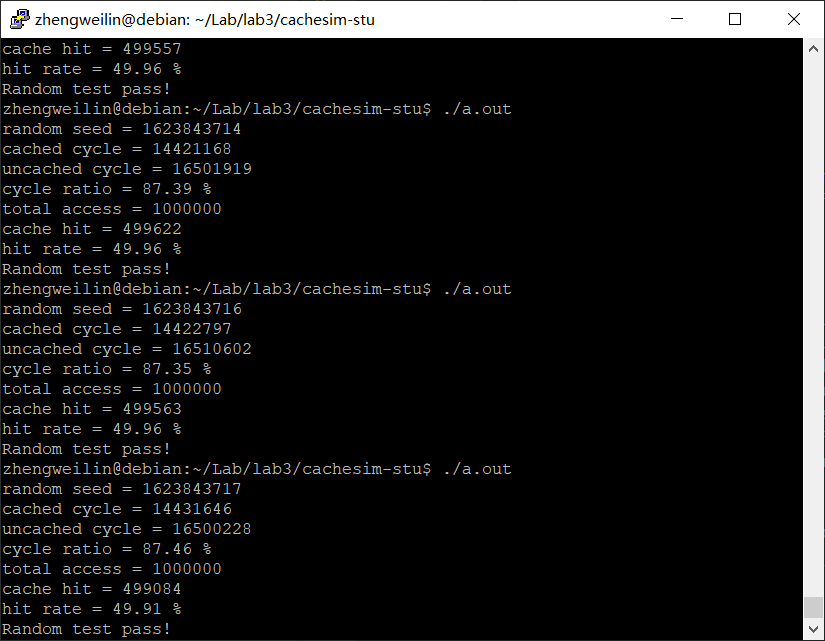

# Lab3 报告

* 姓名：郑伟林
* 班级：1619303
* 学号：061920125
* 报告阶段：lab3
* 完成日期：2021.6.16
* 本次实验，我完成了所有内容。

----

## 目录

[TOC]

## init_cache （20分）

* cache结构设计
  * 思路
  
    ​	首先建立cache行`line`结构体，其包含有效位`valid_bit`，脏位`dirty_bit`，标记tag，`块`号`block_num`和块数组`block`。`line`用以表示cache中的一行。
  
    ​	然后建立`CACHE`结构体，其包含`line`类型的二维指针`cache`，用以生成cache，还辅以两个参数：组数`grow_num`和路数`way_num`。
  
    ​	最后定义一个`CACHE`类型的cache实例`c`。
  
  * 代码
  
    ```c
    typedef struct
    {
    	uint8_t block[BLOCK_SIZE]; //块
    	bool valid_bit;			   //有效位
    	bool dirty_bit;			   //脏位
    	uint32_t tag;			   //标记
    	uint32_t block_num;		   //块号
    } line;
    
    typedef struct
    {
    	line **cache;
    	int grow_num;
    	int way_num;
    } CACHE;
    
    CACHE c; //实例化一个cache
    ```
* cache初始化
  * 思路
  
    ​	先计算组数`grow_num`和路数`way_num`，然后动态申请二维数组`cache`的空间，并将`cache`中所有字段初始化为0.
  
  * 代码
  
    ```c
    // 初始化一个数据大小为`2^total_size_width`B, 关联度为`2^associativity_width`的cache
    // 例如`init_cache(14, 2)`将初始化一个16KB, 4路组相联的cache
    // 将所有valid bit置为无效即可
    void init_cache(int total_size_width, int associativity_width)
    {
    	c.grow_num = (1 << total_size_width) / (BLOCK_SIZE * (1 << associativity_width));
    	c.way_num = 1 << associativity_width;
    
    	c.cache = (line **)malloc(c.grow_num * sizeof(line *));
    	for (int i = 0; i < c.grow_num; i++)
    		c.cache[i] = (line *)malloc(c.way_num * sizeof(line));
    
    	for (int i = 0; i < c.grow_num; i++)
    	{
    		for (int j = 0; j < c.way_num; j++)
    		{
    			c.cache[i][j].valid_bit = 0;
    			c.cache[i][j].dirty_bit = 0;
    			c.cache[i][j].tag = 0;
    			c.cache[i][j].block_num = 0;
    			memset(c.cache[i][j].block, 0, sizeof(c.cache[i][j].block));
    		}
    	}
    }
    ```

## cache_read (30分)

* 思路

  ​	首先取得`addr`中的组号`num_of_grow`，然后遍历`cache`中该组，查询是否命中，若命中了，读取出数据。

  ​	如果未命中，则先查询组是否已满，满了的话取组中随机一行，若脏位标记是1将其写回内存，再进行读取数据；如果未满，则直接读取数据，并更新`cache`行信息。

* 代码

  ```c
  // 从cache中读出`addr`地址处的4字节数据
  // 若缺失, 需要先从内存中读入数据
  uint32_t cache_read(uintptr_t addr)
  {
  	int num_of_grow = (addr >> BLOCK_WIDTH) % c.grow_num; //取地址中的cache组号
  	bool is_hit = false;
  	uint32_t *p = NULL;
  	int tag_offset = (BLOCK_WIDTH + (int)(log(c.grow_num) / log(2.0)));
  
  	for (int i = 0; i < c.way_num; i++)
  	{
  		if ((c.cache[num_of_grow][i].tag == (addr >> tag_offset)) && (c.cache[num_of_grow][i].valid_bit == 1))
  		{
  			hit_increase(1); //命中了
  			is_hit = true;
  			p = (void *)c.cache[num_of_grow][i].block + ((addr & 0x3f) & 0x3c);
  			break;
  		}
  	}
  
  	if (is_hit == false) //如果未命中
  	{
  		bool is_full = true;
  		int i = 0;
  		uint8_t temp[BLOCK_SIZE];
  
  		for (i = 0; i < c.way_num; i++)
  		{
  			if (c.cache[num_of_grow][i].valid_bit == 0)
  			{
  				is_full = false;
  				break;
  			}
  		}
  		if (is_full == true) //如果组已满
  		{
  			i = rand() % c.way_num;						//取随机
  			if (c.cache[num_of_grow][i].dirty_bit == 1) //脏位为1，则需保存回内存
  			{
  				memcpy(temp, c.cache[num_of_grow][i].block, BLOCK_SIZE);
  				mem_write(c.cache[num_of_grow][i].block_num, temp);
  				c.cache[num_of_grow][i].dirty_bit = 0;
  			}
  		}
  		//更新cache
  		c.cache[num_of_grow][i].valid_bit = 1;
  		c.cache[num_of_grow][i].tag = addr >> tag_offset;
  		c.cache[num_of_grow][i].block_num = addr >> BLOCK_WIDTH;
  		mem_read(addr >> BLOCK_WIDTH, temp);					 //从内存读取数据
  		memcpy(c.cache[num_of_grow][i].block, temp, BLOCK_SIZE); //写入cache
  		p = (void *)c.cache[num_of_grow][i].block + ((addr & 0x3f) & 0x3c);
  	}
  	try_increase(1);
  	return *p;
  }
  ```

  

## cache_write (30分)

* 思路

  ​	首先取得`addr`中的组号`num_of_grow`，然后遍历`cache`中该组，查询是否命中，若命中了，直接将`data`经过掩码处理写入`cache`，并将改行脏位设1。

  ​	如果未命中，则先查询组是否已满，满了的话取组中随机一行，若脏位标记是1将其写回内存，再从内存读出数据到`cache`并将`data`经过掩码处理写入`cache`和原内存位置，更新`cache`行信息；如果未满，则直接读取数据到`cache`并将`data`经过掩码处理写入`cache`和原内存位置，并更新`cache`行信息。

* 代码

  ```c
  // 往cache中`addr`地址所属的块写入数据`data`, 写掩码为`wmask`
  // 例如当`wmask`为`0xff`时, 只写入低8比特
  // 若缺失, 需要从先内存中读入数据
  void cache_write(uintptr_t addr, uint32_t data, uint32_t wmask)
  {
  
  	int num_of_grow = (addr >> BLOCK_WIDTH) % c.grow_num; //取地址中的cache组号
  	bool is_hit = false;
  	uint32_t *p = NULL;
  	int tag_offset = (BLOCK_WIDTH + (int)(log(c.grow_num) / log(2.0)));
  
  	for (int i = 0; i < c.way_num; i++)
  	{
  		if ((c.cache[num_of_grow][i].tag == (addr >> tag_offset)) && (c.cache[num_of_grow][i].valid_bit))
  		{
  			hit_increase(1); //命中了
  			is_hit = true;
  			p = (void *)c.cache[num_of_grow][i].block + ((addr & 0x3f) & 0x3c); //写入，参照mem_uncache_write
  			*p = (*p & ~wmask) | (data & wmask);
  			c.cache[num_of_grow][i].dirty_bit = 1; //更新脏位，表示改过
  			break;
  		}
  	}
  	if (is_hit == false) //如果未命中
  	{
  		bool is_full = true;
  		int i = 0;
  		uint8_t temp[BLOCK_SIZE];
  
  		for (i = 0; i < c.way_num; i++)
  		{
  			if (c.cache[num_of_grow][i].valid_bit == 0)
  			{
  				is_full = false;
  				break;
  			}
  		}
  		if (is_full) //如果组已满
  		{
  			i = rand() % c.way_num;						//取随机
  			if (c.cache[num_of_grow][i].dirty_bit == 1) //脏位为1，则需保存回内存
  			{
  				memcpy(temp, c.cache[num_of_grow][i].block, BLOCK_SIZE);
  				mem_write(c.cache[num_of_grow][i].block_num, temp);
  				c.cache[num_of_grow][i].dirty_bit = 0;
  			}
  		}
  		//更新cache
  		c.cache[num_of_grow][i].valid_bit = 1;
  		c.cache[num_of_grow][i].dirty_bit = 0;
  		c.cache[num_of_grow][i].tag = addr >> tag_offset;
  		c.cache[num_of_grow][i].block_num = addr >> BLOCK_WIDTH;
  		mem_read(addr >> BLOCK_WIDTH, temp); //从内存取数据
  		p = (void *)temp + ((addr & 0x3f) & 0x3c); //写入，参照mem_uncache_write
  		*p = (*p & ~wmask) | (data & wmask);
  		mem_write(addr >> 6, temp);
  		
  		memcpy(c.cache[num_of_grow][i].block, temp, BLOCK_SIZE);
  		//c.cache[num_of_grow][i].dirty_bit = 1; //更新脏位，表示改过
  	}
  
  	try_increase(1);
  }
  ```

  

## 最终结果截图（20分）



## 备注

助教真帅


