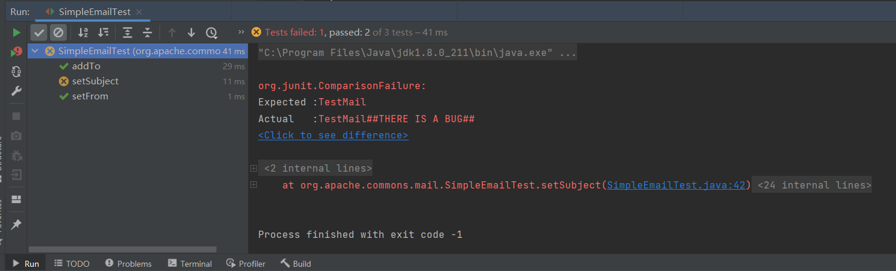
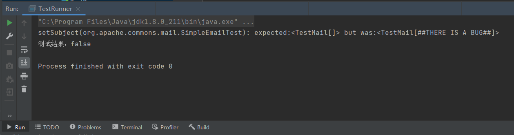

# 软件测试实验一：单元与集成测试报告

------

[TOC]

------

## 一、测试环境

### 1.系统环境

​	操作系统：Windows10 21H1

​	RAM：12GB

​	CPU：i5-8300H

### 2.JAVA环境

​	版本：1.8.0_211

​	运行时：Java(TM) SE Runtime Environment (build 1.8.0_211-b12)

### 3.开发环境

​	IDE: IntelliJ IDEA 2021.1.2

​	JUnit: JUnit 4.12

## 二、测试对象

### 1.测试工具类

​	本次实验测试的类是Apache Commons库中的Email工具类。该类是基于Java的mail库，将原库中的方法整合成一个较为易用的接口，主要用于电子邮件的发送。本次测试选取其中的SimpleEmail类，该类用于发送简易的纯文字邮件，主要的方法有如下：

​	设置邮件发送主机及端口

```java
Email email = new SimpleEmail();

email.setHostName("smtp.qq.com");
email.setSmtpPort(465);
```

​	设置发送人账户，设置SSL连接

```java
email.setAuthenticator(new DefaultAuthenticator("from@qq.com", "xxxxxxxxx"));
email.setSSLOnConnect(true);
```

​	设置发送人邮箱地址

```java
email.setFrom("from@qq.com");
```

​	设置邮件主题

```java
tSubject("TestMail");
```

​	设置邮件内容

```java
email.setMsg("Content...");
```

​	设置接收人邮箱地址

```java
email.addTo("to@163.com");
```

​	发送邮件

```java
email.send();
```

### 2.注入缺陷

​	软件缺陷的类型有很多种，比如 Funciton、Assignment、Algorithm等。

​	本实验在Email类中的`setSubject(final String aSubject)`方法中注入一个简单的算法错误来模拟实际开发中的字符串错误连接。

```java
public Email setSubject(final String aSubject)
    {
        //this.subject = EmailUtils.replaceEndOfLineCharactersWithSpaces(aSubject);
        this.subject = EmailUtils.replaceEndOfLineCharactersWithSpaces(aSubject + "##THERE IS A BUG##");
        return this;
    }
```

​	缺陷分级为严重。

## 三、测试过程

### 1. main方法驱动的单元测试

​	创建TestMail类，建立main方法。

​	先配置完基本邮件配置，然后对关键邮件发送方法进行测试，包括`setFrom()`、`setSubject()` 、`setMsg()`、 `addTo()`等，判断方法执行后对应的值是否正确。

​	具体过程如下

```java
import org.apache.commons.mail.*;

public class TestEmail {
    public static void main(String[] args) throws EmailException {
        //实例化email对象
        Email email = new SimpleEmail();
        //配置基本信息
        email.setHostName("smtp.qq.com");
        email.setSmtpPort(465);
        email.setAuthenticator(new DefaultAuthenticator("1326612236@qq.com", "kccdtrrctnptbabe"));
        email.setSSLOnConnect(true);

        //测试setFrom方法
        email.setFrom("1326612236@qq.com");
        if (!email.getFromAddress().getAddress().equals("1326612236@qq.com"))
            System.out.println("setFrom()函数未通过测试: 结果应该是‘1326612236@qq.com’，但返回了"+email.getFromAddress().getAddress());
        //测试setSubject方法
        email.setSubject("TestMail");
        if (!email.getSubject().equals("TestMail"))
            System.out.println("setSubject()函数未通过测试: 结果应该是‘TestMail’，但返回了"+email.getSubject());
        //测试setMsg方法
        email.setMsg("这是一封简单的邮件。");
        //测试addTo方法
        email.addTo("2529039819@qq.com");
        if (!email.getToAddresses().get(0).getAddress().equals("2529039819@qq.com"))
            System.out.println("addTo()函数未通过测试: 结果应该是‘2529039819@qq.com’，但返回了"+email.getToAddresses().get(0).getAddress());
        //email.send();
    }
}

```

**测试结果：**


### 2. JUnit单元测试

​	使用IDEA的JUnit Generator对`org.apache.commons.mail`包下的`SimpleEmail`类建立`Test`类，

对主要方法：`setFrom()`、`addTo()`、`setSubject()`进行测试。

​	具体操作如下：

```java
package org.apache.commons.mail;

import org.junit.After;
import org.junit.Before;
import org.junit.Test;

import static org.junit.Assert.*;

public class SimpleEmailTest {
    private Email email;

    @Before
    public void setUp() throws Exception {
        email = new SimpleEmail();
        email.setHostName("smtp.qq.com");
        email.setSmtpPort(465);
        email.setAuthenticator(new DefaultAuthenticator("1326612236@qq.com", "kccdtrrctnptbabe"));
        email.setSSLOnConnect(true);

        email.setMsg("这是一封简单的邮件This is a test mail ... :-)");
    }

    @After
    public void tearDown() throws Exception {
    }

    @Test
    public void setFrom() throws EmailException {
        email.setFrom("1326612236@qq.com");
        assertEquals("1326612236@qq.com",email.getFromAddress().getAddress());
    }

    @Test
    public void addTo() throws EmailException {
        email.addTo("2529039819@qq.com");
        assertEquals("2529039819@qq.com",email.getToAddresses().get(0).getAddress());
    }

    @Test
    public void setSubject() {
        email.setSubject("TestMail");
        assertEquals("TestMail",email.getSubject());
    }
}
```

**测试结果：**



### 3.集成测试

​	对于有多个测试用例的单元测试，一个个进行过于费时，因此采用集成测试集，将多个测试用例添加到测试集，然后一键批量运行。

​	首先需要创建测试集

```java
package org.apache.commons.mail;
import org.junit.runner.RunWith;
import org.junit.runners.Suite;

@RunWith(Suite.class)
@Suite.SuiteClasses({
        SimpleEmailTest.class,
        EmailTest.class        
})
public class TestSuite {
}
```

接着驱动测试集，进行批量测试

```java
package org.apache.commons.mail;
import org.junit.runner.JUnitCore;
import org.junit.runner.Result;
import org.junit.runner.notification.Failure;

public class TestRunner {
    public static void main(String[] args) {
        Result result = JUnitCore.runClasses(TestSuite.class);
        for (Failure failure:result.getFailures()) {
            System.out.println(failure.toString());
        }
        System.out.println("测试结果："+result.wasSuccessful());
    }
}
```

**测试结果：**



## 四、总结

​	通过本次实验，我学会了如何在IDEA环境中，利用JUnit对目标进行单元测试。在这个过程中，我了解了常见的缺陷类型，学习了手工进行单元测试和JUnit单元测试。通过对比，手工单元测试极不适合进行大规模的单元测试，而JUnit的解决方案更优，通过使用这个单元测试框架可以很便捷的创建单元测试，而且整体结构与原类相似，便于阅读。利用测试集进行批量测试更是极大地简便了测试过程。