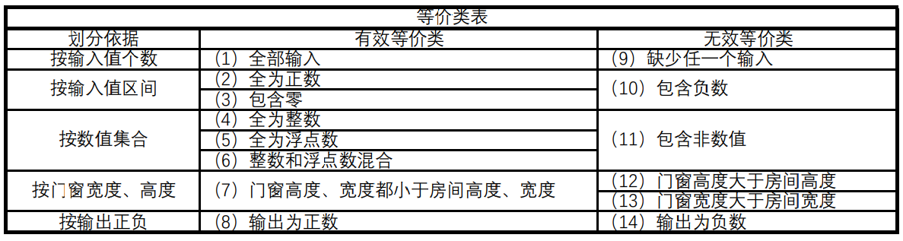
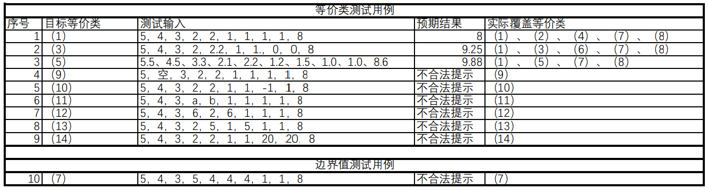
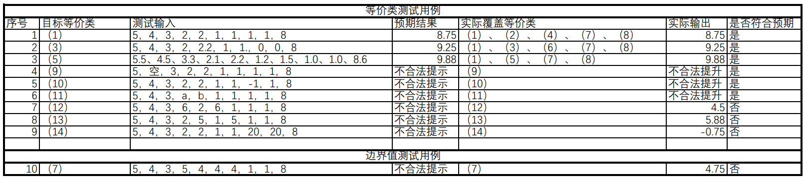

# 《软件测试》实验三黑盒测试报告

* 姓名：郑伟林
* 班级：1619303
* 学号：061920125

## 目录

[TOC]

## 一、实验题目

​	采用黑盒测试方法（例如用例场景法、等价类法、边界值法、决策 表法、正交实验设计法等）为以下软件之一设计测试用例。 

 	1. 分析待测对象的输入、输出结构和行为特征，分析其适合采用哪些方 法来进行测试，说明如何将多种测试方法串联使用； 
 	2. 按步骤(1)给出的测试思路开展测试用例设计，并执行测试，获得测试 结果； 
 	3. 分析测试结果，列出所发现的软件缺陷，并尝试对缺陷的可能成因进 行分析

所选软件：涂料用量计算 http://www.zx123.cn/zxjsq/tuliao/

## 二、等价类划分

### 

​	根据不同的划分依据，将该软件输入分为十四个等价类，其中有八个有效等价类和六个无效等价类。

## 三、设计测试用例

​	根据上述等价类划分，选取十个测试用例对软件进行黑盒测试，测试用例如下。

## 四、执行测试

​	对上述用例进行测试后，我们得出其实际结果

​	从上述结果来看，在面对门窗长、宽、个数异常的情况下，该软件未能给出提示。虽然在实际生活中不会出现这种状况，但可能由于手误输错的情况，而软件未能检测到，从而造成计算结果错误，导致涂料的浪费或缺少。

## 五、总结

​	通过本次实验，我学会了黑盒测试中的等价类方法，简单用到边界值测试法，对黑盒测试有了初步了解，对软件工程有了进一步认知。
