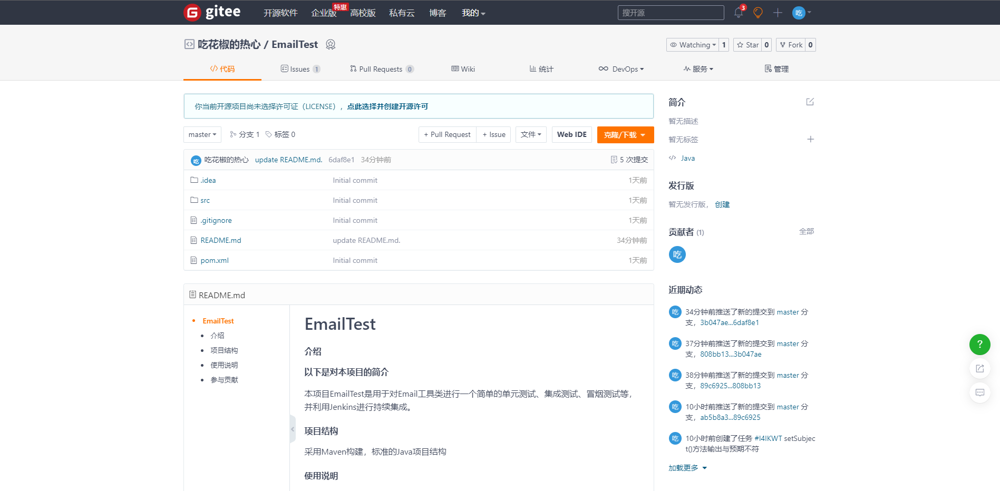
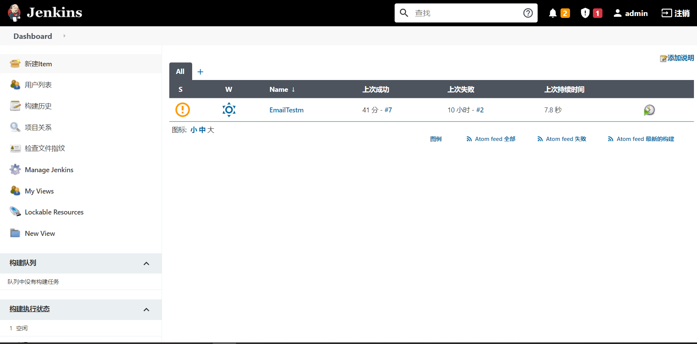
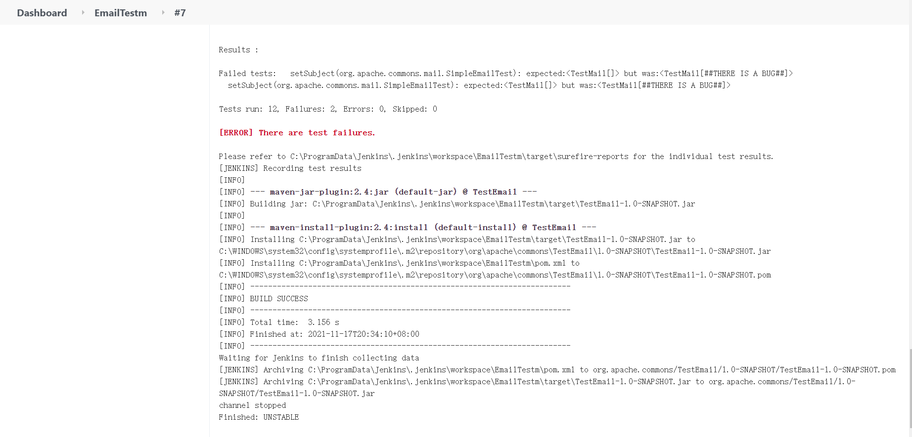
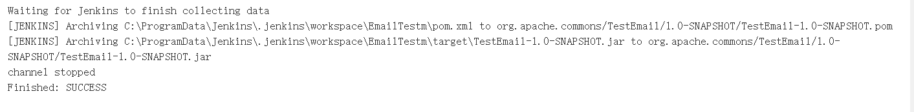
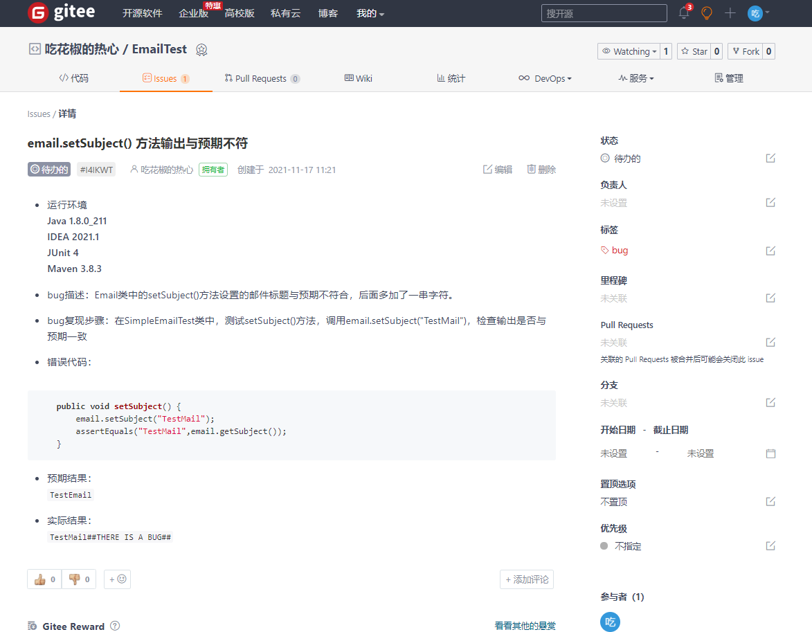

# 《软件测试》实验二测试管理报告

* 姓名：郑伟林
* 班级：1619303
* 学号：061920125

## 目录

[TOC]

## 一、实验题目

1. #### 搭建一个包含以下模块的开发环境

   • Git代码仓库（本次实验选择Gitee） 

   • Jenkins或其它持续集成与测试工具

   • issue tracking模块（本次实验采用Gitee自带的Issue追踪模块）

2. #### 采用Ant 、Maven等配置工具配置软件项目，项目中必须包含 build 和test两个目标，build用来导出程序的完整jar包，test用来 对程序进行测试。 （本次实验采用Maven来配置项目）

3. #### 在持续集成（如Jenkins）中应用项目配置中设定的test任务，完 成冒烟测试。（Jenkins日志中可以看到执行测试用例的提示 ） 

4. #### 调研缺陷提交的一般性流程和格式要求，在缺陷管理工具中登记 发现的bug，填写缺陷信息。 

5. #### 按项目将要给其它人接手的角度，为其编写一个简要的 README.md来说明项目开发、测试与缺陷提交步骤、方法

## 二、git仓库

​	选择Gitee的远程仓库对项目代码进行管理。先在远程仓库建立一个新仓库，然后在本地项目中初始化git，并添加提交，push到远程仓库。

​	仓库地址：https://gitee.com/rlin1538/email-test

## 三、持续集成

​	选择Jenkins来对远程仓库的代码进行自动构建。

​	安装完Jenkins服务后，创建一个Maven项目Item，配置好仓库信息和构建信息，进行持续测试。

配置轮询构建或监听提交进行构建，Jenkins将自动对仓库里的项目进行构建、测试。

若注入缺陷，则测试会失败，并给出错误信息：

​	若无缺陷，则给出构建成功信息：

## 四、缺陷管理

​	利用Gitee提供的Issue追踪管理，可以很方便的对项目缺陷进行追踪、管理。

​	**缺陷管理一般流程：**

1. 测试人员发现缺陷
2. 测试人员对缺陷进行重现
3. 测试人员与开发人员进行沟通，核对需求，确认缺陷
4. 测试人员提交问题单
5. 开发人员修复问题，并进行自验证，然后提交新版本
6. 测试人员验证问题是否修复，修复则

**缺陷提交格式**

*运行环境——简述运行代码的环境*

*bug描述——bug的直观简短的描述*

*bug复现步骤——提供复现问题的步骤。*

*错误代码——发生错误的代码部分*

*预期结果——描述需求预期的结果，必要时辅以截图说明*

*实际结果——描述项目的实际结果，必要时辅以截图说明*

## 五、README

## 六、总结

​	本次实验学会了项目管理与集成持续测试，通过git建立代码仓库并上传到远程仓库可以便捷地对项目进行管理与开发，Jenkins自动构建可以简化开发者的工作，只需将改好的项目上传提交即可进行测试。缺陷管理现在一般都用远程仓库所带的缺陷追踪，易于使用。

