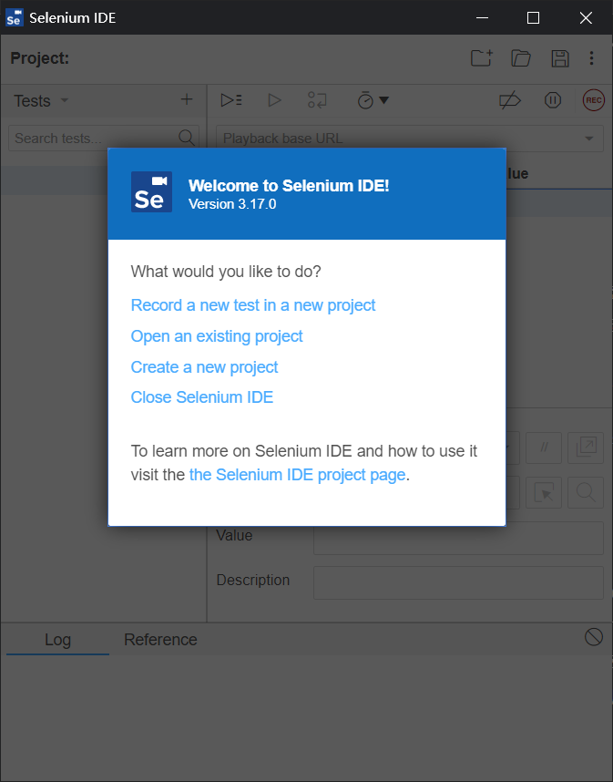
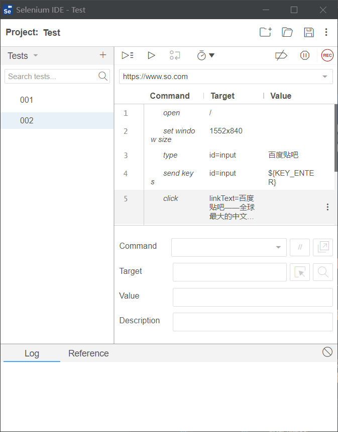
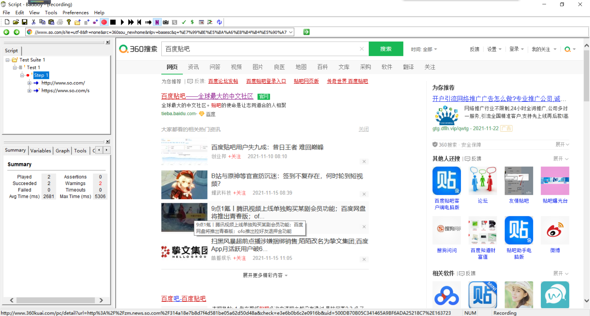
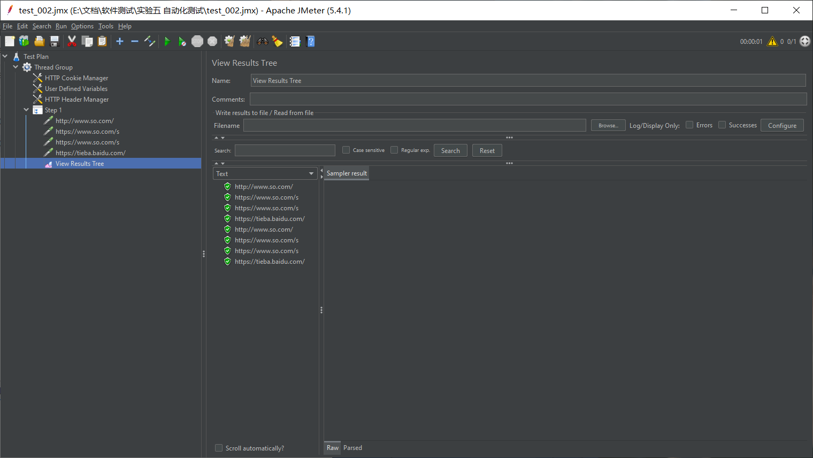

# 《软件测试》实验五自动化测试报告

* 姓名：郑伟林
* 班级：1619303
* 学号：061920125

[TOC]


## 一、实验要求

​	分别使用Selenium工具和Jmeter工具编写或录制测试脚本，解释 脚本结构，执行脚本，并分析比较两种脚本的差异。

## 二、实验内容

## 1.Selenium工具

​	在Chrome浏览器中添加Selenium IDE插件，可以直接进行脚本录制。



新建项目进行脚本录制，进入www.so.com，搜索`百度贴吧`，然后点击第一条搜索结果，结束录制。



保存脚本为Python格式，导出。

```python
# Generated by Selenium IDE
import pytest
import time
import json
from selenium import webdriver
from selenium.webdriver.common.by import By
from selenium.webdriver.common.action_chains import ActionChains
from selenium.webdriver.support import expected_conditions
from selenium.webdriver.support.wait import WebDriverWait
from selenium.webdriver.common.keys import Keys
from selenium.webdriver.common.desired_capabilities import DesiredCapabilities

class Test002():
  def setup_method(self, method):
    self.driver = webdriver.Chrome()
    self.vars = {}
  
  def teardown_method(self, method):
    self.driver.quit()
  
  def wait_for_window(self, timeout = 2):
    time.sleep(round(timeout / 1000))
    wh_now = self.driver.window_handles
    wh_then = self.vars["window_handles"]
    if len(wh_now) > len(wh_then):
      return set(wh_now).difference(set(wh_then)).pop()
  
  def test_002(self):
    self.driver.get("https://www.so.com/")
    self.driver.set_window_size(1552, 840)
    self.driver.find_element(By.ID, "input").send_keys("百度贴吧")
    self.driver.find_element(By.ID, "input").send_keys(Keys.ENTER)
    self.vars["window_handles"] = self.driver.window_handles
    self.driver.find_element(By.LINK_TEXT, "百度贴吧——全球最大的中文社区").click()
    self.vars["win7442"] = self.wait_for_window(2000)
    self.driver.switch_to.window(self.vars["win7442"])
    element = self.driver.find_element(By.CSS_SELECTOR, ".r18f4fbda1 img")
    actions = ActionChains(self.driver)
    actions.move_to_element(element).perform()
    element = self.driver.find_element(By.CSS_SELECTOR, "body")
    actions = ActionChains(self.driver)
    actions.move_to_element(element, 0, 0).perform()
  

```

## 2.Badboy+Jmeter工具

​	用badboy先录制脚本流程



然后导出JMX文件，到Jmeter中运行。

导入JMX后，添加结果树，然后运行即可。



JMX代码：

```xml
<?xml version="1.0" encoding="UTF-8"?>
<jmeterTestPlan version="1.2" properties="5.0" jmeter="5.4.1">
  <hashTree>
    <TestPlan guiclass="TestPlanGui" testclass="TestPlan" testname="Test Plan" enabled="true">
      <stringProp name="TestPlan.comments"></stringProp>
      <boolProp name="TestPlan.functional_mode">false</boolProp>
      <boolProp name="TestPlan.serialize_threadgroups">false</boolProp>
      <elementProp name="TestPlan.user_defined_variables" elementType="Arguments" guiclass="ArgumentsPanel" testclass="Arguments" testname="User Defined Variables" enabled="true">
        <collectionProp name="Arguments.arguments"/>
      </elementProp>
      <stringProp name="TestPlan.user_define_classpath"></stringProp>
    </TestPlan>
    <hashTree>
      <ThreadGroup guiclass="ThreadGroupGui" testclass="ThreadGroup" testname="Thread Group" enabled="true">
        <elementProp name="ThreadGroup.main_controller" elementType="LoopController" guiclass="LoopControlPanel" testclass="LoopController" testname="Loop Controller" enabled="true">
          <boolProp name="LoopController.continue_forever">false</boolProp>
          <stringProp name="LoopController.loops">1</stringProp>
        </elementProp>
        <stringProp name="ThreadGroup.num_threads">1</stringProp>
        <stringProp name="ThreadGroup.ramp_time">1</stringProp>
        <longProp name="ThreadGroup.start_time">1281132211000</longProp>
        <longProp name="ThreadGroup.end_time">1281132211000</longProp>
        <boolProp name="ThreadGroup.scheduler">false</boolProp>
        <stringProp name="ThreadGroup.on_sample_error">continue</stringProp>
        <stringProp name="ThreadGroup.duration"></stringProp>
        <stringProp name="ThreadGroup.delay"></stringProp>
        <boolProp name="ThreadGroup.same_user_on_next_iteration">true</boolProp>
      </ThreadGroup>
      <hashTree>
        <CookieManager guiclass="CookiePanel" testclass="CookieManager" testname="HTTP Cookie Manager" enabled="true">
          <collectionProp name="CookieManager.cookies"/>
          <boolProp name="CookieManager.clearEachIteration">false</boolProp>
          <boolProp name="CookieManager.controlledByThreadGroup">false</boolProp>
          <stringProp name="CookieManager.policy">rfc2109</stringProp>
        </CookieManager>
        <hashTree/>
        <Arguments guiclass="ArgumentsPanel" testclass="Arguments" testname="User Defined Variables" enabled="true">
          <collectionProp name="Arguments.arguments">
            <elementProp name="VIEWSTATE" elementType="Argument">
              <stringProp name="Argument.name">VIEWSTATE</stringProp>
              <stringProp name="Argument.value"></stringProp>
              <stringProp name="Argument.metadata">=</stringProp>
            </elementProp>
            <elementProp name="jsessionid" elementType="Argument">
              <stringProp name="Argument.name">jsessionid</stringProp>
              <stringProp name="Argument.value"></stringProp>
              <stringProp name="Argument.metadata">=</stringProp>
            </elementProp>
          </collectionProp>
        </Arguments>
        <hashTree/>
        <HeaderManager guiclass="HeaderPanel" testclass="HeaderManager" testname="HTTP Header Manager" enabled="true">
          <collectionProp name="HeaderManager.headers">
            <elementProp name="" elementType="Header">
              <stringProp name="Header.name">User-Agent</stringProp>
              <stringProp name="Header.value">Mozilla/5.0 (compatible; MSIE 9.0; Windows NT 6.2; WOW64; Trident/7.0)</stringProp>
            </elementProp>
            <elementProp name="" elementType="Header">
              <stringProp name="Header.name">Accept</stringProp>
              <stringProp name="Header.value">image/gif, image/jpeg, image/pjpeg, application/x-ms-application, application/xaml+xml, application/x-ms-xbap, */*</stringProp>
            </elementProp>
            <elementProp name="" elementType="Header">
              <stringProp name="Header.name">Accept-Language</stringProp>
              <stringProp name="Header.value">zh-Hans-CN,zh-Hans;q=0.8,en-US;q=0.6,en;q=0.4,ja;q=0.2</stringProp>
            </elementProp>
          </collectionProp>
        </HeaderManager>
        <hashTree/>
        <LoopController guiclass="LoopControlPanel" testclass="LoopController" testname="Step 1" enabled="true">
          <boolProp name="LoopController.continue_forever">false</boolProp>
          <stringProp name="LoopController.loops">1</stringProp>
        </LoopController>
        <hashTree>
          <HTTPSamplerProxy guiclass="HttpTestSampleGui" testclass="HTTPSamplerProxy" testname="http://www.so.com/" enabled="true">
            <elementProp name="HTTPsampler.Arguments" elementType="Arguments" guiclass="HTTPArgumentsPanel" testclass="Arguments" testname="User Defined Variables" enabled="true">
              <collectionProp name="Arguments.arguments"/>
            </elementProp>
            <stringProp name="HTTPSampler.domain">www.so.com</stringProp>
            <stringProp name="HTTPSampler.port">80</stringProp>
            <stringProp name="HTTPSampler.protocol">http</stringProp>
            <stringProp name="HTTPSampler.contentEncoding"></stringProp>
            <stringProp name="HTTPSampler.path">/</stringProp>
            <stringProp name="HTTPSampler.method">GET</stringProp>
            <boolProp name="HTTPSampler.follow_redirects">false</boolProp>
            <boolProp name="HTTPSampler.auto_redirects">true</boolProp>
            <boolProp name="HTTPSampler.use_keepalive">true</boolProp>
            <boolProp name="HTTPSampler.DO_MULTIPART_POST">false</boolProp>
            <stringProp name="HTTPSampler.embedded_url_re"></stringProp>
            <stringProp name="HTTPSampler.implementation">Java</stringProp>
            <stringProp name="HTTPSampler.connect_timeout"></stringProp>
            <stringProp name="HTTPSampler.response_timeout"></stringProp>
          </HTTPSamplerProxy>
          <hashTree/>
          <HTTPSamplerProxy guiclass="HttpTestSampleGui" testclass="HTTPSamplerProxy" testname="https://www.so.com/s" enabled="true">
            <elementProp name="HTTPsampler.Arguments" elementType="Arguments" guiclass="HTTPArgumentsPanel" testclass="Arguments" testname="User Defined Variables" enabled="true">
              <collectionProp name="Arguments.arguments">
                <elementProp name="ie" elementType="HTTPArgument">
                  <boolProp name="HTTPArgument.always_encode">true</boolProp>
                  <stringProp name="Argument.value">utf-8</stringProp>
                  <stringProp name="Argument.metadata">=</stringProp>
                  <boolProp name="HTTPArgument.use_equals">true</boolProp>
                  <stringProp name="Argument.name">ie</stringProp>
                </elementProp>
                <elementProp name="fr" elementType="HTTPArgument">
                  <boolProp name="HTTPArgument.always_encode">true</boolProp>
                  <stringProp name="Argument.value">none</stringProp>
                  <stringProp name="Argument.metadata">=</stringProp>
                  <boolProp name="HTTPArgument.use_equals">true</boolProp>
                  <stringProp name="Argument.name">fr</stringProp>
                </elementProp>
                <elementProp name="src" elementType="HTTPArgument">
                  <boolProp name="HTTPArgument.always_encode">true</boolProp>
                  <stringProp name="Argument.value">360sou_newhome</stringProp>
                  <stringProp name="Argument.metadata">=</stringProp>
                  <boolProp name="HTTPArgument.use_equals">true</boolProp>
                  <stringProp name="Argument.name">src</stringProp>
                </elementProp>
                <elementProp name="nlpv" elementType="HTTPArgument">
                  <boolProp name="HTTPArgument.always_encode">true</boolProp>
                  <stringProp name="Argument.value">basesc</stringProp>
                  <stringProp name="Argument.metadata">=</stringProp>
                  <boolProp name="HTTPArgument.use_equals">true</boolProp>
                  <stringProp name="Argument.name">nlpv</stringProp>
                </elementProp>
                <elementProp name="q" elementType="HTTPArgument">
                  <boolProp name="HTTPArgument.always_encode">true</boolProp>
                  <stringProp name="Argument.value">百度贴吧</stringProp>
                  <stringProp name="Argument.metadata">=</stringProp>
                  <boolProp name="HTTPArgument.use_equals">true</boolProp>
                  <stringProp name="Argument.name">q</stringProp>
                </elementProp>
              </collectionProp>
            </elementProp>
            <stringProp name="HTTPSampler.domain">www.so.com</stringProp>
            <stringProp name="HTTPSampler.port">443</stringProp>
            <stringProp name="HTTPSampler.protocol">https</stringProp>
            <stringProp name="HTTPSampler.contentEncoding"></stringProp>
            <stringProp name="HTTPSampler.path">/s</stringProp>
            <stringProp name="HTTPSampler.method">GET</stringProp>
            <boolProp name="HTTPSampler.follow_redirects">false</boolProp>
            <boolProp name="HTTPSampler.auto_redirects">true</boolProp>
            <boolProp name="HTTPSampler.use_keepalive">true</boolProp>
            <boolProp name="HTTPSampler.DO_MULTIPART_POST">false</boolProp>
            <stringProp name="HTTPSampler.embedded_url_re"></stringProp>
            <stringProp name="HTTPSampler.implementation">Java</stringProp>
            <stringProp name="HTTPSampler.connect_timeout"></stringProp>
            <stringProp name="HTTPSampler.response_timeout"></stringProp>
          </HTTPSamplerProxy>
          <hashTree/>
          <HTTPSamplerProxy guiclass="HttpTestSampleGui" testclass="HTTPSamplerProxy" testname="https://www.so.com/s" enabled="true">
            <elementProp name="HTTPsampler.Arguments" elementType="Arguments" guiclass="HTTPArgumentsPanel" testclass="Arguments" testname="User Defined Variables" enabled="true">
              <collectionProp name="Arguments.arguments">
                <elementProp name="ie" elementType="HTTPArgument">
                  <boolProp name="HTTPArgument.always_encode">true</boolProp>
                  <stringProp name="Argument.value">utf-8</stringProp>
                  <stringProp name="Argument.metadata">=</stringProp>
                  <boolProp name="HTTPArgument.use_equals">true</boolProp>
                  <stringProp name="Argument.name">ie</stringProp>
                </elementProp>
                <elementProp name="fr" elementType="HTTPArgument">
                  <boolProp name="HTTPArgument.always_encode">true</boolProp>
                  <stringProp name="Argument.value">none</stringProp>
                  <stringProp name="Argument.metadata">=</stringProp>
                  <boolProp name="HTTPArgument.use_equals">true</boolProp>
                  <stringProp name="Argument.name">fr</stringProp>
                </elementProp>
                <elementProp name="src" elementType="HTTPArgument">
                  <boolProp name="HTTPArgument.always_encode">true</boolProp>
                  <stringProp name="Argument.value">360sou_newhome</stringProp>
                  <stringProp name="Argument.metadata">=</stringProp>
                  <boolProp name="HTTPArgument.use_equals">true</boolProp>
                  <stringProp name="Argument.name">src</stringProp>
                </elementProp>
                <elementProp name="nlpv" elementType="HTTPArgument">
                  <boolProp name="HTTPArgument.always_encode">true</boolProp>
                  <stringProp name="Argument.value">basesc</stringProp>
                  <stringProp name="Argument.metadata">=</stringProp>
                  <boolProp name="HTTPArgument.use_equals">true</boolProp>
                  <stringProp name="Argument.name">nlpv</stringProp>
                </elementProp>
                <elementProp name="q" elementType="HTTPArgument">
                  <boolProp name="HTTPArgument.always_encode">true</boolProp>
                  <stringProp name="Argument.value">鐧惧害璐村惂</stringProp>
                  <stringProp name="Argument.metadata">=</stringProp>
                  <boolProp name="HTTPArgument.use_equals">true</boolProp>
                  <stringProp name="Argument.name">q</stringProp>
                </elementProp>
              </collectionProp>
            </elementProp>
            <stringProp name="HTTPSampler.domain">www.so.com</stringProp>
            <stringProp name="HTTPSampler.port">443</stringProp>
            <stringProp name="HTTPSampler.protocol">https</stringProp>
            <stringProp name="HTTPSampler.contentEncoding"></stringProp>
            <stringProp name="HTTPSampler.path">/s</stringProp>
            <stringProp name="HTTPSampler.method">GET</stringProp>
            <boolProp name="HTTPSampler.follow_redirects">false</boolProp>
            <boolProp name="HTTPSampler.auto_redirects">true</boolProp>
            <boolProp name="HTTPSampler.use_keepalive">true</boolProp>
            <boolProp name="HTTPSampler.DO_MULTIPART_POST">false</boolProp>
            <stringProp name="HTTPSampler.embedded_url_re"></stringProp>
            <stringProp name="HTTPSampler.implementation">Java</stringProp>
            <stringProp name="HTTPSampler.connect_timeout"></stringProp>
            <stringProp name="HTTPSampler.response_timeout"></stringProp>
          </HTTPSamplerProxy>
          <hashTree/>
          <HTTPSamplerProxy guiclass="HttpTestSampleGui" testclass="HTTPSamplerProxy" testname="https://tieba.baidu.com/" enabled="true">
            <elementProp name="HTTPsampler.Arguments" elementType="Arguments" guiclass="HTTPArgumentsPanel" testclass="Arguments" testname="User Defined Variables" enabled="true">
              <collectionProp name="Arguments.arguments"/>
            </elementProp>
            <stringProp name="HTTPSampler.domain">tieba.baidu.com</stringProp>
            <stringProp name="HTTPSampler.port">443</stringProp>
            <stringProp name="HTTPSampler.protocol">https</stringProp>
            <stringProp name="HTTPSampler.contentEncoding"></stringProp>
            <stringProp name="HTTPSampler.path">/</stringProp>
            <stringProp name="HTTPSampler.method">GET</stringProp>
            <boolProp name="HTTPSampler.follow_redirects">false</boolProp>
            <boolProp name="HTTPSampler.auto_redirects">true</boolProp>
            <boolProp name="HTTPSampler.use_keepalive">true</boolProp>
            <boolProp name="HTTPSampler.DO_MULTIPART_POST">false</boolProp>
            <stringProp name="HTTPSampler.embedded_url_re"></stringProp>
            <stringProp name="HTTPSampler.implementation">Java</stringProp>
            <stringProp name="HTTPSampler.connect_timeout"></stringProp>
            <stringProp name="HTTPSampler.response_timeout"></stringProp>
          </HTTPSamplerProxy>
          <hashTree/>
          <ResultCollector guiclass="ViewResultsFullVisualizer" testclass="ResultCollector" testname="View Results Tree" enabled="true">
            <boolProp name="ResultCollector.error_logging">false</boolProp>
            <objProp>
              <name>saveConfig</name>
              <value class="SampleSaveConfiguration">
                <time>true</time>
                <latency>true</latency>
                <timestamp>true</timestamp>
                <success>true</success>
                <label>true</label>
                <code>true</code>
                <message>true</message>
                <threadName>true</threadName>
                <dataType>true</dataType>
                <encoding>false</encoding>
                <assertions>true</assertions>
                <subresults>true</subresults>
                <responseData>false</responseData>
                <samplerData>false</samplerData>
                <xml>false</xml>
                <fieldNames>true</fieldNames>
                <responseHeaders>false</responseHeaders>
                <requestHeaders>false</requestHeaders>
                <responseDataOnError>false</responseDataOnError>
                <saveAssertionResultsFailureMessage>true</saveAssertionResultsFailureMessage>
                <assertionsResultsToSave>0</assertionsResultsToSave>
                <bytes>true</bytes>
                <sentBytes>true</sentBytes>
                <url>true</url>
                <threadCounts>true</threadCounts>
                <idleTime>true</idleTime>
                <connectTime>true</connectTime>
              </value>
            </objProp>
            <stringProp name="filename"></stringProp>
          </ResultCollector>
          <hashTree/>
        </hashTree>
      </hashTree>
    </hashTree>
  </hashTree>
</jmeterTestPlan>

```

## 三、脚本对比

​	Selenium的是Python脚本，结构清晰，容易理解，易于直接编写脚本驱动测试；而Jmeter的JMX是XML格式的，十分难以理解，不易编写，一个操作往往需要数十行代码，不过其数据存储较方便。

## 四、实验总结

​	本次实验学会了如何利用脚本对目标测试对象进行自动化测试，学习了Selenium和Jmeter两种方法。自动化测试可以大大便利重复繁琐的工作。