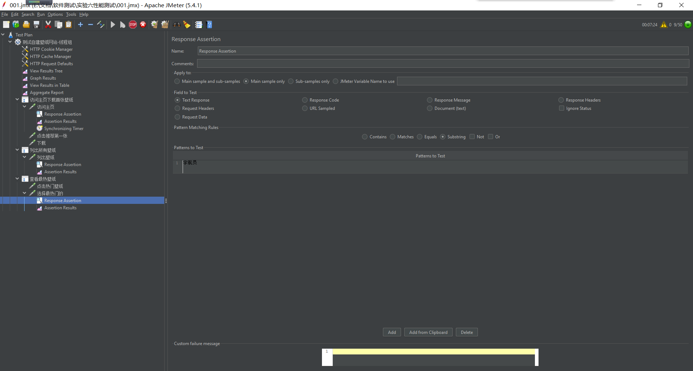
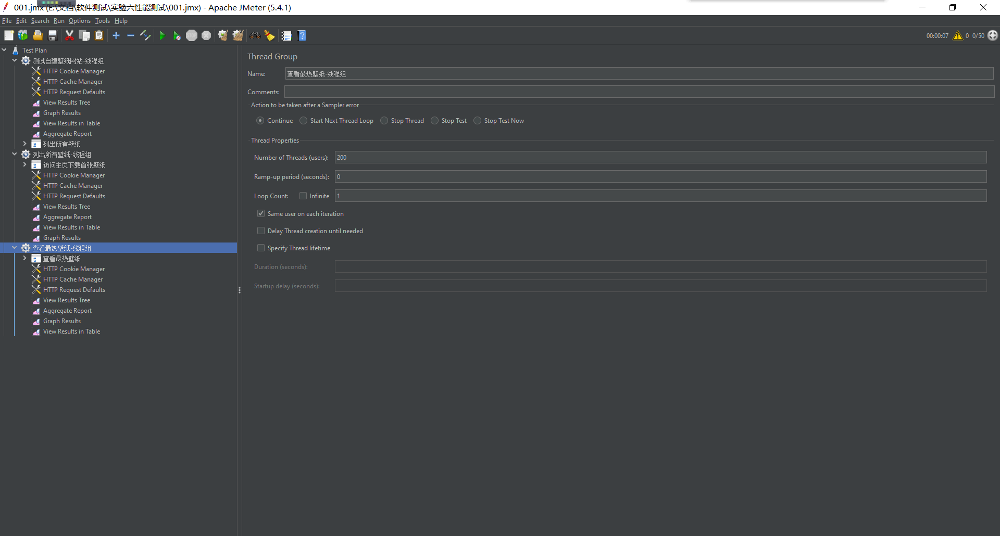

# 《软件测试》实验六性能测试报告

* 姓名：郑伟林
* 班级：1619303
* 学号：061920125

[TOC]

## 一、实验要求

​	用JMete对任选一个Web应用进行性能测试，步骤如下：

• 分析待测应用的主要功能场景和性能需求； 

• 针对至少三个典型功能场景，手工操作测试过程，获得测试结果； 将上述功能场景分别录制为初始测试脚本；

 • 在脚本中增加检查点，利用检查点判断测试结果是成功还是失败； 

• 对脚本中的用户名、密码等信息进行参数化，似的脚本能够模拟不 同虚拟用户同时登录的情况； 

• 在以上脚本设定的基础上，定义多种负载规模和变化策略，以模拟 不同软件工作场景； 

• 执行性能测试，分别获得响应时间、吞吐量等性能指标，解读这些 性能指标，对照步骤(1)中的性能需求，形成关于应用性能的评价

## 二、实验内容

### 1.应用典型功能场景

| 功能场景         | 描述                                               | 活动规模 |
| ---------------- | -------------------------------------------------- | -------- |
| 进入网站下载壁纸 | 用户进入主页，然后点击首页第一张壁纸查看，点击下载 | 200      |
| 列出所有壁纸     | 选择最新壁纸，进入尾页                             | 200      |
| 查看最热壁纸     | 点击热门壁纸，查看热门第一张                       | 200      |

### 2.增加检查点

​	分别为上述三个场景录制脚本，并设置检查点.

并在合适位置设置集合点。

​	由于此web应用没有登录设置，因此无需参数化设计。

### 3.多种负载规模

##### 	①恒定规模负载

​	在线程组中设置Numbers of Threads和Ramp-Up Period为200和0，含义是200个虚拟用户并发在0s内，即同时进行访问，模拟大量用户同时访问的场景。

##### 	②渐增规模负载

​	在线程组中设置Numbers of Threads和Ramp-Up Period为200和5，含义是在5s内逐渐从0个虚拟用户加压到200个虚拟用户，模拟用户逐渐增加的场景。

### 4.添加监听器

​	对各个线程组添加结果树、表格、图形和聚合报告，以便查看结果

## 三、结果分析

由于服务器地址在国外，因此本系统响应时间会慢很多

从上述聚合报告中可以，场景列出所有壁纸的平均响应时间5976ms，吞吐量在4.8/sec；下载壁纸的平均响应时间在11825ms，吞吐量3.8/sec；查看最热壁纸平均响应时间5233ms，吞吐量3.9/sec.

在进行阶梯增加线程数后，最后得到在虚拟用户达到1000时，该系统会出现异常，返回错误信息，大概0.2%~0.4%的错误率，即最大并发数在1000左右。

综上，本系统由于图片较多，数据量稍大，在需求的并发负载规模下，平均响应时间在7678ms左右，最大并发数在1000左右，其性能基本满足可用的要求。

## 四、实验总结

​	通过本次实验，我学会了利用JMeter对web应用进行性能测试，利用生成大量虚拟用户来对网页的负载性能进行测试，然后分析结果数据，对网站性能进行评估。