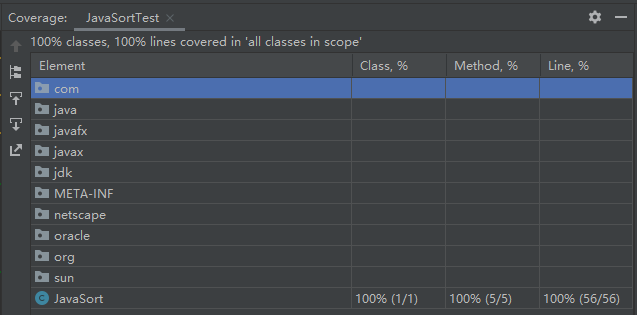

# 《软件测试》实验三覆盖测试报告

* 姓名：郑伟林
* 班级：1619303
* 学号：061920125


## 一、实验要求

​	要求： 选择你过去编写过的任意一个50行以上程序，尝试为 其生成测试用例，实现语句覆盖、分支覆盖。


## 二、实验内容

​	利用IDEA的Run with Coverage即可一键覆盖测试。

测试内容：

```java
public class JavaSort {
    public static void selectSort(int[] a){
        int i,j;
        //int a[ ]={30,1,-9,70,25};
        int n=a.length;
        for( i=0; i<n-1; i++)
            for( j=i+1; j<n; j++ )
                if( a[i]>a[j] ){
                    int t=a[i];
                    a[i]=a[j];
                    a[j]=t;
                }
    }
    public static void bubbleSort(int[] a){
        int i,j;
        //int a[ ]={30,1,-9,70,25};
        int n=a.length;
        for( i=1; i<n; i++)
            for( j=0; j<n-i; j++ )
                if( a[j]>a[j+1]){
                    int t=a[j];
                    a[j]=a[j+1];
                    a[j+1]=t;
                }
    }
    public static void quickSort(int[] arr,int low,int high){
        int i,j,temp,t;
        if(low>high){
            return;
        }
        i=low;
        j=high;
        //temp就是基准位
        temp = arr[low];

        while (i<j) {
            //先看右边，依次往左递减
            while (temp<=arr[j]&&i<j) {
                j--;
            }
            //再看左边，依次往右递增
            while (temp>=arr[i]&&i<j) {
                i++;
            }
            //如果满足条件则交换
            if (i<j) {
                t = arr[j];
                arr[j] = arr[i];
                arr[i] = t;
            }

        }
        //最后将基准为与i和j相等位置的数字交换
        arr[low] = arr[i];
        arr[i] = temp;
        //递归调用左半数组
        quickSort(arr, low, j-1);
        //递归调用右半数组
        quickSort(arr, j+1, high);
    }
    public static void mergeSort(int[] a,int s,int e){
        int m = (s + e) / 2;
        if (s < e){
            mergeSort(a,s,m);
            mergeSort(a,m+1,e);
            //归并
            merge(a,s,m,e);
        }
    }

    private static void merge(int[] a, int s, int m, int e) {
        //初始化一个从起始s到终止e的一个数组
        int[] temp = new int[(e - s) + 1];
        //左起始指针
        int l = s;
        //右起始指针
        int r = m+1;
        int i = 0;
        //将s-e这段数据在逻辑上一分为二,l-m为一个左边的数组,r-e为一个右边的数组,两边都是有序的
        //从两边的第一个指针开始遍历,将其中小的那个值放在temp数组中
        while (l <= m && r <= e){
            if (a[l] < a[r]){
                temp[i++] = a[l++];
            }else{
                temp[i++] = a[r++];
            }
        }

        //将两个数组剩余的数放到temp中
        while (l <= m){
            temp[i++] = a[l++];
        }
        while (r <= e){
            temp[i++] = a[r++];
        }

        //将temp数组覆盖原数组
        for (int n = 0; n < temp.length; n++) {
            a[s+n] = temp[n];
        }

    }
}

```

测试类：

```java
import static org.junit.Assert.*;

public class JavaSortTest {
    int arr[];

    @org.junit.Before
    public void setUp() throws Exception {
        arr = new int[]{4, 5, 1, 3, 9, 2, 4, 8};
    }

    @org.junit.Test
    public void selectSort() {
        int[] arr1 = arr;
        JavaSort.selectSort(arr1);
        for (int j : arr1) System.out.println(j);
    }

    @org.junit.Test
    public void bubbleSort() {
        int[] arr2 = arr;
        JavaSort.bubbleSort(arr2);
        for (int j : arr2) System.out.println(j);
    }

    @org.junit.Test
    public void quickSort() {
        int[] arr3 = arr;
        JavaSort.quickSort(arr3,0,arr3.length-1);
        for (int j : arr3) System.out.println(j);
    }
    @org.junit.Test
    public void mergeSort() {
        int[] arr4 = arr;
        JavaSort.mergeSort(arr4,0,arr4.length-1);
        for (int j : arr4) System.out.println(j);
    }
}

```

## 三、测试结果



## 四、实验总结

​	本次实验学会了如何利用IDEA进行覆盖测试，可以看到在IDEA现代化集成开发环境中，进行覆盖测试是非常方便的事。